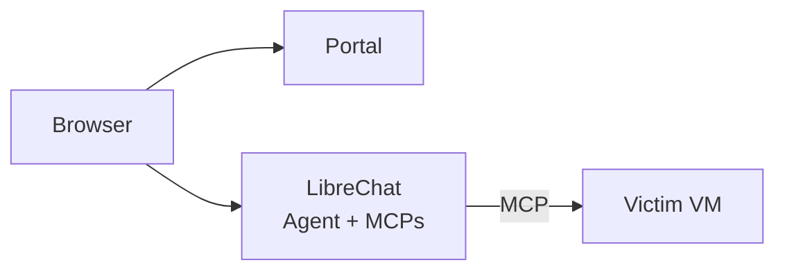

  

    

# Shifter

AI-driven cyber range platform with autonomous agent capabilities.

## Overview

Ephemeral cloud-based cyber range for AI agent attack simulation and XDR/XSIAM detection testing.

**Use Cases:**
- AI-driven attack demonstrations
- XDR/XSIAM detection validation
- Security tool testing
- AI cyber capability research

## Workflow

1. Authenticate via portal (Cognito)
2. Launch range (provisions VPC, victim VM, LibreChat instance)
3. Interact via chat interface (natural language to AI agent)
4. Agent executes via MCP tools (SSH, command execution, file ops)
5. XDR/XSIAM detects activity
6. Destroy range (tears down infrastructure)

## Architecture

**Components:**
- **Portal**: Django app, Cognito auth, range provisioning
- **LibreChat**: Chat UI, AI agent execution, MCP tool integration
- **Victim**: EC2 target with XDR agent

## Infrastructure

- **AWS**: VPCs, EC2, RDS, Lambda, Step Functions
- **IaC**: Terraform-managed
- **Auth**: Cognito with MFA
- **AI Tools**: Model Context Protocol (MCP) for agent capabilities
- **Access**: Browser-based, no local dependencies

Documentation: [docs/src/](docs/src/)

## Limitations

Initial release: single victim VM per range.

See [GitHub Issues](https://github.com/Brad-Edwards/shifter/issues) for roadmap.

## Ethics

AI-driven attack capabilities exist in adversary arsenals. Defensive practitioners require exposure to these techniques.

See [docs/src/ethics.md](docs/src/ethics.md).

## Security

- Network isolation (no internet egress from victim VMs)
- Cognito authentication with MFA enforcement
- Human-in-the-loop (user directs all scenarios)
- Audit logging enabled
- Access control via IAM/Cognito

## Disclaimer

Provided "as is" without warranty. Authors disclaim liability for damages or legal consequences. Users responsible for compliance with applicable laws.

## License

MIT

---

Badge icons:  
