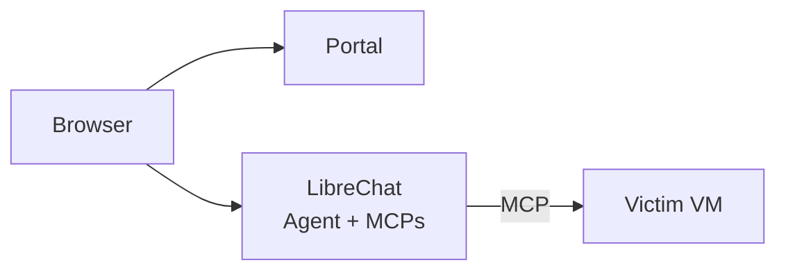

  

    

# Shifter

**Watch an AI hack. In your browser. Under your control.**

A SaaS cyber range for autonomous AI hacking agents.

**Beta coming soon:** Cortex Catalyst - December 18, 2025

## What is Shifter?

Shifter gives you a turnkey environment to experiment with AI-driven attacks. No setup, no infrastructure headaches—just log in and go.

- **Demo** AI cyber capabilities for customers, executives, or colleagues
- **Experiment** with AI-driven attacks against victim infrastructure
- **Educate** yourself on what autonomous offensive AI looks like in practice
- **Research** AI cyber agent capabilities in an isolated environment

Everything runs in the cloud. Open your browser, launch a range, and start.

## Why Shifter?

- **No infra to manage** — spin up a range in minutes, not days
- **No tools to install** — everything's in the browser
- **No scripts to write** — tell the AI what you want in plain English
- **Your endpoint agent** — victim VMs run your XDR/XSIAM agent, detections in your tenant
- **No cleanup** — tear down when you're done

## How It Works

1. Log into the portal and launch a range
2. Open the chat interface
3. Tell the agent what to do: *"Set up a vulnerable web server"* or *"Attack the target and get root"*
4. Watch the AI autonomously configure, exploit, and pivot
5. See detections in your security tooling

You direct. The agent executes.

## Architecture

- **Portal**: Authentication and range management
- **LibreChat**: Browser-based chat with AI agent and MCP tools
- **Victim**: Target infrastructure with your XDR agent

## Under the Hood

- **AI Integration**: [Model Context Protocol (MCP)](https://modelcontextprotocol.io/) gives the agent real tools—SSH, command execution, file ops
- **Infrastructure**: Terraform-managed AWS (VPCs, EC2, ALB, Cognito auth)
- **Chat UI**: LibreChat with agent loops and MCP tool use
- **Zero local install**: Everything browser-based

Full technical docs: [docs/](docs/)

## Roadmap

See [GitHub Issues](https://github.com/Brad-Edwards/shifter/issues).

**Note:** Initial release limits ranges to a single victim VM per user.

## Ethics

AI-driven attack capabilities are already in adversary hands. Defenders need to catch up. [Read more](docs/ethics.md).

## Safety

- Ranges are isolated—no internet egress from victim VMs
- Human oversight required—you direct every scenario
- AI actions are logged and auditable
- Users authenticate via Cognito with MFA required
- Access restricted to authorized personnel

## Disclaimer

This software is provided "as is" without warranty of any kind. The authors disclaim all liability for any damages or legal consequences arising from its use or misuse. You are solely responsible for ensuring your use complies with applicable laws and regulations.

Do not f*** around and find out.

## License

MIT

---

10-23 AI hacker shenanigans 🚓
