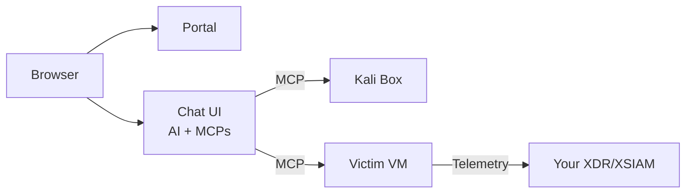

  

# Shifter

**Your AI demo partner. Instant environments. Zero prep.**

Shifter spins up demo environments on demand and uses AI to configure and run scenarios for you. Describe what you need in plain English—the agent handles the rest.

**Beta coming soon:** Cortex Catalyst - December 18, 2025

## What is Shifter?

Shifter is an agentic demo platform. Tell it what scenario you need, and it builds and executes it autonomously. No scripts, no manual setup, no infrastructure wrestling.

**The hook:** Watch an AI hack a target in real-time. Agentic offensive AI is a compelling demo—customers pay attention when they see autonomous exploitation.

**The real value:** A polymorphic demo environment that adapts to whatever scenario you need. The AI handles setup *and* execution, so you focus on the conversation, not the keyboard.

## Use Cases

- **Security demos** — Show XDR/XSIAM detecting AI-driven attacks in your customer's tenant
- **Product walkthroughs** — Let AI configure vulnerable targets to highlight specific detections
- **POC environments** — Spin up isolated test scenarios without touching production
- **Training** — Hands-on labs without the lab maintenance

## Why Shifter?

| Traditional demo prep | With Shifter |
|-----------------------|--------------|
| Hours configuring VMs | "Set up a web server with SQLi" |
| Scripts that break | Natural language instructions |
| "Let me share my screen" | "Open this link" |
| "I'll send you the recording" | Live, interactive, in their browser |
| Cleanup and reset for next demo | Tear down with one click |

**Zero infrastructure. Zero scripting. Zero cleanup.**

## How It Works

1. **Launch a range** — Log into the portal, click a button
2. **Describe your scenario** — "Set up a vulnerable PHP app" or "Configure a Windows DC with weak credentials"
3. **AI builds it** — The agent configures the environment to your spec
4. **Run the demo** — "Now attack it and get root" or walk through manually
5. **Tear down** — One click when you're done

The same AI that sets up scenarios can also execute them. Two chat contexts: one for setup, one for attack. Fresh perspective, no cheating.

## Architecture

- **Portal**: Authentication, range management, agent uploads
- **Chat UI**: Browser-based AI chat with MCP tool access
- **Kali**: Pre-configured attack box with pentesting tools
- **Victim**: Target VM running your XDR agent

## Under the Hood

- **AI Tools**: [Model Context Protocol (MCP)](https://modelcontextprotocol.io/) gives the agent real capabilities—SSH, command execution, file operations
- **Infrastructure**: AWS (VPCs, EC2, Step Functions), Terraform-managed
- **Chat**: Agent loops and multi-turn conversations
- **Auth**: Cognito with MFA, SSO across portal and chat

Full technical docs: [docs/](docs/)

## Roadmap

See [GitHub Issues](https://github.com/Brad-Edwards/shifter/issues).

## Ethics

AI-driven attack capabilities already exist in the wild. Defenders need realistic exposure to understand what they're facing. [Read more](docs/src/ethics.md).

## Safety

- Ranges are network-isolated—no lateral movement between users
- Human oversight required—you direct every scenario
- All AI actions logged and auditable
- MFA-enforced authentication
- Access restricted to authorized personnel

## Disclaimer

This software is provided "as is" without warranty of any kind. The authors disclaim all liability for any damages or legal consequences arising from its use or misuse. You are solely responsible for ensuring your use complies with applicable laws and regulations.

Do not f*** around and find out.

## License

MIT

---

*Polymorphic demos for a polymorphic threat landscape*
