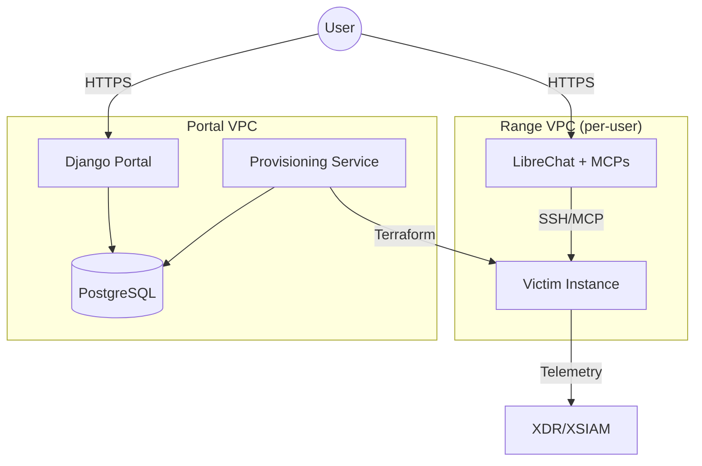
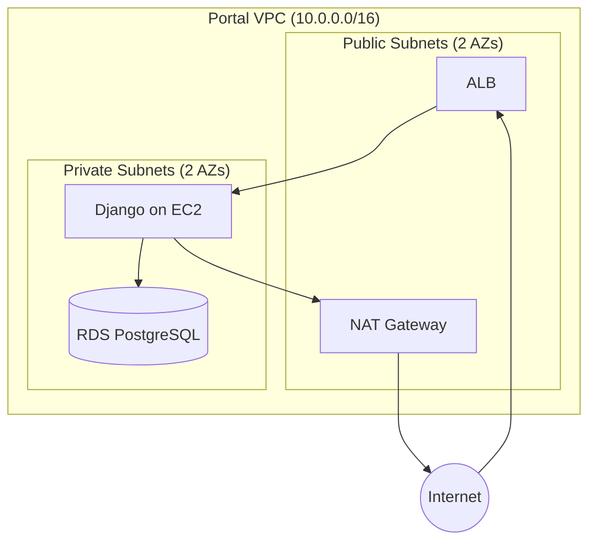
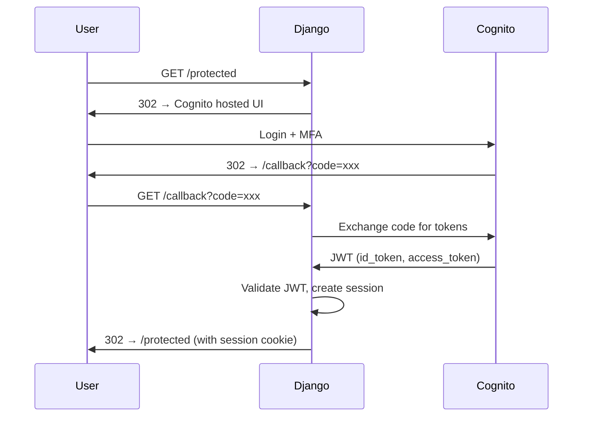
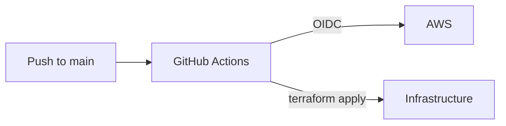
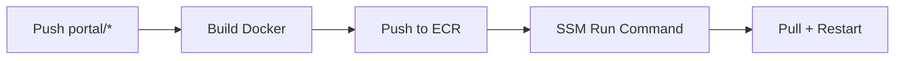

# Architecture

## Infrastructure Overview

Three components, decoupled via RDS:

- **Portal**: Django app for auth, agent upload, range status UI
- **Provisioning Service**: Watches DB, provisions infra, deploys LibreChat
- **Range**: Per-user VPC with LibreChat + MCPs and victim EC2



Portal and Provisioner share the `Range` table. Portal writes requests, Provisioner fulfills them.

## Portal Infrastructure

### Network



Two AZs required for RDS subnet group. ALB in public subnets with ACM cert. EC2 in private subnet pulls container from ECR.

### Components

| Component | Purpose |
|-----------|---------|
| ALB | HTTPS termination, routes to EC2 |
| EC2 | Runs Django container, pulls from ECR |
| ECR | Container registry for Django image |
| VPC | Network isolation, public/private subnet separation |
| RDS | PostgreSQL 16, encrypted, credentials in Secrets Manager |
| Cognito | User authentication, MFA, email verification |

### Authentication



Cognito user pool configured with:

- Email as username
- MFA required (TOTP)
- Pre-signup Lambda for domain restriction (`@paloaltonetworks.com`)
- Email verification required

Django stores minimal user data (email from token claims). No passwords in DB.

### Secrets Management

RDS credentials auto-generated at provision time, stored in Secrets Manager. Secret configured with `recovery_window_in_days = 0` to allow immediate deletion and avoid naming conflicts on destroy/recreate cycles.

## Range Infrastructure

Per-user ephemeral VPCs provisioned by the Provisioning Service.

### Provisioning Flow

1. Portal writes `Range(status='pending', agent_id=X)` to RDS
2. Provisioning Service polls for pending ranges
3. Terraform apply:
   - VPC + subnet
   - Security group (SSH from LibreChat)
   - EC2 victim instance
   - User-data installs XDR agent from S3
4. Generate MCP config JSON with victim IP
5. Deploy LibreChat instance (ECS or EC2) with MCP servers
6. Update Range row: `status='ready'`, `victim_ip`, `chat_url`

### Components

| Component | Purpose |
|-----------|---------|
| LibreChat | Chat UI, agent loop, MCP tool use |
| MCP Servers | SSH to victim, command execution |
| Victim EC2 | Target for attacks, runs user's XDR agent |

### Isolation

- Each range is its own VPC (no peering to portal)
- MCP config hardcodes victim IP (agent can't escape)
- Cognito SSO ensures user identity across Portal and LibreChat

## Deployment Pipeline

### Infrastructure

GitHub Actions deploys infra via Terraform on merge to main.



### Portal Application

Portal deploys on push to `portal/**`:



EC2 user data bootstraps Docker and ECR auth. SSM pulls new image and restarts container.

IAM via OIDC federation. No static credentials. Role permissions scoped to shifter-* resources.

### Secrets Sync

Terraform variables stored locally in `.tfvars` files (gitignored). Synced to GitHub secrets before PR:

```bash
./scripts/sync-tfvars.sh
```

Creates namespaced secrets: `TF_VARS_{ENV}_{COMPONENT}` (e.g., `TF_VARS_PROD_PORTAL`).

## Two-Context Pattern

MCP enables AI-driven scenario setup via separate LibreChat conversations:

1. **Setup chat**: "Set up a PHP command injection on /cmd.php and a SUID privesc"
   - AI uses victim MCP to configure vulnerabilities
   - User can specify flags, locations, difficulty

2. **Attack chat**: "Hack the target at 10.0.1.50, get root, find the flag"
   - Fresh context (no memory of setup)
   - AI uses attack methodology: recon → exploit → privesc
   - XDR/XSIAM detects the attack chain

User demos detections to customer.

## MCP Configuration

MCPs are config-driven. Provisioning service generates per-range config:

```json
{
  "server": {
    "name": "shifter-range-${range_id}",
    "toolPrefix": "victim"
  },
  "containers": {
    "victim": {
      "container_ip": "${victim_private_ip}",
      "ssh_key": "/secrets/range-${range_id}.pem",
      "ssh_user": "ubuntu",
      "ssh_port": 22
    }
  },
  "mcp": {
    "allowed_networks": ["${vpc_cidr}"],
    "audit_enabled": true
  }
}
```

Same MCP binary, different config per range. No code changes needed.
