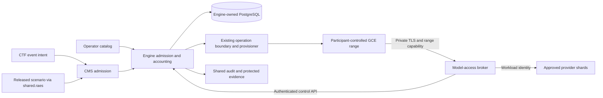

# Model-access architecture and contracts

This is proposed behavior for [#681](index.md). Names and JSON shapes below
are design contracts for implementation, not installed endpoints or RAES
schema additions. ADR-059 through ADR-061 govern the design.

## Ownership and deployment



| Owner | Responsibility and concrete seam |
| --- | --- |
| Installation/bootstrap | Validated deployment catalog, project/account onboarding, workload IAM and private broker reachability. Extend `shifter/installation`, `scripts/gcp/render_runtime_env.py`, Terraform and `platform/charts/shifter`; one rendered configuration source. |
| CTF | Event intent, logical profile selection, capacity hints and event authority through `ctf.services`, `ctf.bridges`, and existing organizer APIs. No provider SDK or Engine ORM access. |
| CMS | Resolve approved scenario/version and model needs, current owner/workspace authorization, and invoke public Engine services before dispatch. Retain `cms.services` admission and hydration. |
| Engine | Catalog resolution, shard allocation, grant epochs, request/spend/rate/concurrency admission, operation correlation and reconciliation. Extend `engine.services` and Engine models. |
| Shared | Dependency-light validated model-access DTOs, normalization/digest helpers and adapter protocols in proposed `shared/model_access`. Provider construction follows the existing `shared.cloud` protocol/factory pattern, but is selected by the validated shard adapter ID rather than the deployment's `CLOUD_PROVIDER`; RAES interpretation stays in `shared.raes`. |
| Provisioner | Consume a closed, versioned non-secret access projection through ADR-043; bootstrap the admitted endpoint/capability; return bounded installation/readiness or cleanup results. No provider selection or budget database. |
| Broker | Separate ASGI entry point in the platform package, dedicated Helm Deployment/KSA and pinned image digest. Parse bounded requests, call Engine's private control facade, route only approved provider operations, stream with backpressure, and report metadata/usage. No Django ORM import, schema ownership, provider administration, or direct database credentials. |
| Provider adapter | Translate a pinned supported client protocol, construct the exact destination, obtain invocation-only identity and normalize safe usage/errors. No prompt interpretation, automatic tool execution or independent routing policy. |

The broker is a new streaming process, not a new public platform API or
general agent orchestrator. Control endpoints are implemented by the existing
platform service deployment behind a dedicated private listener. Range
networks can reach only the broker listener; they cannot route to that
control listener, PostgreSQL, Redis, the Kubernetes API or portal internals.
NetworkPolicy, TLS server validation and workload authentication all apply.
The shared image does not imply shared runtime secrets: the broker entry
point must not bootstrap Django's full application settings or inherit the
portal/worker secret bundle. Render a closed broker-only configuration and
credential inventory, and test the resulting process environment and imports.

## Configuration and policy precedence

Use four typed inputs, with schema/version and content digest:

1. A deployment catalog owns logical profiles, shard coordinates, immutable
   model mappings, billing-feature allowlists, provider identity references,
   quota pools, price bounds, region/data policy, and hard budget ceilings.
2. A scenario binding declares logical needs for a particular immutable
   pack/scenario digest and admitted workload role: profile, required/optional,
   allowed model/tool capabilities, expected demand and maximum duration.
3. An event selects an allowed strategy/profile and can tighten limits; a
   standalone range uses its authorized owner/workspace policy. CTF demand
   includes cohort, concurrent ranges, spares, window and per-participant
   model request/token hints through CTF-908's existing declaration.
4. Operator-authorized sharing bindings select explicit range sets, CTF
   events/cohorts, a user's ranges, typed groups, named collections or all
   deployment ranges. Select independently which profile, provider identity,
   model assignment, capacity and spend/rate/concurrency resources to share.

The mounted deployment catalog is the closed inventory and portable authoring
boundary for profiles, shards, pools and binding definitions; it is not a
second live policy database. Engine-owned published collection, pool and
binding revisions are the sole runtime authority. A definition sourced from
installation configuration must pass the same authorized, revision-fenced
publication transaction as an API-authored definition before it can affect a
range. Runtime resolution must not merge file-backed bindings with database
bindings or let a catalog reload activate, withdraw or reinterpret a binding
implicitly. Every published revision pins the exact catalog digest against
which its profile, alias, provider-pool and account references were validated;
a replacement catalog requires explicit validation and publication rather than
same-name rebinding.

Only deployment operators may add shards, provider identity references,
regions, model/feature aliases, prices or maxima. Scenario authors and event
organizers cannot widen that inventory. Effective sets are intersections;
effective ceilings and deadlines are minima. An event override outside its
delegated envelope is rejected, rather than silently clipped. A selected
profile must satisfy the scenario's required capabilities; an empty
intersection is a failed admission, not a default profile.

The [sharing contract](sharing.md) defines snapshot/dynamic membership,
per-alias assignment affinity, and partial or complete sharing. Applicable
scopes can overlap: hard restrictions and every distinct account still
apply; explicit priorities resolve non-combinable choices, with conflicting
ties rejected. A user's cap can span both CTF and standalone ranges.

Only a released RAES field with the matching semantics may be consumed as
scenario intent. Until such a field is qualified, use a Shifter-owned CMS
binding keyed to the exact released scenario digest and workload role.
Do not inject a made-up `llm_access` field into a RAES document, alter an
upstream schema locally, or infer permission from tool names in pack content.
The mapping is an explicit author/operator product surface with provenance.

Conceptual, non-secret profile example:

```yaml
contract_version: model-access-policy/v1
profile: event-coding
strategy: weighted-rendezvous-v1
model_aliases: [coding-main, coding-small]
tool_capabilities: []
eligible_shards: [vertex-primary, vertex-secondary]
data_policy: regional-only
required: true
max_request_seconds: 120
max_concurrent_requests_per_range: 2
```

This partial example is not deployable configuration: complete validation
also requires explicit prices, monetary ceilings/currency, token and byte
bounds, rate windows, quota pools, deadlines and identity references. Zero
means disabled; missing money or unknown currency never means unlimited.
Regions and model versions are chosen from a verified deployment catalog;
there is no baked-in `global` region or `latest` model fallback.

Catalog versions are immutable. An operator can drain/disable a shard
immediately; adding or changing routing requires a new revision and explicit
reassessment. Existing allocations retain their original identity and cleanup
references. Emergency ceilings may only tighten a live grant; expansion or
residency changes need a new authorized admission and grant epoch.

### Canonical contract and configuration boundary

`shared.model_access` is the only semantic owner of model-access DTOs, enums,
normalization, digests, allocation algorithms and provider protocol types.
HTTP serializers, Django models, installation configuration and provider SDK
objects are adapters to that contract, not second definitions of it. In
particular, do not extend `shared.schemas.SpecBase`: these are closed policy and
wire records, not scenario topology entities, and `SpecBase` is not closed.

Every DTO is immutable and closed, uses strict JSON types, and carries explicit
bounds. Reject booleans where integers are required, non-finite/floating money,
unknown enum members, unknown keys, duplicate list/set identities and mutually
inconsistent references. Lists whose order has no contract meaning normalize
by their canonical ID; lists whose order affects policy declare that fact and
retain it. Currency is a closed supported code and there is no conversion;
money and prices use integer micro-units with an explicit billing component and
unit denominator. Missing limits, prices or units are not infinity or zero.

Keep identity namespaces explicit in names and types: compute target,
model/billing project or account, broker workload identity, dynamic-secret
project, provider credential reference, real provider quota pool, stable
financial account, routing-pool revision, range UUID, capacity draw UUID and
operation UUID are not interchangeable strings. A shard references these
objects; it does not collapse them into a generic `project_id`, `account_id` or
`scope`. Persistence may use scalar cross-layer references, but the DTO field
and discriminator must preserve which owner and namespace can resolve it.

Raw JSON entry points must reject duplicate object members at every depth
*before* constructing a mapping. Calling a DTO validator on an already-decoded
mapping is valid only when the producer already proved duplicate rejection,
such as `installation.loader`'s root YAML node pass. Pydantic validation alone
cannot recover a duplicate member discarded by a JSON/YAML decoder. Contract
errors contain a bounded code and field path only; they never echo a rejected
value, credential reference, provider response or exception string.

The provider protocol uses closed result DTOs, not provider dictionaries or a
new public exception hierarchy. Its capability descriptor declares supported
request protocol/version, streaming, token counting, billing components,
trustworthy usage fields, cancellation support and a bounded completion
horizon. A pre-dispatch billing-bound result supplies an integer maximum vector
for every enabled component; a post-dispatch usage result identifies which
fields were provider-verified. Errors normalize to bounded category,
retryability and safe retry delay without raw provider text. Cancellation
reports `confirmed`, `requested_unconfirmed`, `unsupported` or `unknown`;
anything except `confirmed` retains the conservative reservation. An unknown
model, feature, price, usage component or capability mismatch fails before
transport. Provider exceptions may be chained for internal diagnosis but never
cross the protocol, API envelope, audit or log boundary verbatim.

For every digest-bearing v1 record, first validate and normalize the complete
semantic record with defaults materialized, omit only its own digest field,
then encode UTF-8 JSON with lexicographically sorted object keys, compact
separators, Unicode unescaped, and non-finite numbers forbidden. The digest is
lowercase `sha256:<64 hex characters>` over those exact bytes. Contract version
and every policy-affecting default are inside the digest. Comparisons validate
the shape and use constant-time comparison. The rendezvous algorithm below
uses the 64-character hex payload after the validated `sha256:` prefix as its
`policy digest` string. Any change to normalization is a new contract version,
not an in-place parser change. Publish golden bytes, digests and allocation
vectors so Python, Terraform/tooling and future adapters cannot disagree.

The operator-authored deployment catalog is a shared, cross-backend
`settings.model_access` concern, like `settings.range_egress` and
`settings.warm_pool`; it must not be added to both `AwsSettings` and
`GcpBackendSettings`. `installation` remains independently installable, so it
must validate against a generated, versioned JSON Schema published from the
canonical `shared.model_access` models, with a parity check that forbids manual
schema drift. Its distribution also packages that same source tree through the
`canonical_model_access` link and applies the canonical semantic validator and
normalizer after schema validation. This preserves independent installation
without a copied contract or a schema-only gap for cross-reference and digest
rules. The root loader retains ownership of YAML duplicate/merge-key rejection
and sanitized `ConfigIssue` rendering. The runtime composition root re-parses
the rendered projection with the canonical shared parser and refuses startup
on version, digest or shape failure.

Render the normalized non-secret catalog once through the installation output
contract and the backend runtime inventories. Pass only the path and expected
digest through process environment; do not put the catalog body, credential
material or tokens in environment variables, Helm command arguments, Job
commands, Terraform variables/state, or process argv. A dedicated mounted
artifact may contain provider/project/account and identity *references*, never
credential values. The Engine and broker receive least-privilege projections
from that artifact; the provisioner receives only an admitted per-operation
projection through ADR-043. Keep runtime activation independently disabled
until the consuming and qualification issues land.

`installation.contract.BackendCapability` and `shared.cloud._get_provider()`
describe capabilities of the deployment's compute backend. They must not be
used as the model shard registry: a GCE range may route to Bedrock and an AWS
range may route to Vertex. The model-adapter construction seam therefore takes
the closed adapter ID and validated shard projection explicitly. Adding a
provider adds one adapter/registry entry and conformance evidence; it does not
add branches to scenario, event, allocation or broker policy code.

## Shards, quota pools and capacity

A shard is a routable tuple: provider adapter, account/project, region,
provider model/version, approved protocol/features, identity reference and
quota-pool references. Logical main/small models can map to different shards;
the allocation is the complete immutable map, not one mutable default model.
Two service accounts or model aliases using the same real quota share the
same quota-pool row. Shifter must not multiply headroom by adding credentials.

Engine extends ADR-047's catalog/assessment boundary for model metrics.
Compute placement and model routing are independent dimensions: a GCE range
may later use an independently qualified Bedrock shard without moving its
compute target. A scenario never selects the cloud account directly.

Supported strategies in v1:

- `fixed-v1`: exactly one deployment-approved shard per alias; fail if it
  cannot be admitted.
- `weighted-rendezvous-v1`: rank eligible shards deterministically from the
  deployment ID, stable pre-creation participant/spare draw key, policy digest
  and logical model alias using SHA-256 and positive integer weights.
  Pick the highest-ranked shard whose shared quota pools can be reserved.
  Use at most 32 eligible shards and integer weights from 1 through 64.
  A shard with weight `w` has virtual slots numbered `0` through `w-1`.
  For each slot, hash the sequence of UTF-8 strings `shifter/model-access/v1`,
  lowercase canonical deployment UUID, lowercase canonical draw UUID,
  lowercase policy SHA-256 hex digest, logical alias and shard ID; each string
  is preceded by its four-byte unsigned big-endian byte length. Append the
  slot number as four-byte unsigned big-endian. Interpret the digest as an
  unsigned big-endian integer. A shard's rank is its maximum slot score;
  choose descending score, breaking ties by ascending ASCII shard ID.
  This avoids floating-point and language-specific hash behavior. #2118
  publishes cross-implementation test vectors for this exact encoding.

Assignment affinity is independently `per_range`, `per_user` or `per_pool`
for each alias. Shared assignment uses the persisted allocation-group UUID
in place of the draw UUID, as specified in the sharing contract. Serialize
first allocation and reuse the pinned result; new membership cannot
reshuffle existing members or silently choose an incompatible alternate.

Provider observations happen outside database transactions. After filtering
compatibility, residency, health and observation freshness, lock candidate
quota pools in canonical ID order and recheck committed overlapping
reservations before persisting the assessment, allocation and draws. Reserve
an alias's share in every applicable request/input/output/concurrency pool;
if aliases share a pool, sum their demands once. Retrying a draw returns the
persisted map. Adding shards affects new allocations only. No automatic
mid-stream or cross-region/account failover is allowed.

An event assessment accounts for declared ranges, spares and model demand
before spinup. Range creation draws from that assessment. Replacements use
existing stable request/draw identity rules and release old reservations
only after old requests cannot continue. Warm ranges may reserve planned
capacity, but receive no usable participant grant until the actual owner is
bound at activation. Unused spare reservations expire with the event window.

A configured shared capacity pool commits its reservation once; event/range
draws reference it without committing the same capacity again. Distinct
dedicated reservations against the same real provider quota still add up.
Resolve overlap and shared versus dedicated demand before admission effects.

The model admission result is `admitted`, `rejected` or `indeterminate`, with
bounded reason codes. Both non-admitted results block required access before
dispatch. The current CTF bridge's exception-to-`None` path must propagate a
required model denial through every participant, spare, replacement and
standalone launch. General compute advisory behavior is a separate policy;
this design does not change all compute metrics to enforcing.

No fresh provider measurement means `indeterminate` for a policy requiring
that measurement. A deployment-declared conservative application cap can be
used only when explicitly recorded as such; it is never labeled observed
provider quota. Provider quota is still externally shared and can change.

## Durable records and invariants

These are proposed Engine-owned records, linked to existing `Range`,
`ProvisionerLaunchIntent.operation_id`, `request_id`, capacity declaration,
assessment and draw references. `grant_epoch` is a revocation counter, not a
new range execution generation.

| Record | Minimum persisted fields and constraints |
| --- | --- |
| Policy snapshot | Version, digest, bounded effective policy and price revisions, scenario artifact binding and actor/source references. Immutable; secrets are references only. |
| Sharing binding and pool | Typed bounded selector, snapshot/dynamic membership, revision, publisher authority, priority, facet references and interval. Stable pool/account IDs survive binding changes; routing revisions and affinity namespaces are explicit. |
| Membership projection | Canonical owner/group/event/draw references, membership and spending-eligibility revisions, allowed/revoked state. Owning services publish through downward bridges; request-time revision checks fence bulk invalidation before asynchronous reassessment. |
| Allocation | Deployment/range/existing generation, draw and event/owner scope, full alias-to-shard map, original identity/resource references, policy/assessment revisions, deadline and state. One live allocation per bound generation/capability set. |
| Grant | Random public ID, allocation, subject/workload, current authorization revision, epoch, state, hard expiry; hashed enrollment/access/refresh credentials and their expiries. Tokens and refresh secrets are never stored in clear text. |
| Authorization projection | Minimal Engine-owned allowed/revoked state and monotonic revision for the upstream subject/event/owner binding. Upstream owning services publish it transactionally through the existing downward CTF-to-CMS-to-Engine service path; it is not a copy of their domain tables. Missing or stale projection denies admission. |
| Budget account | Scope and explicit UTC window, currency, immutable price basis, limit, spent, reserved, requests and active leases. Integer money/token units and database nonnegative/ceiling constraints. Shared provider pools have their own dimension/unit. |
| Request reservation | Broker-generated request UUID, scoped optional client retry key, short-lived keyed intent fingerprint, grant epoch, alias/shard, reservation vector, dispatch state, lease/deadline, provider request reference, usage, settlement and uncertainty reason. Unique retry key within the grant and operation. |
| Reconciliation obligation | Request/allocation reference, original provider/secret reference, next attempt, bounded outcome and last observation. Uses the existing Engine worker/reconciliation scheduling, not another workflow service. |

Allocations also retain the complete effective binding/pool revision vector
and allocation-group reference; they cannot infer these from current group
membership during settlement or cleanup.

Budget scopes include deployment, event, user across CTF and standalone
ranges, typed group/workspace, selected collection, configured range lifetime
accounts, grant bounds and relevant provider quota pools. Shared-only spend
is supported without an artificial per-range partition; optional individual
caps tighten it. Finite deployment and request bounds remain mandatory.
Recreating a range, rotating a token, changing a model alias or starting a
subagent does not
reset parent spend. Budget increases are explicit operator changes with
audit and version checks. Parent caps include all live allocations and
unknown in-flight costs, not only currently connected ranges.

Treat applicable account IDs as a set: reserve and settle each once even if
several selectors match the same pool. Different caps all constrain a call,
but their overlapping constraint ledgers are not multiple provider charges.
Member removal or pool migration keeps prior spend and unresolved liability
on the original account vector; it never refunds or resets a parent cap.

## Launch-time model admission (M02, #2119)

Before any range launch dispatches, required model access is decided by a
distinct, fail-closed admission — never the best-effort PLAT-201 capacity path
whose `None` result means "proceed". This is the M02 admission decision layer;
the broker/allocation runtime described in the following sections is later work.

**Two lifecycles.** Deployment policy (profiles, shards, quota pools, sharing
pools/bindings) stays in the operator-owned, deploy-time, digest-bound mounted
`ModelAccessCatalog`. The per-pack scenario need rides the runtime pack
lifecycle instead: `ScenarioModelNeeds` is a Shifter-owned, staff-authored
overlay (sibling to `ScenarioMetadata`, keyed by `scenario_id`) that maps
`workload_role` to a `shared.model_access.ScenarioNeed`, together with the
`authored_package_digest` the needs were authored against. It is deliberately
not on the provenance-only `RaesPackageSource`, and not in the mounted catalog:
a newly registered model-requiring pack must be admissible without an operator
catalog redeploy. A `ScenarioNeed.profile_id` references a catalog profile, and
admission intersects the two (`shared.model_access.policy.intersect_profile`).

**Digest binding.** Admission verifies the registered pack's current
`package_digest` against the overlay's `authored_package_digest`; a re-registered
pack (mismatch) fails closed for a required need rather than inheriting a stale
binding. A scenario with no authored need carries no required-model gate.

**Typed organizer demand.** The CTF-908 event declaration carries typed
organizer model demand (`CTFEvent.model_demand`: per workload role — expected
concurrency, per-participant request/input/output demand, allowed strategy),
validated by `shared.model_access.EventModelDemand` and projected into the
existing capacity declaration rather than a parallel event contract. It never
names a provider, account, region, shard, credential, or price.

**The decision.** `shared.model_access.decide_model_admission` is the pure,
fail-closed core. For a required need it denies on: an unverified pack digest,
absent deployment policy/profile, a zero-egress posture, an unresolved required
capability, an empty profile intersection, an unresolvable sharing overlap
conflict, or a demand strategy outside the effective envelope; it returns
indeterminate when the sharing authority cannot be consulted. Optional access is
admitted as an explicit visible absence and never blocks. The Engine service
`admit_range_model_access` composes the CMS-resolved need projection, the catalog
profile, and the sharing overlap — folded through the existing
`compile_effective_policy`/`preview_effective_policy` (#2139/#2140), so overlap
precedence is resolved once — then delegates to the pure decision.

**Enforcement point.** CMS owns scenario hydration and egress posture; the
Engine owns the decision. Every launch family (participant, spare, wave,
standalone, recovery-rebuild, and warm-claim activation) funnels through the CMS
authoritative launch path, which enforces the gate once, before dispatch. The
sharing overlap resolves against the canonical membership subject — a CTF
participant's draw reference (`ctf:draw:<id>`) is threaded from the launch caller
so a conflicting or stale published binding on that draw refuses the launch; a
brand-new spare or non-CTF launch has no draw/range membership yet, so no
range-scoped binding applies pre-dispatch. The admit/deny verdict is a
deterministic function of its inputs, so a launch retry recomputes the same
outcome without a persisted decision; immutable allocation and request
accounting (which do need persistence) are the later milestone below.

**M02 egress rule.** A zero-egress posture (`deny-all`/`none`) is incompatible
with required external model use. The admitted private-broker exception for a
zero-egress range is deferred with the broker runtime; when it lands, the egress
mapping and the demand-strategy/allocation threading are revisited (tracked
separately).

## Request admission and accounting

1. The broker checks authentication, trusted ingress binding, path/method,
   decompressed byte limit, strict duplicate-key/unknown-field handling,
   protocol/version/beta allowlist, model alias and supported billing
   features. Reject oversized or unsupported input before a provider call.
2. Through its authenticated control API, it asks Engine to reserve the
   maximum charge and rate/concurrency units for this exact grant epoch,
   operation and request. Engine verifies current range/subject authority,
   state, expiry, allocation and policy, then locks all applicable accounts
   in a fixed order. Decision audit, reservation and counters commit together.
3. Before transport, persist `dispatching` and acquire a short dispatch lease.
   The broker checks that lease immediately before starting the HTTP call.
   Revocation waits for outstanding dispatch leases to expire/acknowledge
   before reporting the transport fence complete; an already-issued lease
   is residual authority for at most the documented ten-second bound.
4. Stream through bounded buffers. At least every five seconds renew the
   continuation lease against Engine with a two-second timeout. Expiry,
   revoke, lost authority, downstream disconnect or deadline closes both
   connections. The broker never continues silently using a cached grant.
5. Normalize verified provider usage and settle exactly once. Release only
   proven unused reservations. A settlement retry is idempotent; its failure
   leaves reserved money and an explicit reconciliation obligation.

The upper charge is calculated in integer micro-units of the configured
currency. For each permitted billing component, multiply a proven upper
unit bound by the highest applicable price in the pinned price schedule
(rounding upward), then sum. Input/output, long-context tiers, cache writes,
cache reads and any allowed fixed tool charges must be accounted for.
Discounts are not assumed when reserving. Cache discounts may be settled only
from trustworthy usage. A price revision has a validity deadline; expiry
stops new requests until reviewed.

The initial conservative input bound may use the complete allowed model
context limit. A smaller bound requires a qualified tokenizer/count endpoint
covering system text, tool schemas and every permitted modality. Token
counting itself has rate/byte/concurrency limits and a reservation if billable.
Character-count guesses are not a spend bound. Unknown image/audio/video,
server-side tools, cache tiers or batch/asynchronous billing are rejected
until their adapter supplies a tested bound. Output tokens and request
duration have hard maxima. The broker clamps only fields explicitly defined
as server limits; incompatible client requests get a clear validation error.

For a spend account with cap `B`, committed spend `S`, unresolved reserves
`R` and proposed upper charge `U`, admit only if `S + R + U <= B` in the same
transaction as every other affected account. Deployment/event parent checks
cannot be skipped because a range has balance. Reducing `B` below `S + R`
stops admission and initiates cancellation; it cannot undo consumed spend.
Request and token windows have explicit UTC starts/ends. Reserve a request's
maximum token cost in the dispatch window; provider rate enforcement remains
separate because provider token/window attribution can differ.

On an unambiguous failure before bytes could leave, release the money and
concurrency reserve, while retaining abuse-rate accounting. After dispatch
may have occurred, a timeout, crash or incomplete usage means `unknown`:
retain the maximum charge, do not invoke again, and retain the concurrency
slot through the configured provider completion horizon. Where no provider
completion/cancel bound can be qualified, count only broker transport
concurrency, explicitly label the limitation, and use rate/spend ceilings as
the remaining provider-work bounds. Never claim a strict bound on provider
jobs that cannot be observed or cancelled.

At the request's reconciliation deadline, an unknown charge may be moved
from reserved to conservatively spent with the same value; this clears stale
holds without creating spend headroom. Keep the unknown outcome for later
reconciliation. Proven provider usage can adjust that charge once, preserving
an append-only adjustment audit. No timed automatic refund is allowed.

## Protocol, retries and tool boundary

The first client protocol is the Anthropic Messages shape used by the selected
released Claude Code client. The broker exposes only:

| Participant route | Contract |
| --- | --- |
| `POST /v1/messages` | Bounded supported Messages request, JSON or SSE response, server-resolved alias. |
| `POST /v1/messages/count_tokens` | Same identity/model/features, bounded costed count operation. |
| `GET /v1/models` | Optional, authenticated list of this grant's logical aliases only. |
| `POST /v1/access/exchange` | One-use bootstrap credential exchange. |
| `POST /v1/access/refresh` | Rotate the current refresh credential while authority remains valid. |
| `POST /v1/tools/{capability}/invoke` | Follow-on fixed HTTPS tool adapter; unavailable unless explicitly installed, qualified and granted. |

`anthropic-version` and supported `anthropic-beta` values are validated and
translated by the adapter, not blindly stripped or forwarded. The Vertex
adapter maps aliases to approved publisher model paths and translates to
`rawPredict`/`streamRawPredict` and its supported count operation. Pin the
client/SDK versions and test streaming, tool-use/tool-result data, token
counting and feature headers together. No promise of every Messages feature
or future client compatibility is made. Google protocol details are sourced
from its [Claude API guidance](https://docs.cloud.google.com/vertex-ai/generative-ai/docs/partner-models/claude/use-claude);
gateway requirements are in [Claude Code's documentation](https://code.claude.com/docs/en/llm-gateway).

Generate a fresh broker request ID for each received call. Accept a bounded
optional `Idempotency-Key`; scope it to grant epoch and operation. A
deployment-keyed fingerprint of canonical request intent allows conflict
detection without retaining prompts. Store that HMAC only in the restricted
request record for the retry retention period; never export it as audit or
metrics. This is a narrow exception to retaining no content-derived metadata.
Rotate fingerprint keys with explicit key versions and keep only the versions
needed to check unexpired records.

Same key/different intent is `409 conflict`. Same key pending/unknown is
`409 in_progress_or_unknown`. Completed duplicates return metadata indicating
completion without replaying a saved response or invoking again. Clients
needing a new result must consciously submit a new request, which consumes
budget again. Clients that supply no retry key can repeat requests; each is a
new budgeted invocation. Disable SDK automatic post-dispatch retries and
automatic provider fallback. Provider 429/503 before an accepted effect may
return a bounded `Retry-After`; do not maintain an invisible work queue.

For external tools, a catalog entry fixes provider origin, method, route
template, request/response schema, field limits, timeout, side-effect class,
identity reference, price bound, and idempotency/cancellation semantics.
Participant parameters cannot populate an origin, arbitrary path, headers,
credential, callback or redirect. Grant model and tool capabilities
independently. A model's suggested tool call never invokes that API by itself.
Local scenario MCP tools can use the broker as an HTTP client under their
range capability; platform/operator MCP endpoints remain unreachable.

## Authentication, enrollment and lifecycle

Engine first persists a non-usable allocation and grant bound to the actual
range owner and operation generation. The trusted provisioner requests a
one-use enrollment secret for that existing binding through its authenticated
operation capability, delivers it using the existing secured guest bootstrap
transport, and writes only to a temporary in-memory guest file. No secret is
placed in operation JSON, process arguments, image layers, startup metadata,
Terraform state or setup output. A secret reference, where required by the
transport, uses #1586/#2083's dedicated project and generation-bound naming.

Proposed default enrollment expiry is two minutes. The broker exchanges it
atomically for an opaque five-minute access token and rotating refresh
credential. Refresh is limited by the original grant deadline (at most eight
hours before fresh control-plane enrollment), current subject authorization,
network binding and epoch. All credentials have at least 256 random bits;
store only hashes. The guest credential helper refreshes early and updates
its private runtime file atomically. Lost exchange/refresh responses require
new trusted enrollment; do not replay stored clear-text secrets. Concurrent
refresh is serialized by the helper and database compare-and-swap.

The pinned client uses `ANTHROPIC_BASE_URL` and its documented
`apiKeyHelper` mechanism. It receives a broker capability, no Google token or
AWS key. Disable direct provider selection and nonessential external client
traffic in the qualified image/configuration. Guest settings aid reliability;
the security boundary is enforced outside the guest. Root can read and use
its range capability, but cannot mint another range's grant or bypass budgets.

Engine's existing lifecycle generation and a monotonically increasing grant
epoch fence all effects. Authorization changes in CTF/CMS/workspaces call the
Engine invalidation facade inside the authoritative mutation transaction;
outbox delivery alone is too late for revocation. No direct cross-layer model
imports are allowed. Invocation admission validates current owner/service
authorization revisions and rejects unresolved mappings. ADR-054's current
event-native authority applies until #2048's workspace migration is complete.
Engine must not import or call back into CTF or CMS, even through a service
module. It checks its own current authorization projection and range state;
upstream owners update/invalidate that projection through their permitted
downward bridges in the same transaction as the authority mutation. The
implementation must enumerate every supported mutation path and test that
none can commit a revoked authority while leaving its projection active.
An unintegrated authority path cannot issue a model grant. Broker invocation
does not create a new CTF-to-Engine reverse dependency.

| Event | Required model-access transition |
| --- | --- |
| Create | Reserve and bind, enroll, run a separately budgeted safe readiness probe, then activate; required access failure prevents participant-ready. |
| Retry or duplicate bootstrap | Reuse the allocation; replace expired enrollment, never add a second grant/allocation or restore a revoked epoch. |
| Pause, quarantine, participant disable, owner transfer or event stop | Commit grant invalidation first, cancel leases, then report the transport fence outcome. A failed VM action does not silently reactivate model access. |
| Resume | Reauthorize, reassess relevant capacity and issue a new grant epoch; spent parent balances persist. |
| Reset/replacement | Revoke the old binding before enrolling the successor; late old results cannot overwrite or revoke the new binding. |
| Destroy or expiry | Reject new work immediately, cancel transports, retain unknown charges, clean up original credential references, and preserve outstanding cleanup obligations. |
| Provider/credential rotation | Stop new allocation to the shard, drain active calls, switch through a new reviewed catalog revision; original references remain usable for cleanup only. |

Grant states are `pending`, `active`, `suspended`, `revoked`, `expired`;
allocation states are `reserved`, `bound`, `draining`, `released`.
These are access/accounting states, not new `ResourceStatus` values. `revoked`
and `expired` grants cannot become active; resumption creates a new epoch.
Readiness and cleanup state are projected through existing lifecycle/status
and ADR-025 events, never inferred solely from a successful bootstrap script.

## Management API and user experience

Extend the canonical DRF `/api/v1` surface with versioned schema and scope
registry entries, using domain facades. Proposed resources are operator
catalog validation/publish/drain, event access-policy revision/assessment,
range access-status/revoke/re-enroll, and sharing collection/binding/pool
preview/publish/drain. Operator configuration and spend expansion require
deployment operator authority; organizers can select only
delegated profiles and tighten event ceilings. Preserve session/CSRF and
bearer-first scoped-token parity. Use optimistic concurrency (`If-Match` or
existing revision fields) on policy updates and reauthorize retries.

The private broker control API has only authenticate/exchange/refresh,
reserve/dispatch/continue/settle and safe status operations. Authenticate its
dedicated KSA/GSA using a Google-signed ID token with pinned issuer, exact
audience, expiry and allowlisted subject, plus TLS and private reachability.
Provisioner enrollment uses its separately allowed workload identity and the
existing operation binding; broker identity cannot enroll arbitrary grants,
change ceilings or mutate a range. Participant credentials and portal user
tokens are invalid on this listener. AWS requires an independently qualified
equivalent workload-auth adapter; a shared static control token is not the
default cross-cloud design.

In the existing organizer event configuration, show allowed profiles,
strategy, declared demand, budget and an assessment before launch. After
launch show allocation readiness, used/reserved budget, time remaining and
bounded denial reasons. Account IDs, raw quotas and IAM references remain
operator-only. Participants see availability and actionable limits for their
own range, never credentials or another participant's usage. An optional
capability failure is visibly unavailable; a required one blocks readiness.
Keep CTF-native authority separate from workspace membership.

Expose which ranges and which shared facets as separate choices, including
selected CTF ranges, a user's ranges, typed group selectors and operator-only
all ranges. Preview snapshot/dynamic membership, overlapping policies,
priority conflicts, pooled balances, individual limits and active-range
impact. Publication rechecks membership, authority and revision; a preview
cannot authorize later changes. The sharing contract defines the full matrix.

Errors use the existing safe envelope: 400 malformed/unsupported request,
401 invalid credential, 403 wrong scope/revoked policy, 409 stale binding or
conflicting retry, 413 too large, 429 local rate/budget/concurrency exhaustion,
503 unavailable admission/provider and 504 deadline. Do not disclose whether
an inaccessible foreign range exists. After SSE headers, emit a bounded
protocol error and terminate instead of pretending a final success.

### M06 deployment package

The [GCP packaging implementation](gcp-packaging.md) defines the disabled
infrastructure/process contract supplied by #2123. Its chart and root-config
projection do not implement M05 authentication/streaming or M08 enrollment,
and do not mark any grant active. Their consumers must use the exact
broker-only inventory and the explicit admitted egress seam; setting a global
broker VIP never enrolls a range.
