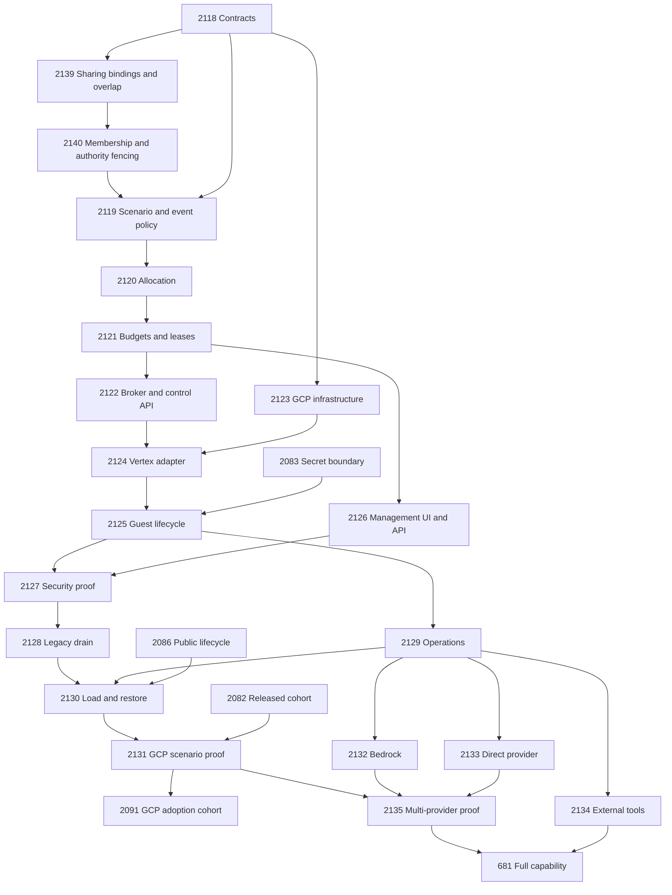

# Model-access implementation and dependency ledger

Design: [#681 / PLAT-202](index.md). Created and verified 2026-09-06.
The full capability remains tracked by [#681](https://github.com/Brad-Edwards/shifter/issues/681).
The design PR references it without a closing keyword.

## Delivery ownership

Each row is a bounded implementation or evidence task with concrete code
entry points, acceptance criteria and verification in its GitHub body.
The expected unit is a focused PR; where a migration needs multiple releases,
its issue owns the expand/drain/contract sequence and records each PR.
Every source change carries its meaningful local tests. Separate test issues
own independent deployed evidence, not an excuse to ship untested code.

| Package | Issue and outcome | Milestone | Native prerequisites |
| --- | --- | --- | --- |
| M01 | [#2118: define policy catalog and shared access contracts](https://github.com/Brad-Edwards/shifter/issues/2118) | 35 | Reviewed design on dev |
| M19 | [#2139: persist sharing bindings and resolve overlapping policies](https://github.com/Brad-Edwards/shifter/issues/2139) | 35 | [#2118](https://github.com/Brad-Edwards/shifter/issues/2118) |
| M20 | [#2140: project sharing membership and fence authority changes](https://github.com/Brad-Edwards/shifter/issues/2140) | 35 | [#2139](https://github.com/Brad-Edwards/shifter/issues/2139) |
| M02 | [#2119: bind scenario and event intent to enforcing model demand](https://github.com/Brad-Edwards/shifter/issues/2119) | 35 | [#2118](https://github.com/Brad-Edwards/shifter/issues/2118), [#2140](https://github.com/Brad-Edwards/shifter/issues/2140) |
| M03 | [#2120: persist quota-aware shard allocations and grant bindings](https://github.com/Brad-Edwards/shifter/issues/2120) | 35 | [#2119](https://github.com/Brad-Edwards/shifter/issues/2119) |
| M04 | [#2121: enforce atomic request budgets and dispatch leases](https://github.com/Brad-Edwards/shifter/issues/2121) | 35 | [#2120](https://github.com/Brad-Edwards/shifter/issues/2120) |
| M05 | [#2122: add the private broker and authenticated Engine control API](https://github.com/Brad-Edwards/shifter/issues/2122) | 35 | [#2121](https://github.com/Brad-Edwards/shifter/issues/2121) |
| M06 | [#2123: package model broker identity and private range reachability](https://github.com/Brad-Edwards/shifter/issues/2123) | 35 | [#2118](https://github.com/Brad-Edwards/shifter/issues/2118) |
| M07 | [#2124: implement the Vertex invocation and usage adapter](https://github.com/Brad-Edwards/shifter/issues/2124) | 35 | [#2122](https://github.com/Brad-Edwards/shifter/issues/2122), [#2123](https://github.com/Brad-Edwards/shifter/issues/2123) |
| M08 | [#2125: bind guest enrollment and revocation to range lifecycle](https://github.com/Brad-Edwards/shifter/issues/2125) | 35 | [#2124](https://github.com/Brad-Edwards/shifter/issues/2124), [#2083](https://github.com/Brad-Edwards/shifter/issues/2083) |
| M09 | [#2126: expose scoped operator and organizer management](https://github.com/Brad-Edwards/shifter/issues/2126) | 35 | [#2121](https://github.com/Brad-Edwards/shifter/issues/2121) |
| M10 | [#2127: prove model-access identity and revocation boundaries](https://github.com/Brad-Edwards/shifter/issues/2127) | 35 | [#2125](https://github.com/Brad-Edwards/shifter/issues/2125), [#2126](https://github.com/Brad-Edwards/shifter/issues/2126) |
| M11 | [#2128: drain and retire legacy guest provider credentials](https://github.com/Brad-Edwards/shifter/issues/2128) | 36 | [#2127](https://github.com/Brad-Edwards/shifter/issues/2127) |
| M12 | [#2129: add operator telemetry and bounded reconciliation](https://github.com/Brad-Edwards/shifter/issues/2129) | 36 | [#2125](https://github.com/Brad-Edwards/shifter/issues/2125) |
| M13 | [#2130: qualify load, rollout and restore failure behavior](https://github.com/Brad-Edwards/shifter/issues/2130) | 36 | [#2128](https://github.com/Brad-Edwards/shifter/issues/2128), [#2129](https://github.com/Brad-Edwards/shifter/issues/2129), [#2086](https://github.com/Brad-Edwards/shifter/issues/2086) |
| M14 | [#2131: qualify the selected scenario's brokered model access](https://github.com/Brad-Edwards/shifter/issues/2131) | 37 | [#2130](https://github.com/Brad-Edwards/shifter/issues/2130), [#2082](https://github.com/Brad-Edwards/shifter/issues/2082) |
| M15 | [#2132: add the cross-account Bedrock broker adapter](https://github.com/Brad-Edwards/shifter/issues/2132) | 22 | [#2129](https://github.com/Brad-Edwards/shifter/issues/2129) |
| M16 | [#2133: add a direct Anthropic provider adapter](https://github.com/Brad-Edwards/shifter/issues/2133) | 22 | [#2129](https://github.com/Brad-Edwards/shifter/issues/2129) |
| M17 | [#2134: add capability-scoped external HTTPS tool invocation](https://github.com/Brad-Edwards/shifter/issues/2134) | 22 | [#2129](https://github.com/Brad-Edwards/shifter/issues/2129) |
| M18 | [#2135: prove multi-provider allocation and adapter conformance](https://github.com/Brad-Edwards/shifter/issues/2135) | 22 | [#2131](https://github.com/Brad-Edwards/shifter/issues/2131), [#2132](https://github.com/Brad-Edwards/shifter/issues/2132), [#2133](https://github.com/Brad-Edwards/shifter/issues/2133) |

## Milestone scope

- [35 — BigRAE GCP 1: scope and security foundations](https://github.com/Brad-Edwards/shifter/milestone/35):
  #2118–#2127 and #2139–#2140, ending in effective GCP identity, network,
  configurable sharing and revocation proof.
- [36 — BigRAE GCP 2: reliable operations](https://github.com/Brad-Edwards/shifter/milestone/36):
  #2128–#2130, legacy credential retirement, telemetry/reconciliation, load and restore.
- [37 — BigRAE GCP 3: qualified scenarios and adoption](https://github.com/Brad-Edwards/shifter/milestone/37):
  #2131, the released scenario's GCP model-access evidence consumed by #2091.
- [22 — Backend Bundles & Substrate Program](https://github.com/Brad-Edwards/shifter/milestone/22):
  #2132–#2135 and the full #681 tracker, covering additional provider/account/cloud
  adapters, external tools and conformance beyond the GCP adoption slice.

#681 moved from milestone 35 to 22 because its original PLAT-202 scope
includes multiple providers and external tool APIs. Its GCP security
foundation work is retained explicitly in milestone 35. No existing
requirement was narrowed or marked complete.

## Native dependency semantics

Dependencies were created with `gh api` using
`POST /repos/Brad-Edwards/shifter/issues/{number}/dependencies/blocked_by`
and the prerequisite's numeric GitHub database `issue_id`, not its issue
number. The [API contract](https://docs.github.com/en/rest/issues/issue-dependencies)
defines these native blocking relationships. Narrative references and
`blocked` labels are not the dependency mechanism.

Readback verified all 20 issue states, milestone assignments, PLAT-202
references and the exact changed blocker lists. The complete reachable
prerequisite graph is acyclic. The machine-readable
[dependency snapshot](dependencies.json) records 28 implementation edges,
two terminal prerequisites of #681, and one GCP adoption edge: **31 added
relationships** in total.

Only one existing relationship was removed: #2091 blocked by #681. It was
replaced by #2091 blocked by #2131 after the latter was created and verified.
All 14 other original #2091 blockers and #681's existing #1295 blocker were
preserved. This keeps AWS/Bedrock and unrelated external-tool qualification
outside the GCP adoption gate, as required by #2080's scope.

#681 is blocked by #2134 (external tool capability) and #2135 (multi-provider
model proof); their transitive prerequisites cover every new implementation
issue. No child is blocked by #681, which would create an umbrella cycle.
These native relationships express work order; GitHub does not replace
review, CI or evidence acceptance with a dependency relation.

Arrows in the diagram run prerequisite → dependent; the JSON and table
use the GitHub `blocked_by` direction (dependent → prerequisite). The graph
above shows new work and its immediate external inputs; the JSON also
retains existing ancestors and adoption blockers.

## Sharing amendment

The original design landed in #2136. The subsequent clarification makes
partial or complete sharing across selected ranges, users, groups, CTF
collections and all deployment ranges an explicit first-delivery requirement.
The [sharing contract](sharing.md) specifies independent facets, membership
modes, overlapping policies and pooled allocation/accounting.

#2139 owns Engine binding/pool persistence and deterministic effective-policy
resolution. #2140 owns authoritative membership adapters and transactional
revision fencing. They consume #2118's shared types and block #2119 before
allocation/accounting consumers. This amendment adds three native edges and
removes none; all original blockers and milestone assignments are preserved.

Existing issues #2118–#2121, #2125–#2127 and #2129–#2131 now include explicit
sharing acceptance for their own boundaries. Shared assignment/capacity stays
in allocation, atomic pooled balances stay in accounting, management stays in
the existing UI/API task, and GCP qualification must demonstrate every supported
collection and partial/all sharing. The complete readback graph has 47 nodes.

## Existing work and completion boundaries

- #680/ADR-047 are the capacity-planning foundation. #2119/#2120 extend them
  rather than inventing a second allocator. #668/#621 already have code;
  #2119 reconciles their remaining model-demand acceptance.
- #1586 owns the dedicated dynamic-secret project design; #2083 owns its
  effective implementation. It blocks guest enrollment and legacy migration
  where secret/bootstrap operations depend on that boundary.
- #1446's request for another guest Vertex-key path conflicts with the new
  broker delivery. #2125/#2128 own the replacement wiring and reconciliation
  if that scenario is selected; this plan does not silently certify the scenario.
- #2082 selects released scenario/contract artifacts. #2086 owns public
  lifecycle/retry truth. They gate only the issues that consume those outcomes.
- PLAT-215 runtime/experiment metering and prompt capture are separate.
  Mandatory budget accounting does not authorize a prompt-capture subsystem.

Design completion means the proposed ADRs and architecture/security/ops
documents are reviewable in a PR to `dev`, and the issue graph is verified.
It does not close #681 or assert deployment readiness. Implementation starts
from the reviewed design; necessary decision changes and ADR status adoption
must be recorded in the implementation PR rather than assumed.

GCP adoption consumes #2131 after its security, migration, load and recovery
prerequisites. Full PLAT-202 completion additionally requires the separately
qualified model/provider and external-tool capabilities in #2135/#2134.
Each evidence issue binds actual artifacts and reports limitations; future
adapters cannot inherit an unrelated provider's evidence.

All new issues reference the existing Ground Control requirement PLAT-202.
This change does not mutate requirement status or fabricate IMPLEMENTS/TESTS
links. Requirement management and actual implementation/test traceability
remain in the Ground Control MCP workflow when implementation starts.
Repository requirement snapshots are not edited as a substitute for that API.
