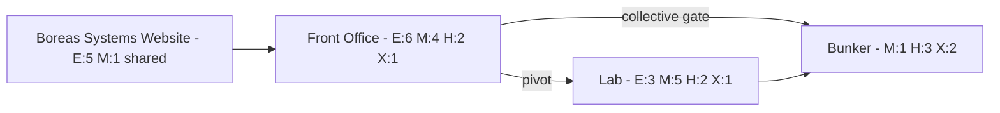
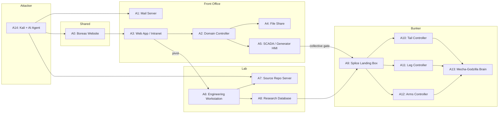

# Operation NORTHSTORM - Scenario Architecture

## Zone Layout

## Flags Per Zone

| Zone | Easy | Medium | Hard | Expert | Total |
|------|------|--------|------|--------|-------|
| Shared OSINT | 5 | 1 | - | - | 6 |
| Front Office | 6 | 4 | 2 | 1 | 13 |
| Lab | 3 | 5 | 2 | 1 | 11 |
| Bunker | - | 1 | 3 | 2 | 6 |
| **Total** | **14** | **11** | **7** | **4** | **36** |

## Missions

- **M1: Who are they?** — Identify the organization and its people. OSINT + Front Office. Easy/Medium.
- **M2: What are they building?** — Piece together Leviathan from fragments. Front Office + Lab. Medium/Hard.
- **M3: Lights out** — Disrupt operations, kill the generator. Front Office. Hard/Expert. Collective gate.
- **M4: Seize the brain** — Take control of the master AI. Lab + Bunker. Expert.

## Flag Breakdown

| # | Flag | Zone | Diff | M1 | M2 | M3 | M4 |
|---|------|------|------|:--:|:--:|:--:|:--:|
| 1 | Boreas Systems company info | OSINT | E | x | | | |
| 2 | Employee directory / org chart | OSINT | E | x | | | |
| 3 | Job posting reveals tech stack | OSINT | E | x | | | |
| 4 | Client list / cover contracts | OSINT | E | x | | | |
| 5 | DNS records reveal internal hostnames | OSINT | E | x | | | |
| 6 | Supplier identified from public filings | OSINT | M | x | x | | |
| 7 | Creds in web app config | FO | E | x | | | |
| 8 | Employee email with project hints | FO | E | x | x | | |
| 9 | HR records — terminated engineer | FO | E | x | | | |
| 10 | Password reuse gives mail access | FO | E | x | | | |
| 11 | Cafeteria menu / mundane file share | FO | E | x | | | |
| 12 | Internal wiki — "the project" references | FO | E | x | x | | |
| 13 | Procurement orders — hydraulic actuators | FO | M | x | x | | |
| 14 | AD enumeration — suspicious accounts | FO | M | | x | | |
| 15 | Lateral movement to second host | FO | M | | | x | |
| 16 | Guard rotation logs — unreliable guard | FO | M | x | | x | |
| 17 | Privilege escalation — domain admin | FO | H | | | x | |
| 18 | SCADA interface discovered on network | FO | H | | | x | |
| 19 | Generator SCADA override — collective gate | FO | X | | | x | |
| 20 | Default creds on dev tooling | Lab | E | | x | | |
| 21 | Research file share — compartment A | Lab | E | | x | | |
| 22 | Shipping manifest — reactor delivery | Lab | E | | x | | |
| 23 | Simulation archive — bipedal stress test | Lab | M | | x | | |
| 24 | Source repo — control software | Lab | M | | x | | x |
| 25 | MIDNIGHT test series — full integration sim | Lab | M | | x | | |
| 26 | Engineering notes — 100m structure | Lab | M | | x | | |
| 27 | Compartment pivot — weapons specs | Lab | M | | x | | |
| 28 | Assembly status log — what's complete | Lab | H | | x | | x |
| 29 | Full Leviathan schematic assembly | Lab | H | | x | | |
| 30 | Leviathan simulation video recovered | Lab | X | | x | | |
| 31 | OT network enumeration — protocol map | Bunker | M | | | | x |
| 32 | Tail motor controller data | Bunker | H | | x | | x |
| 33 | Leg joint actuator data | Bunker | H | | x | | x |
| 34 | Arms controller — weapons integration | Bunker | H | | x | | x |
| 35 | Mecha-Godzilla brain access | Bunker | X | | | | x |
| 36 | Combat system seized | Bunker | X | | | | x |

## Expected Progression (4 hours, with AI agent)

| Participant Level | Likely Missions | Flags |
|---|---|---|
| Novice | M1 complete | 10-14 |
| Intermediate | M1 + M2 partial | 16-22 |
| Advanced | M1 + M2 + M3 + M4 attempt | 25-35 |

## Asset Map

## Flags by Asset

| Asset | Flags |
|-------|-------|
| A0: Boreas Website | 1, 2, 3, 4, 5, 6 |
| A1: Mail Server | 8, 10, 15 |
| A2: Domain Controller | 14, 16, 17 |
| A3: Web App / Intranet | 7, 12 |
| A4: File Share | 9, 11, 13 |
| A5: SCADA / Generator HMI | 18, 19 |
| A6: Engineering Workstation | 20, 22, 23, 25, 26, 30 |
| A7: Source Repo Server | 24, 29 |
| A8: Research Database | 21, 27, 28 |
| A9: Splice Landing Box | 31 |
| A10: Tail Controller | 32 |
| A11: Leg Controller | 33 |
| A12: Arms Controller | 34 |
| A13: Mecha-Godzilla Brain | 35, 36 |

*36 total flags*

## Infrastructure

- Single GKE cluster on GCP
- One namespace per participant (~110 namespaces), each containing A1-A4, A6, A8-A13, A14 (Kali) — 12 pods each
- Shared namespace for A0 (Boreas website), A5 (SCADA/Generator HMI), A7 (Source Repo Server), and CTFd scoreboard
- Network policies isolate participant namespaces from each other
- A2 (Domain Controller): Samba DC in container first choice; fall back to Compute Engine Windows VMs or GDC VM runtime if AD attack paths require real Windows
- ~110 namespaces x 12 pods = ~1320 pods + shared pods
