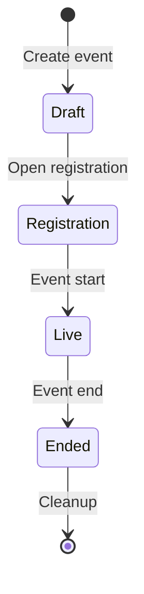

# CTF Organizer Guide

How to run a capture-the-flag event end to end. The organizer surface lives under the
**CTF Admin** area of the portal (`/ctf/admin/`) and is restricted to users with CTF
organizer access.

## Event Lifecycle

## 1. Create the Event

From **CTF Admin → Events → Create**, set the core parameters:

| Setting | Purpose |
|---------|---------|
| Name / description | Shown to participants |
| Scenario | The range scenario each participant gets |
| Event start / end | Competition window |
| Registration deadline | Latest time a participant may register |
| Max participants | Capacity limit |
| Team mode / team size | Individual vs. team competition |
| Range spin-up minutes | Lead time to provision ranges before start |
| Submission cooldown / attempt limit | Anti-brute-force throttles |
| Scoreboard visibility / freeze | Whether and when standings are shown |
| Auto cleanup / cleanup delay | Whether ranges are torn down after the event |
| Publish public registration page | Opt-in public event details and request form; off by default |

### Optional public registration

Enable **Publish public registration page** only when you want an unauthenticated
signup surface for this event. The form previews the disclosure: event name,
description, start/end times, effective registration deadline, and timezone. It does
not publish the scenario, workspace, capacity, participant roster, rules, challenges,
briefing, custom pages, or logo. The privacy notice linked from the page is
operator-supplied; review it for your deployment before sharing the URL.

The share link appears on the event overview after publication is enabled. The page
is reachable only while the event is in **Registration** and the event remains
explicitly published. Turning the switch off, starting, or cancelling the event
closes the public route without changing the stored switch.

## 2. Add Challenges

Under an event, **Challenges → Create**. For each challenge set its name, category,
description, points, difficulty, and the flag. Flags are stored as a salted hash, so
the plaintext flag is never persisted after creation.

Additional controls:

- **Release time**: schedule a challenge to appear partway through the event.
- **Prerequisite**: lock a challenge until another is solved.
- **Visibility**: hide a challenge from the participant list until you release it.
- **Target instance / port**: point participants at the right host in their range.
- **Files**: upload challenge attachments.
- **Hints**: optional, point-reducing hints.

A challenge can carry multiple flags (for multi-stage solves), each validated
independently.

### Scenario-provided challenges

Some deployments bind a scenario to an immutable native CTF content bundle.
Selecting that scenario while creating an event automatically populates its
challenges, flags, hints, and prerequisite graph. Do not manually import or
duplicate challenges for such an event.

Managed content is fail closed. An organizer edit marks the event content as
drifted, and the event cannot be activated from registration. Create a new
event to adopt a revised bundle instead of overwriting or merging the existing
graph. The selected scenario also cannot be changed after managed content has
been created.

## 3. Participant Briefing

Give participants event-specific orientation: what environment they are in, how their
range is reached, and where to start. This is the guidance a shared help page cannot
carry—for example, that they are a red-team operator on a Kali workstation inside a
target network, reached from that box, with the public website, DNS server, and domain
controller as useful first objectives.

Author it from the event's admin page in the **Participant briefing** editor. It is
Markdown: headings, lists, code, and links render; raw HTML, scripts, and images do
not, and unsafe link schemes (such as `javascript:` and `data:`) are stripped when the
briefing is shown. Editing updates the published briefing in place; removing it
restores the generic help.

The briefing is stored and shown verbatim in the language you write it—the platform
does not translate it, so you own its wording. Because it is visible to every
participant, never put flags, passwords, invitation or reset links, range credentials,
or any other secret in it.

When a briefing exists, participants get a **Briefing** entry on their event home and a
dedicated briefing page. An event with no briefing shows the standard help unchanged,
so nothing regresses if you do not author one.

## 4. Manage Participants

From an event's **Participants** page you can add participants individually or bulk
import a roster. Each participant is tracked through registration, range assignment,
and scoring. Use **Brackets** to group participants into ranked cohorts, and (in team
mode) manage team membership.

Requests from the optional public page appear separately at the top of this screen.
**Reject** closes a request without side effects. **Approve** sends the request
through the same participant-admission path as a manual add: current capacity and
duplicate-email policy are rechecked, then the isolated account, participant seat,
and normal provisioning wake-up are created. A public submission itself never sends
mail, creates credentials, reserves capacity, or provisions a range. Requests can be
reviewed only once and their PII is removed by the scheduler after the event-relative
participant-account retention window.

Participants use isolated temporary accounts on the dedicated CTF login page.
Generate accounts before an event and hand out each generated username and initial
password manually, or attach an optional delivery email for non-secret login
information. By default, every new account receives its own strong generated
password. If an event explicitly needs one shared initial password, set it on the
event form; leaving that field blank while editing preserves the existing policy,
and **Disable the event shared participant password** returns new accounts to unique
generated passwords.

Use **Manage password** on the participant list or detail page to generate a new
password or set a policy-compliant one. The result is displayed once and cannot be
retrieved later. Resetting a participant does not change the event-wide policy for
new accounts. A reset invalidates the participant's existing web sessions and API
tokens and requires a password change on next login. Invitation resend sends only
the login URL and username; it never resets or emails a password. Generated
usernames remain globally unique and start with `range-`.

Accounts stop authenticating at event end and are anonymized after the configured
participant-account retention window.

## 5. Ranges

The **Ranges** page shows the provisioning state of every participant's range. The
platform provisions ranges automatically around the spin-up window and, when auto
cleanup is enabled, tears them down after the event. The CTF scheduler drives batch
provisioning; see the technical
[CTF documentation](../technical/shifter_platform/ctf) for how it runs.

### Recovering a destroyed range

Live-fire scenarios can leave a participant's range unrecoverable in place (the
participant or their agent may encrypt, wipe, or corrupt it). From the **Ranges** page
you can recover a single participant's range without editing any records by hand:

- **Rebuild** provisions a fresh range for the same event and scenario.
- **Reassign spare** hands the participant a prewarmed spare range from the event's spare
  pool, when one is available.

The old range is always destroyed so it can no longer receive the
participant's traffic, and the participant keeps their scoreboard identity,
submissions, awards, team and bracket membership, and registration. Recovery is safe
to retry after a partial failure. The current recovery phase and any failure reason are
shown on the Ranges page. A participant cannot recover their own range; recovery is
organizer-only.

### Setting the spare pool

The **Spare pool** panel on the Ranges page controls how many prewarmed ranges are
kept ready for **Reassign spare** recovery. Set the target pool size and update it;
the platform provisions any shortfall under managed system accounts (never
counted as participants) and shows the current target, available, provisioning,
and failed counts. The pool only grows on request; it does not shrink automatically.
Unconsumed spares are torn down along with the rest of the event's ranges during
event cleanup.

### Recovery spares vs. the initial-launch warm pool

The event **recovery-spare** pool described here is distinct from the
deployment-level **warm pool** for faster *initial* launches (see
[Ranges](ranges.md)). Recovery spares replace a participant range that **fails
mid-event** via **Reassign spare**; the warm pool speeds up the *first* launch by
handing out a pre-provisioned range. They are configured separately (recovery
spares per event here; the warm pool in `shifter.yaml`), accounted separately
against capacity, and never share generations; a recovery spare is never claimed
as an initial-launch warm range, and vice versa.

## 6. Notifications

Use **Notifications** to send announcements during the event and **Email Templates**
to configure reminder messages. Events can also send registration reminders at the
hour offsets you configure.

## 7. During and After the Event

- The **Scoreboard** updates as submissions land. Freeze it near the end to keep final
  standings suspended until close.
- **Analytics** summarizes solves, attempts, and challenge difficulty in practice.
- After the event, scoring can be recomputed authoritatively if needed (see the
  technical docs for the leaderboard recompute command).

## See Also

- [CTF](ctf): the participant experience.
- [CTF technical documentation](../technical/shifter_platform/ctf): models, services,
  scheduling, and range provisioning.
- [Native CTF scenario content](../dev/ctf-scenario-content): publish and bind
  private, digest-pinned event content.
