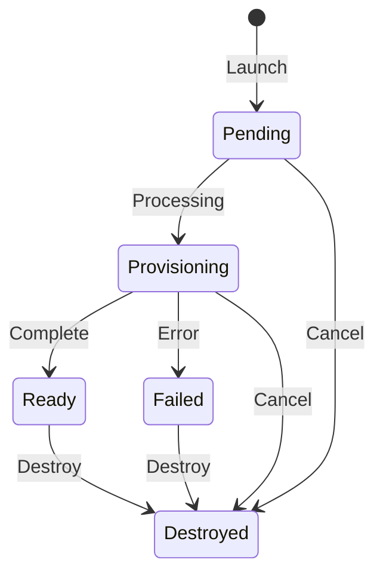

# Ranges

Launch and manage isolated demo environments.

## Range Lifecycle



## Status Reference

| Status | Meaning |
|--------|---------|
| Pending | Queued for provisioning |
| Provisioning | Infrastructure being created |
| Ready | Range is live, accessible |
| Failed | Provisioning error occurred |
| Destroyed | Range terminated |

## Launch a Range

1. Go to **Ranges page**
2. Select a scenario
3. Select an agent
4. Click **Launch Range**

Provisioning takes about 10 minutes.

## Monitor Provisioning

The Ranges page shows real-time status updates during provisioning. You'll see progress as instances are created and configured.

## Access a Range

Once Ready:

1. Go to **Terminal**
2. Select an instance
3. Use SSH or RDP to connect

When the active range advertises VPN access, Mission Control also offers a
**Download VPN profile** action. Treat the `.ovpn` file as a private credential.

See [Terminal](terminal) for details.

## Range Lifetime

Mission Control ranges have a server-owned lease: an initial lifetime, a
per-extension increment, and a maximum lifetime a range can never exceed. The SPA
shows the time remaining and the scheduled cleanup time on the active range page,
and offers **Extend by up to N days** (the configured increment), bounded by the
range's maximum lifetime. Expired ranges are automatically destroyed.

The default lease is **30 / 30 / 365 days** (initial / increment / maximum).

CTF participant and spare ranges use the CTF event cleanup time as their
deadline and are removed automatically through the same range cleanup process;
they are unaffected by the Mission Control lease policy below.

### Configuring the lease policy

The deployment setting is the fallback policy. Set it in `shifter.yaml` under
`settings.mission_control_leases`; the same provider-neutral block applies to both
AWS and GCP:

```yaml
settings:
  mission_control_leases:
    initial_days: 30        # lifetime a new range starts with (positive)
    extension_days: 30      # increment each extension adds (positive)
    maximum_days: 365       # ceiling a range can never exceed (positive, >= initial_days)
    extensions_enabled: true
```

Rules and behavior:

- All fields are optional; omitted fields use the defaults above, so an omitted
  block keeps the historical 30 / 30 / 365 behavior.
- `initial_days` must be positive and no greater than `maximum_days`;
  `extension_days` must be positive. `extension_days` may exceed `maximum_days`;
  an extension is always bounded by the range's remaining lifetime. Invalid
  combinations fail configuration validation at install time, not at range launch.
- **New ranges only.** Durations are snapshotted onto each range generation when it
  is created. Changing the policy applies to ranges created afterward; ranges that
  already exist keep the deadlines and increment they launched with. Lowering
  `maximum_days` does not shorten existing ranges, and raising it does not extend
  their ceilings.
- **`extensions_enabled: false`** is a live switch that denies further extensions
  across all Mission Control ranges after the deployment rolls out. It does not
  shorten any deadline and does not stop automatic cleanup; expired ranges are
  still destroyed. Use it to stop new extensions without orphaning ranges. Setting
  `initial_days` equal to `maximum_days` only prevents extensions for new ranges and
  is not a substitute for the switch.
- **Cost.** Longer leases increase standing infrastructure, storage, and access
  exposure for the lease duration; shorter leases reduce cost but can expire while a
  range is still in use. Cleanup is asynchronous destruction dispatch, so billing
  stops when destruction completes, not exactly at the deadline.

Deployment-fallback changes take effect after the platform processes roll out
with the new configuration (the runtime ConfigMap change triggers a normal
rolling restart); mixed old/new processes may briefly apply different fallback
policies until the rollout completes.

### Runtime tenant and group policy (platform administrators)

An active platform superuser can change the effective Mission Control policy at
**Administer → Platform settings** without redeploying Shifter. The page always
shows the deployment fallback and whether the tenant currently uses that
fallback or a runtime replacement.

- Saving the tenant policy replaces all four fields as one revision-checked
  operation. **Reset tenant policy** removes the runtime row and restores the
  current deployment fallback.
- A policy on an administrator-controlled Django RBAC group replaces the tenant
  values for that group. If a user belongs to several configured groups, the
  lowest initial, extension, and maximum durations win and extensions are
  enabled only when every matching group and the tenant allow them. Group
  initial and maximum durations cannot exceed the effective tenant maximum.
- `CTF Participant`, provider claim strings, CTF teams, and workspace or
  organization roles never select a Mission Control policy. Group policy
  restricts lease behavior; it does not grant launch or range access.
- Runtime duration changes affect new cold-created and warm-claimed generations
  only. Existing generations retain their snapshotted deadlines and increment.
  The current tenant/group `extensions_enabled` switch is checked live and can
  stop another extension without shortening a range or disabling cleanup.
- Each save or reset is strict-audited and uses the revision displayed by the
  page. A stale browser receives a conflict and must refresh instead of silently
  overwriting a newer change. Reset advances that revision even though the
  override is removed, so a later replacement cannot reuse an old revision.

## Cancel a Range

While in Pending or Provisioning status:

1. Go to **Ranges page**
2. Click **Cancel** on the range

## Destroy a Range

When finished:

1. Go to **Ranges page**
2. Click **Destroy** on the range

This is irreversible. All range data is deleted.

## Warm pool for faster initial launch

A deployment can keep a **warm pool** of pre-provisioned, system-owned ranges so an
initial launch is handed a ready range instead of waiting for cold provisioning.
Warm pooling is **disabled by default**; an operator enables it in `shifter.yaml`
under `settings.warm_pool`.

How it behaves:

- Launch first tries to atomically claim a compatible ready range from the pool. On
  a hit, the range is transferred to the launching user with **fresh, fully
  re-established credentials and access**. No prior tenant's data, credentials, or
  sessions cross the ownership boundary. On a miss (empty pool, an incompatible
  request, or a backend without warm support), launch **falls back to normal cold
  provisioning** with no change in behavior.
- Compatibility is decided by the exact immutable launch inputs (backend, region,
  scenario package/lock digest, purpose, access posture). A scenario, image, or
  config change makes older ready ranges incompatible; the pool retires them and
  prepares new ones.
- **Supported backends:** the GCE range-cell backend is warm-capable today. AWS and
  the retained GDC substrate report warm activation as unsupported and always
  cold-provision (AWS support is tracked separately).

Sizing and cost:

- Each bucket declares a `target`, `minimum`, and `maximum` ready count and a warm
  idle lifetime. Warm ranges **count against provider capacity and cost admission**
  exactly like a launched range. A warm pool trades standing cost for lower launch
  latency, so size `target` to your expected concurrent cold-start demand, not
  higher.
- A capacity or cost ceiling can hold the pool below `minimum`; the reconciler
  alerts rather than exceeding a ceiling.
- Metrics are published to the `Shifter/WarmPool` namespace: ready / provisioning /
  unhealthy counts, claim hit and fallback rates, and idle age, per bucket and
  backend/region.

This warm pool is distinct from the CTF **recovery-spare** pool (see the CTF
organizer guide): recovery spares replace a *failed participant range mid-event*,
while the warm pool speeds up *initial* launches. The two are configured and
accounted separately.

## Limits

- One active range at a time per user
- Mission Control ranges cannot be extended past their maximum lifetime (default
  365 days from creation; see [Configuring the lease policy](#configuring-the-lease-policy-operators))
- Warm-pool claims apply to RAES-native (GCE) initial launches; other backends
  cold-provision.
