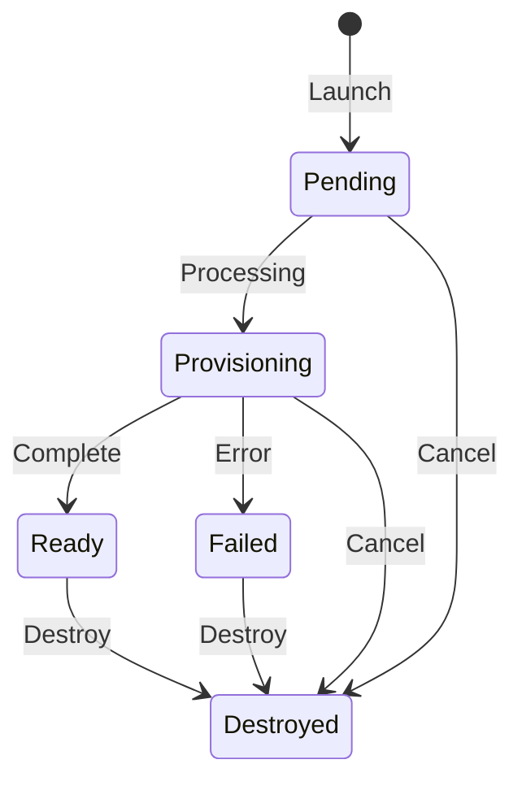

# Ranges

Launch and manage isolated demo environments.

## Range Lifecycle

## Status Reference

| Status | Meaning |
|--------|---------|
| Pending | Queued for provisioning |
| Provisioning | Infrastructure being created |
| Ready | Range is live, accessible |
| Failed | Provisioning error occurred |
| Destroyed | Range terminated |

## Launch a Range

1. Go to **Ranges page**
2. Select a scenario
3. Select an agent
4. Click **Launch Range**

Provisioning takes about 10 minutes.

## Monitor Provisioning

The Ranges page shows real-time status updates during provisioning. You'll see progress as instances are created and configured.

## Access a Range

Once Ready:

1. Go to **Terminal**
2. Select an instance
3. Use SSH or RDP to connect

When the active range advertises VPN access, Mission Control also offers a
**Download VPN profile** action. Treat the `.ovpn` file as a private credential.

See [Terminal](terminal) for details.

## Range Lifetime

Mission Control ranges start with a 30-day lifetime. The SPA shows both the time
remaining and the scheduled cleanup time on the active range page. Use
**Extend by up to 30 days** to extend the deadline, up to the range's fixed
365-day maximum lifetime. Expired ranges are automatically destroyed.

CTF participant and spare ranges use the CTF event cleanup time as their
deadline and are removed automatically through the same range cleanup process.

## Cancel a Range

While in Pending or Provisioning status:

1. Go to **Ranges page**
2. Click **Cancel** on the range

## Destroy a Range

When finished:

1. Go to **Ranges page**
2. Click **Destroy** on the range

This is irreversible. All range data is deleted.

## Limits

- One active range at a time per user
- Mission Control ranges cannot be extended past 365 days from creation
