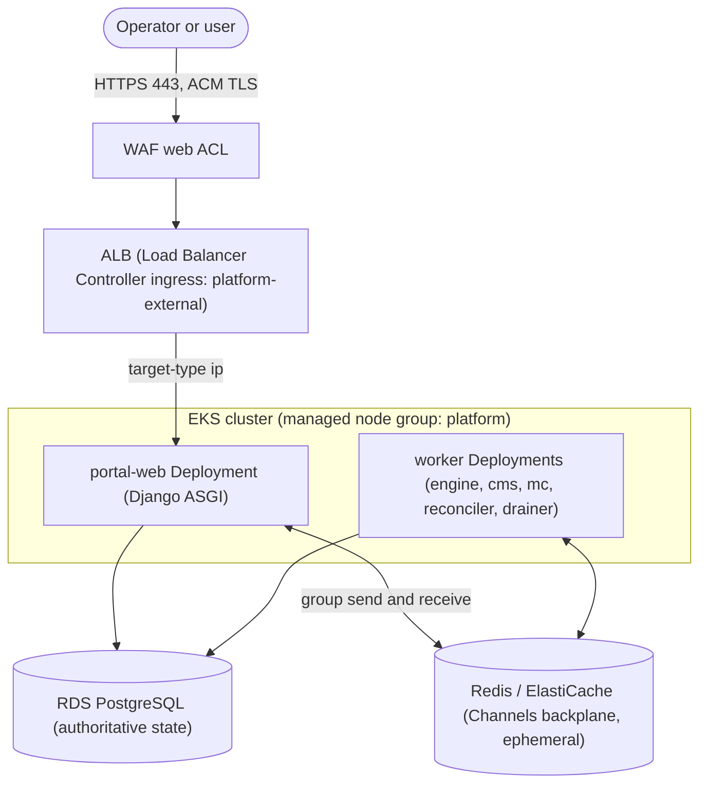

# Portal on EKS operations runbook

Tracking issue: <https://github.com/Brad-Edwards/shifter/issues/188>
Ownership and security model: [AWS EKS backend bundle](../technical/platform_infrastructure/aws-eks-bundle.md)
Region: `us-east-2` (all AWS Portal resources)

This runbook is the operator procedure for running the Portal on EKS: how to
monitor it, scale it, deploy to it, troubleshoot it, and roll it back. It covers
the AWS EKS platform compute path only. Range and target delivery (the VMs
inside a range) remain ECS/VM behind the ADR-039 range adapter and are out of
scope here.

## Scope and status

Under [ADR-044](../adr/README.md), EKS plus the `platform/charts/shifter` Helm
chart is the canonical AWS platform compute path. New AWS deployments use EKS;
the older EC2 Auto Scaling Group (ASG) portal path is a retained compatibility
path with separate Terraform state and a controlled cutover. In CI the ASG
deploy lane is disabled (`inputs.environment == '__legacy-disabled__'` in
`.github/workflows/_shifter-platform.yml`); the active AWS deploy lane is the
`eks-deploy` job in the same workflow. For an ASG-to-EKS or EKS-to-ASG
transition, follow
[Migrate an AWS deployment from ECS to EKS](../how-to/aws-ecs-to-eks-migration.md).

Prerequisites for the commands below:

- An AWS profile or GitHub OIDC role with the environment's Terraform deploy
  role. Never place access keys, session tokens, or passwords in command
  arguments or in copied examples.
- `kubectl` access acquired through the Terraform-output deploy role, for
  example:

  ```console
  aws eks update-kubeconfig \
    --region us-east-2 \
    --name "$(terraform -chdir=platform/terraform/environments/prod/eks output -raw cluster_name)"
  ```

- Terraform state is the only topology authority. Discover the cluster name,
  node group, ALB name, and resource identifiers from the environment's
  `platform/terraform/environments/<profile>/eks` outputs, never from a guessed
  resource name or a GitHub variable.

Throughout, `<profile>` is the environment (`dev`, `proof`, or `prod`) and the
platform workloads live in the `shifter-platform` namespace.

## 1. Architecture overview



Key relationships:

- **ALB and TLS.** A single public ingress named `platform-external` is served
  by the AWS Load Balancer Controller as an internet-facing ALB. TLS terminates
  at the ALB using an ACM certificate; a WAF web ACL is associated by the
  controller. Client access is restricted with
  `alb.ingress.kubernetes.io/inbound-cidrs`, and the ALB routes to pods with
  `target-type: ip`. These annotations are projected from Terraform outputs at
  deploy time, so they are not committed to the chart values.
- **Django Channels over Redis.** The Portal runs Django Channels (ASGI). Redis
  is the channel layer, the cross-pod backplane that lets any `portal-web`
  replica deliver a WebSocket message originated on any other replica. Redis is
  ephemeral transport, not durable state.
- **No ALB stickiness needed.** Because Redis is the backplane, a WebSocket does
  not need to return to the same pod, so no ALB session-stickiness cookie is
  configured. This differs from the legacy ASG path, which used an ALB cookie.
- **RDS is authoritative.** Application state lives in RDS PostgreSQL. Redis and
  in-cluster pod memory are never durable recovery state.
- **Node autoscaling, fixed pod counts.** Node capacity is managed by
  `cluster-autoscaler` against the managed node group. Pod counts are declarative
  replica values in the chart; there is no HorizontalPodAutoscaler for the Portal
  today.

## 2. Monitoring and health

Inspect live state rather than assuming committed defaults are active.

- **Workload health:**

  ```console
  kubectl -n shifter-platform get deploy,pods -l app.kubernetes.io/component=portal
  kubectl -n shifter-platform rollout status deploy/portal-web
  ```

- **Application readiness.** The `portal-web` liveness and readiness probes hit
  `/health/`, which exercises a Redis round trip and database reachability. From
  a shell with cluster access:

  ```console
  kubectl -n shifter-platform exec deploy/portal-web -- \
    curl -sS -o /dev/null -w '%{http_code}\n' http://localhost:8000/health/
  ```

  The public response is intentionally coarse. Do not expose raw provider error
  text to clients.

- **Channel-layer posture.** On startup each Portal process logs a single
  non-secret channel-layer posture record (backend, whether `REDIS_HOST` is
  present, port, TLS, CA mode). Use it to confirm the process actually selected
  Redis:

  ```console
  kubectl -n shifter-platform logs deploy/portal-web | grep 'channel-layer posture'
  ```

- **Nodes and autoscaling.** Confirm node count and cluster-autoscaler activity:

  ```console
  kubectl get nodes -o wide
  kubectl -n kube-system logs deploy/cluster-autoscaler | tail -n 50
  ```

- **ALB target health.** Read the ingress, then inspect the target group in the
  AWS console or CLI:

  ```console
  kubectl -n shifter-platform get ingress platform-external
  ```

- **Control-plane and container logs.** EKS control-plane logs and pod logs are
  available in CloudWatch. Query only sanitized values: posture records, counts,
  states, instance and node identifiers. Never log tokens, Redis URLs with
  passwords, or environment dumps.

## 3. Scaling operations

### Pod replicas (declarative, canonical)

Portal and worker replica counts are set per profile in the chart values, for
example `portal.replicas` in
`platform/charts/shifter/values-aws-<profile>.yaml`. Change the value and apply
it through the deploy path (a Helm upgrade) so the change is durable and matches
the committed source of truth.

`kubectl scale deploy/portal-web --replicas=<n>` is a transient override for an
incident. The next Helm apply reconciles it back to the values file, so record
any manual change and fold it into the values file if it should persist.

### Nodes (cluster-autoscaler)

`cluster-autoscaler` owns the managed node group's desired size within
`[node_min_size, node_max_size]`. Terraform intentionally ignores changes to the
node group `desired_size` so an apply does not fight the autoscaler.

To change the capacity envelope, edit `node_min_size` and `node_max_size` for the
environment's `eks` root and apply. To temporarily pin node capacity (for
example, to freeze the fleet during an investigation), set
`node_min_size = node_max_size`; that removes headroom for the autoscaler without
removing the node group. Restore the original bounds afterward.

### Expected behavior

- **Scale-out.** When pod replicas increase past node headroom, pods stay
  `Pending` until cluster-autoscaler adds a node and the pods schedule. New
  Portal pods join the Redis backplane, so they can serve any WebSocket.
- **Scale-in.** When load drops, cluster-autoscaler drains and removes
  underused nodes. Managed node group updates use a bounded
  `max_unavailable_percentage`, so a rolling replacement keeps capacity while
  nodes cycle.

## 4. Deployment

Deployment is a Helm upgrade driven by the deploy tooling, not an SSM instance
refresh (that is the legacy ASG path).

- **Pipeline.** The `eks-deploy` job in `.github/workflows/_shifter-platform.yml`
  runs `scripts/bootstrap/deploy.py eks-deploy` with the rendered `shifter.yaml`
  (`backend: aws`), a digest-pinned image file, the backend config, and the EKS
  Terraform inputs. Image identities are `repository@sha256:<digest>`; tags are
  rejected.
- **What happens.** Terraform applies the isolated `eks` root (cluster, private
  placement, IRSA roles, add-ons, ALB and WAF prerequisites, KMS, secret
  stores). Helm then performs an atomic upgrade of the `platform/charts/shifter`
  release. Runtime secret values are hydrated in-process from Secrets Manager by
  the entrypoint; they never enter Helm values, ConfigMaps, or process
  arguments.
- **Verify a deploy completed.** Deploy succeeds only after every managed add-on
  is `ACTIVE`, controller and chart rollouts complete, the admission policy
  rejects a non-launcher provisioner Job, live Deployment and Job probes observe
  the default-deny NetworkPolicy, each workload ServiceAccount receives its
  expected IRSA role and cannot assume a sibling role, and HTTPS `/health/`
  succeeds. Spot-check the workload rollout directly:

  ```console
  kubectl -n shifter-platform rollout status deploy/portal-web
  kubectl -n shifter-platform get pods -o wide
  ```

## 5. Troubleshooting

### WebSocket connections fail

The channel layer is the usual cause.

1. Confirm the resolved backend from the posture log (see
   [Monitoring and health](#2-monitoring-and-health)). A Portal that logs
   `backend=in_memory` cannot fan out across replicas.
2. Confirm `/health/` is green; it exercises the Redis round trip.
3. If `CHANNEL_LAYER_BACKEND=redis` is set but `REDIS_HOST` is absent, the
   process fails closed with `ImproperlyConfigured` at startup rather than
   silently degrading. Check the pod events and logs for that error.
4. Confirm the Redis security group ingress admits the cluster. Redis ingress is
   granted by security-group reference. Do not open Redis (6379) publicly to test
   connectivity.

### Sticky sessions

There are no ALB stickiness cookies on the EKS path by design; the Redis
backplane removes the need for them. If a WebSocket only works when pinned to one
pod, the backplane is not healthy: revisit the channel-layer checks above rather
than adding stickiness.

### Instance or pod health in the target group

```console
kubectl -n shifter-platform get pods -l app.kubernetes.io/component=portal
kubectl -n shifter-platform describe pod <pod>
kubectl -n shifter-platform get ingress platform-external
```

Unhealthy ALB targets usually trace to failing `/health/` probes (database or
Redis reachability) or to the pod not being `Ready`. NetworkPolicy is default
deny; a newly added path that cannot reach a dependency is often a missing
NetworkPolicy allowance rather than an application bug.

### IRSA and admission failures

- A pod that cannot read a secret or object usually has the wrong or missing
  IRSA binding. Confirm the ServiceAccount and its role annotation match the
  expected workload subject.
- A rejected provisioner Job is expected when it is not the dedicated launcher;
  the fail-closed admission policy enforces that boundary.

### Security guardrails while troubleshooting

- Keep Portal ingress ALB-only and Redis ingress security-group referenced. Do
  not temporarily expose port 8000 or 6379 publicly.
- Redis AUTH stays in Secrets Manager and is hydrated by the entrypoint. Do not
  run `get-secret-value` to print it, do not pass a password to `redis-cli`, and
  do not dump a container environment.

## 6. Rollback

### Roll back a platform release

For a bad chart or image release, roll the Helm release back to the previous
revision:

```console
helm -n shifter-platform history shifter
helm -n shifter-platform rollback shifter <previous-revision>
```

Do not destroy the EKS Terraform root as a way to stop workloads.

### Recover the channel layer (Redis)

The channel layer runs on Redis, so recovery means restoring a known-good Redis
backend, not switching backends. If a release broke Redis connectivity or
configuration, roll the platform release back (see
[Roll back a platform release](#roll-back-a-platform-release)) or correct the
Redis configuration, then confirm cross-process delivery: a WebSocket message
published on one `portal-web` pod reaches a client connected to another pod.

Do not switch to `CHANNEL_LAYER_BACKEND=in_memory` as a production rollback.
In-memory Channels is process-local, so it cannot fan out across replicas, or
even across the multiple ASGI workers inside a single pod; it is retained only
for local development and tests. Keep Redis enabled even when the fleet is
reduced to one replica; a single-replica Redis posture is the safer,
event-representative configuration. With an explicit `redis` posture, a missing
`REDIS_HOST` fails closed at startup rather than silently degrading, which is the
intended behavior.

### Roll back to the legacy ASG compatibility path

An EKS-to-ASG rollback is a controlled traffic cutover, not an in-place move, and
the legacy and EKS control planes must never run concurrently against the shared
queues, outboxes, schedulers, and reconciliation state. Follow
[Migrate an AWS deployment from ECS to EKS](../how-to/aws-ecs-to-eks-migration.md),
whose rollback section applies symmetrically: stop the EKS consumer set, confirm
it is quiescent, restore the previous traffic target, then start the legacy
consumer set. Retire either platform root only after the observation window,
recovery evidence, queue and outbox reconciliation, and operator approval.
