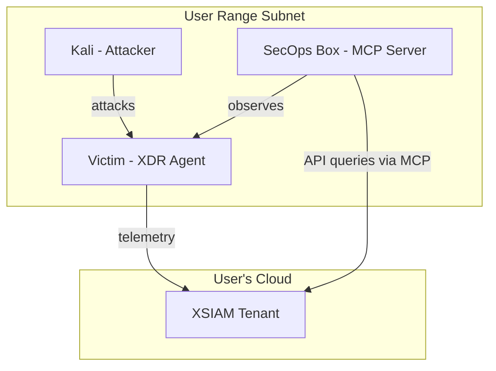

# Cortex XDR MCP Server - SecOps Box Integration Plan

## Overview

This plan describes how to integrate a **SecOps Box** (blue team workstation) into Shifter ranges, running the **Palo Alto Networks Cortex MCP Server** to enable AI-powered security analysis against the user's XSIAM/XDR tenant.

### What is the Cortex MCP Server?

The [Cortex MCP Server](https://www.paloaltonetworks.com/blog/security-operations/introducing-the-cortex-mcp-server/) is Palo Alto Networks' official Model Context Protocol server that:
- Connects to Cortex XDR/XSIAM tenants via API
- Enables natural language queries for security data (incidents, cases, endpoints, assets)
- Works with Claude Desktop, Cursor, VS Code, and other MCP-compatible AI clients
- Runs locally in a Docker container

### Use Case for Shifter

Domain consultants running demos can:
1. Launch attacks from Kali against XDR-protected victims
2. Use the SecOps box to query their XSIAM tenant via AI
3. Demonstrate AI-assisted incident triage and investigation
4. Show how alerts generated by attacks appear in XSIAM via natural language

---

## Architecture

### Current Range Architecture (AD Attack Lab)

```
User Subnet (/24)
├── Kali EC2 (attacker)
├── DC EC2 (domain controller, optional)
└── Victim EC2 (XDR agent → user's XSIAM)
```

### Proposed Architecture (with SecOps Box)

```
User Subnet (/24)
├── Kali EC2 (attacker) - Red Team
├── DC EC2 (domain controller, optional)
├── Victim EC2 (XDR agent → user's XSIAM) - Target
└── SecOps EC2 (Cortex MCP Server) - Blue Team ← NEW
    ├── Docker + Cortex MCP Server
    ├── Claude Desktop or VS Code + MCP extension
    └── Connects to user's XSIAM tenant via API token
```

### Network Flow



---

## Implementation Plan

### Phase 1: Instance Catalog Extension

**Add new role: `secops`**

Update `shifter-engine/catalog/instances.py`:

```python
def _get_secops_instance_type() -> str:
    """Get default instance type for SecOps workstation."""
    # SecOps needs resources for Docker + AI client
    return os.environ.get("SECOPS_INSTANCE_TYPE") or "t3.large"

INSTANCE_CATALOG["ubuntu-24.04-secops"] = InstanceType(
    name="ubuntu-24.04-secops",
    role="secops",  # New role
    _instance_type_getter=_get_secops_instance_type,
    user_data_template="secops_linux.sh.j2",
    description="Ubuntu 24.04 SecOps workstation with Cortex MCP Server",
    ami_lookup={
        "name": "ubuntu/images/hvm-ssd-gp3/ubuntu-noble-24.04-amd64-server-*",
        "owner": "099720109477",
    },
    requires_agent=False,  # No XDR agent on SecOps box
    ssh_user="ubuntu",
)
```

**Files to modify:**
- `shifter-engine/catalog/instances.py` - Add secops instance type
- `shifter-engine/components/range_stack.py` - Handle secops role in provisioning
- `shifter-engine/config.py` - Add secops config fields

### Phase 2: User Data Template

**Create `shifter-engine/templates/secops_linux.sh.j2`:**

```bash
#!/bin/bash
set -e

# Install Docker
curl -fsSL https://get.docker.com | sh
usermod -aG docker ubuntu

# Pull Cortex MCP Server image (placeholder - actual image TBD from PANW)
# docker pull ghcr.io/paloaltonetworks/cortex-mcp-server:latest

# Install desktop environment for GUI access (optional - for Claude Desktop)
apt-get update
apt-get install -y ubuntu-desktop-minimal xrdp

# Configure RDP
systemctl enable xrdp

# Create MCP config directory
mkdir -p /home/ubuntu/.config/claude-desktop
chown -R ubuntu:ubuntu /home/ubuntu/.config

# Signal ready
echo "SecOps box initialized" > /var/log/secops-init.log
```

### Phase 3: XSIAM API Token Management

Users need to provide their XSIAM API credentials to connect the MCP server. Options:

**Option A: Pre-configure via Portal (Recommended)**

1. Add `XSIAMConfig` model to store encrypted API credentials:

```python
# shifter/shifter_platform/mission_control/models.py
class XSIAMConfig(models.Model):
    """User's XSIAM tenant configuration for MCP server."""
    user = models.ForeignKey(User, on_delete=models.CASCADE)
    tenant_url = models.URLField()  # e.g., https://api-tenant.xdr.us.paloaltonetworks.com
    api_key_encrypted = models.BinaryField()  # Encrypted with KMS
    api_key_id = models.CharField(max_length=32)
    created_at = models.DateTimeField(auto_now_add=True)

    class Meta:
        constraints = [
            models.UniqueConstraint(fields=['user'], name='unique_xsiam_per_user')
        ]
```

2. Portal encrypts API key before storage using AWS KMS
3. During provisioning, create SSM Parameter with credentials:
   - `/shifter/{env}/range/{range_id}/xsiam-config`
4. SecOps user data retrieves and configures MCP server

**Option B: User configures post-boot**

- User SSHs to SecOps box and runs setup script
- Less automated but simpler to implement initially

### Phase 4: Scenario Configuration

**Add new scenario: `secops_demo`**

Update `shifter/shifter_platform/mission_control/views.py`:

```python
def _get_scenario_instance_config(scenario: str, agent_os: str) -> list:
    scenarios = {
        "basic": [...],
        "ad_attack_lab": [...],
        # New scenario with SecOps box
        "secops_demo": [
            {"role": "attacker", "os_type": "kali"},
            {"role": "victim", "os_type": os_type},
            {"role": "secops", "os_type": "ubuntu"},  # SecOps box
        ],
        "ad_secops_demo": [
            {"role": "attacker", "os_type": "kali"},
            {
                "role": "dc",
                "os_type": "windows",
                "dc_config": {"domain_name": "shifter.local", "netbios_name": "SHIFTER"},
            },
            {"role": "victim", "os_type": "windows", "join_domain": True},
            {"role": "secops", "os_type": "ubuntu"},  # SecOps box
        ],
    }
    return scenarios.get(scenario, scenarios["basic"])
```

### Phase 5: Security Group Updates

**Terraform: Add SecOps security group**

Update `terraform/modules/range/vpc/`:

```hcl
# secops_sg.tf
resource "aws_security_group" "secops" {
  name        = "${var.prefix}-secops-sg"
  description = "SecOps workstation security group"
  vpc_id      = aws_vpc.range.id

  # SSH from portal
  ingress {
    from_port       = 22
    to_port         = 22
    protocol        = "tcp"
    security_groups = [var.portal_sg_id]
  }

  # RDP from portal (for GUI access)
  ingress {
    from_port       = 3389
    to_port         = 3389
    protocol        = "tcp"
    security_groups = [var.portal_sg_id]
  }

  # HTTPS outbound to XSIAM API
  egress {
    from_port   = 443
    to_port     = 443
    protocol    = "tcp"
    cidr_blocks = ["0.0.0.0/0"]
  }

  # Communication within subnet (observe victim)
  ingress {
    from_port   = 0
    to_port     = 0
    protocol    = "-1"
    self        = true
  }

  tags = {
    Name = "${var.prefix}-secops-sg"
  }
}
```

### Phase 6: Setup Plan for MCP Server

**Create `shifter-engine/components/plans/secops_setup.py`:**

```python
from dataclasses import dataclass
from .setup_plan import SetupPlan, SetupStep

@dataclass
class SecOpsSetupPlan(SetupPlan):
    """Setup plan for SecOps box with Cortex MCP Server."""

    xsiam_tenant_url: str
    xsiam_api_key_id: str
    # API key retrieved from SSM at runtime

    @property
    def steps(self) -> list[SetupStep]:
        return [
            SetupStep(
                name="configure-mcp-server",
                script="""
                    # Retrieve API key from SSM parameter
                    API_KEY=$(aws ssm get-parameter \
                        --name "{{ ssm_param_name }}" \
                        --with-decryption \
                        --query 'Parameter.Value' --output text)

                    # Create MCP server config
                    cat > /home/ubuntu/.config/cortex-mcp/config.json << EOF
                    {
                        "cortex_api_url": "{{ xsiam_tenant_url }}",
                        "cortex_api_key": "$API_KEY",
                        "cortex_api_key_id": "{{ xsiam_api_key_id }}"
                    }
                    EOF
                    chown ubuntu:ubuntu /home/ubuntu/.config/cortex-mcp/config.json
                    chmod 600 /home/ubuntu/.config/cortex-mcp/config.json
                """,
                timeout_seconds=60,
            ),
            SetupStep(
                name="start-mcp-server",
                script="""
                    # Start MCP server container
                    docker run -d \
                        --name cortex-mcp \
                        --restart unless-stopped \
                        -v /home/ubuntu/.config/cortex-mcp:/config:ro \
                        -p 8080:8080 \
                        ghcr.io/paloaltonetworks/cortex-mcp-server:latest
                """,
                timeout_seconds=120,
            ),
        ]

    @property
    def verify_step(self) -> SetupStep:
        return SetupStep(
            name="verify-mcp-server",
            script="""
                # Check container is running
                docker ps | grep cortex-mcp
                # Health check endpoint
                curl -s http://localhost:8080/health || exit 1
            """,
            timeout_seconds=30,
        )
```

---

## Database Schema Changes

### New Models

```python
# shifter/shifter_platform/mission_control/models.py

class XSIAMConfig(models.Model):
    """User's XSIAM tenant configuration."""
    user = models.OneToOneField(User, on_delete=models.CASCADE)
    tenant_url = models.URLField(
        help_text="XSIAM API URL (e.g., https://api-tenant.xdr.us.paloaltonetworks.com)"
    )
    api_key_id = models.CharField(max_length=32)
    api_key_secret_arn = models.CharField(max_length=256)  # Secrets Manager ARN
    created_at = models.DateTimeField(auto_now_add=True)
    updated_at = models.DateTimeField(auto_now=True)
```

### Range Model Updates

Add to `Range` model:
```python
# Track SecOps box details
secops_ip = models.GenericIPAddressField(null=True, blank=True)
secops_instance_id = models.CharField(max_length=64, blank=True)
secops_ssh_key_secret_arn = models.CharField(max_length=256, blank=True)
```

---

## Portal UI Changes

### Settings Page

Add XSIAM configuration section:
- Input: Tenant URL
- Input: API Key ID
- Input: API Key (masked, stored encrypted)
- Test connection button

### Dashboard

- Show SecOps box status when present
- "Open SecOps Terminal" button (SSH)
- "Open SecOps Desktop" button (RDP via browser, future)

### Launch Range

- New scenario options:
  - "SecOps Demo" - Basic + SecOps box
  - "AD SecOps Demo" - AD Attack Lab + SecOps box
- Show XSIAM config status before launch

---

## Environment Variables

Add to ECS task definition:

| Variable | Purpose |
|----------|---------|
| `SECOPS_AMI_ID` | Pre-baked SecOps AMI (Ubuntu + Docker) |
| `SECOPS_INSTANCE_TYPE` | EC2 size (default: t3.large) |
| `SECOPS_SECURITY_GROUP_ID` | SecOps security group |

---

## Implementation Order

### MVP (Phase 1-3)

1. **Instance Catalog** - Add `secops` role
2. **User Data Template** - Basic SecOps box with Docker
3. **Scenario Config** - Add `secops_demo` scenario
4. **Security Group** - Create SecOps SG in Terraform
5. **Manual MCP Config** - User configures MCP server post-boot via SSH

### Full Integration (Phase 4-6)

6. **XSIAM Config Model** - Store user's API credentials
7. **Portal Settings UI** - XSIAM configuration page
8. **Automated Setup Plan** - SSM-based MCP server configuration
9. **Pre-baked AMI** - SecOps AMI with Docker + MCP server pre-installed
10. **RDP Access** - Browser-based desktop access (Apache Guacamole or similar)

---

## Open Questions

1. **MCP Server Image**: Palo Alto Networks Cortex MCP Server image location
   - Currently in open beta per [PANW blog](https://www.paloaltonetworks.com/blog/security-operations/introducing-the-cortex-mcp-server/)
   - May need to use `ghcr.io` or Docker Hub once GA

2. **AI Client**: Which client to pre-install?
   - Claude Desktop (requires desktop environment)
   - VS Code Server (browser-based, lighter)
   - CLI-only MCP client

3. **API Key Storage**: KMS encryption vs Secrets Manager
   - Recommend: Store in Secrets Manager, reference ARN in DB

4. **Network Access**: SecOps box needs HTTPS to XSIAM
   - Ensure egress rules allow *.paloaltonetworks.com

5. **Cost**: Additional EC2 per range
   - t3.large adds ~$60/month if running 24/7
   - Ranges are typically short-lived (hours)

---

## References

- [Introducing the Cortex MCP Server](https://www.paloaltonetworks.com/blog/security-operations/introducing-the-cortex-mcp-server/) - PANW Blog
- [Cortex MCP Server Docs](https://docs-cortex.paloaltonetworks.com/r/Cortex-XSIAM/Cortex-XSIAM-Enterprise-Documentation/Cortex-MCP-server) - Official Docs
- [Model Context Protocol](https://modelcontextprotocol.io/) - MCP Specification
- [Cortex XDR API Overview](https://cortex-panw.stoplight.io/docs/cortex-xdr/axpm6b98x4p18-cortex-xdr-api-overview) - API Reference
- [cortex-xdr-client PyPI](https://pypi.org/project/cortex-xdr-client/) - Python client for direct API access
