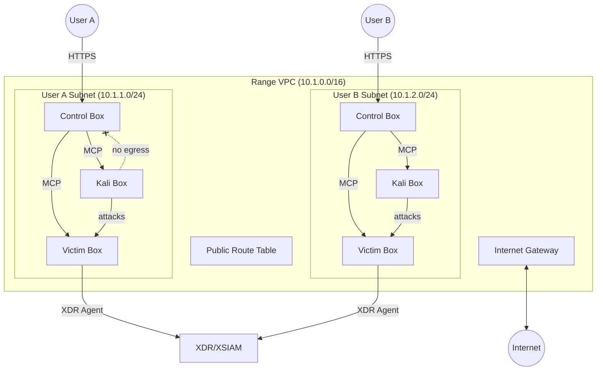

# Range Infrastructure

Stable VPC with ephemeral per-user subnets for XDR/XSIAM demo environments.

## Architecture

## Per-User Subnet

Each user gets one subnet with three instances:

| Instance | Purpose |
|----------|---------|
| Control Box | Kasm desktop, Cursor/Cline, MCP connections to Kali and Victim |
| Kali Box | Attack tools, MCP-controlled from Control |
| Victim Box | Target with XDR agent, MCP-configured from Control |

## Security Groups

| SG | Ingress | Egress |
|----|---------|--------|
| Control | HTTPS from internet | SSH to Kali SG, Victim SG |
| Kali | SSH from Control SG | ALL to Victim SG only |
| Victim | ALL from Kali SG, SSH from Control SG | HTTPS (agent callbacks) |

Kali has no egress to Control. SGs are default-deny and stateful—Kali can only respond to Control-initiated connections.

## CIDR

| VPC | CIDR |
|-----|------|
| Portal | `10.0.0.0/16` |
| Range | `10.1.0.0/16` |

255 usable `/24` subnets. AWS default 200 subnets/VPC (adjustable to 500).

## Components

### Stable

| Resource | Purpose |
|----------|---------|
| VPC | Network boundary |
| Internet Gateway | Internet access |
| Route Table | 0.0.0.0/0 → IGW |

### Ephemeral (per-user)

| Resource | Purpose |
|----------|---------|
| Subnet | `/24` per user |
| Control/Kali/Victim EC2 | User instances |
| 3x Security Groups | Traffic isolation |

## Terraform

Stable module: `modules/range/vpc/` (VPC, IGW, route table)

Environment: `environments/prod/range/`

Future: `modules/range/user-subnet/` for ephemeral per-user resources.

## Deployment

`range-infra.yml` workflow:

- PR → `terraform plan`
- Merge to main → `terraform apply`
- Manual dispatch → plan/apply/destroy

State: `s3://shifter-infra-xxx/prod/range/terraform.tfstate`

Variables: `TF_VARS_PROD_RANGE` GitHub secret.
