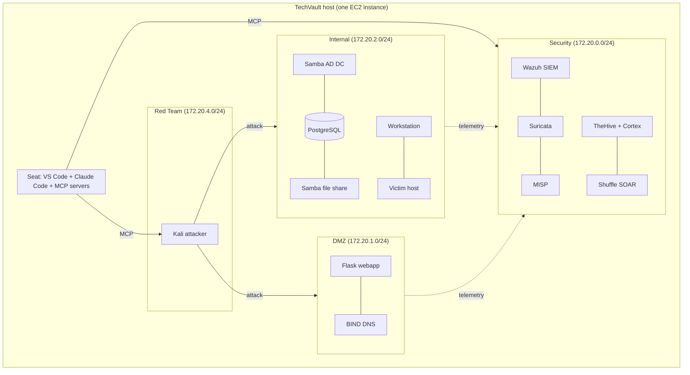

# TechVault Purple-Team Lab

A full purple-team range for the fictional *TechVault Solutions* company:
vulnerable enterprise targets, a production-grade SOC stack, and a Kali
attacker, all on a single host, driven by an AI agent through VS Code.

Unlike the other scenarios (one EC2 instance per box), TechVault is **one host
running a Docker Compose stack** of ~31 containers, baked ahead of time into a
single AMI. It is the [APTL](https://github.com/Brad-Edwards/aptl)
`techvault-operational` scenario delivered as a Shifter range.

## Architecture

## Instances

| Instance | OS | Role | Notes |
|----------|-----|------|-------|
| TechVault | Ubuntu host (presents as Kali attacker) | Attacker / seat | Runs the whole compose stack; `r5.2xlarge` |

The enterprise targets, SOC, and Kali are **containers inside this one host**,
not separate Shifter instances.

## Network

Four Docker networks inside the host: Security `172.20.0.0/24`, DMZ
`172.20.1.0/24`, Internal `172.20.2.0/24`, and Red Team `172.20.4.0/24`. The Kali
attacker can reach the DMZ and Internal targets; targets report telemetry to the
SOC.

## Access

- **RDP from the portal (Guacamole)** into the host desktop (XFCE).
- The desktop runs **VS Code Desktop**, opened on the lab workspace, with an
  integrated terminal and the MCP/agent surface.
- Drive the range with **Claude Code** in the VS Code terminal: it is wired to
  the APTL MCP servers, giving the agent red-side control of Kali
  (`kali_run_command`, and so on) and blue-side control of the SOC
  (`wazuh_query_alerts`, `cases_create_case`, `soar_execute_workflow`, and so
  on).

## Planted vulnerabilities

Application, identity, and infrastructure weaknesses across the stack: SQL and
command injection and XSS in the webapp; weak/seasonal and kerberoastable AD
accounts; guest-writable SMB shares leaking PII and credentials; workstation
secrets and passwordless SSH. These are synthetic scenario content.

## Use cases

- Autonomous / agent-driven purple-team exercises
- Attack, detect, enrich, and respond across a real SOC stack
- AI red- and blue-team assessment

## Launch steps

1. Go to **Ranges** in the sidebar.
2. Select the **TechVault Purple-Team Lab** scenario.
3. Click **Launch Range**.
4. Wait for provisioning, then **RDP** into the host from the portal.
5. VS Code opens on the lab; use the integrated terminal and Claude Code.

## What's installed

- The full APTL `techvault-operational` compose stack (Kali, enterprise
  targets, and the Wazuh/Suricata/MISP/TheHive/Cortex/Shuffle SOC).
- **Claude Code** plus the APTL MCP servers on the host seat (model credentials
  via AWS Bedrock).
- **VS Code Desktop** in an XFCE + xrdp desktop.

> The stack is pre-baked and starts automatically on boot, so provisioning a
> range does not rebuild or reprovision it.
