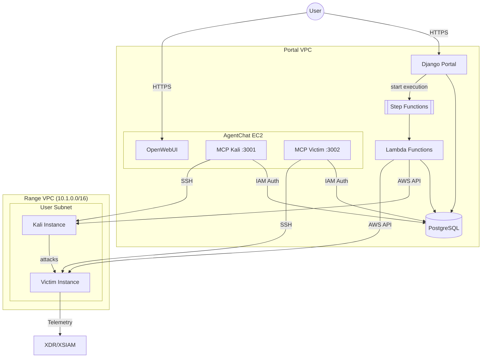
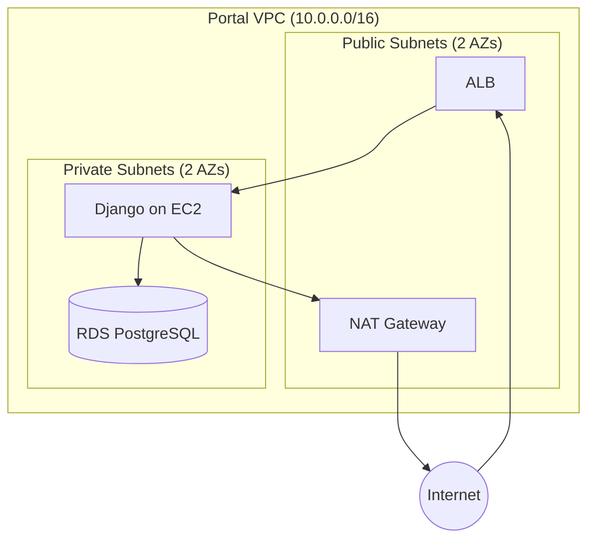
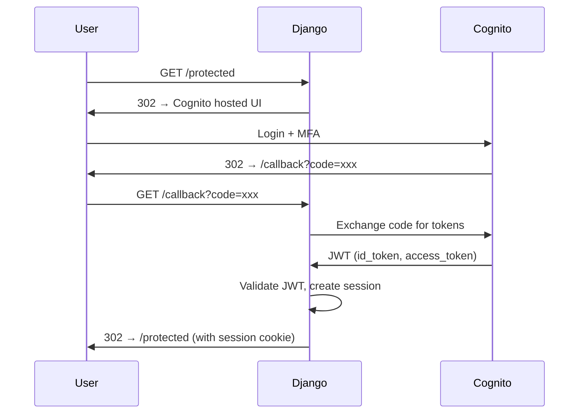
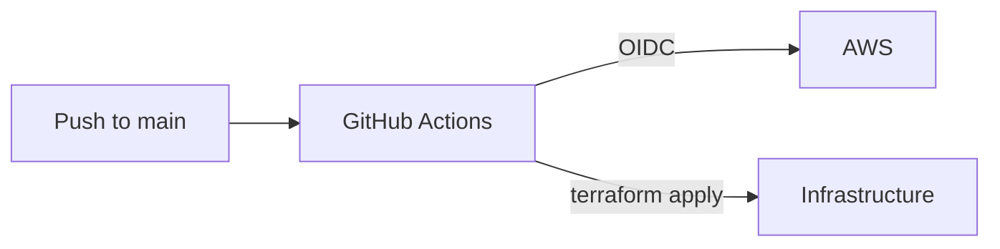
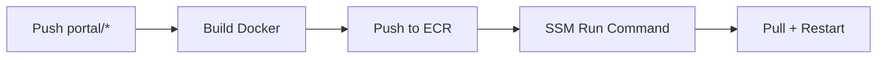
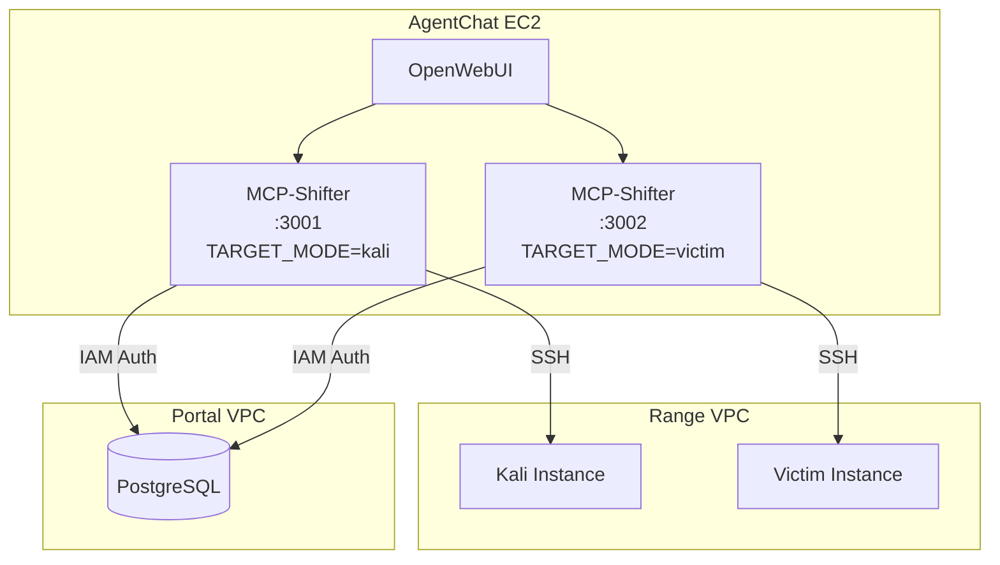
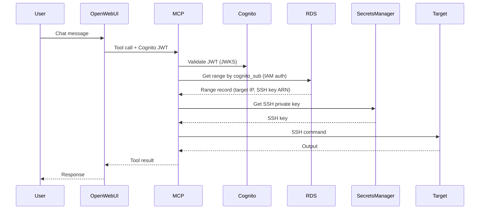

# Architecture

## Infrastructure Overview

Three components, decoupled via RDS:

- **Portal**: Django app for auth, agent upload, range status UI. Triggers Step Functions on launch.
- **Provisioning Service**: Step Functions + Lambda, provisions range infra (subnet, Kali, Victim)
- **Chat UI**: Shared multi-tenant chat UI (being evaluated - see issue #209)
- **Range**: Per-user subnet in Range VPC with Kali + Victim EC2



Portal writes to RDS and triggers Step Functions. Lambda functions create AWS resources and update RDS directly.

## Portal Infrastructure

### Network



Two AZs required for RDS subnet group. ALB in public subnets with ACM cert. EC2 in private subnet pulls container from ECR.

### Components

| Component | Purpose |
|-----------|---------|
| ALB | HTTPS termination, routes to EC2 |
| EC2 | Runs Django container, pulls from ECR |
| ECR | Container registry for Django image |
| VPC | Network isolation, public/private subnet separation |
| RDS | PostgreSQL 16, encrypted, credentials in Secrets Manager |
| Cognito | User authentication, MFA, email verification |

### Authentication



Cognito user pool configured with:

- Email as username
- MFA required (TOTP)
- Pre-signup Lambda for domain restriction (`@paloaltonetworks.com`)
- Email verification required

Django stores minimal user data (email from token claims). No passwords in DB.

### Secrets Management

RDS credentials auto-generated at provision time, stored in Secrets Manager. Secret configured with `recovery_window_in_days = 0` to allow immediate deletion and avoid naming conflicts on destroy/recreate cycles.

## Range Infrastructure

Per-user ephemeral subnets in Range VPC, provisioned by Step Functions + Lambda.

### Provisioning Flow

1. Portal writes `Range(status='provisioning', agent_id=X)` to RDS
2. Portal starts Step Functions execution with `{ range_id }`
3. Lambda functions execute sequentially:
   - `create_subnet`: Create /24 subnet in Range VPC
   - `create_kali`: Launch Kali EC2 from pre-baked AMI
   - `create_victim`: Launch Victim EC2, install XDR agent from S3
   - `mark_ready`: Update Range status to 'ready'
4. Each Lambda reads from RDS, creates AWS resources, writes back to RDS
5. On error: `cleanup` Lambda destroys any created resources

### Components

| Component | Location | Purpose |
|-----------|----------|---------|
| Chat UI | Portal VPC | Shared chat UI, agent loop, MCP tool use |
| Kali EC2 | Range VPC | Attack tools, MCP-controlled |
| Victim EC2 | Range VPC | Target with XDR agent |

### Isolation

- Each user gets a dedicated /24 subnet in Range VPC
- Security groups restrict traffic between subnets
- Range VPC has no route to Portal VPC (Lambda uses AWS APIs)
- Victim VMs have no IAM role (can't call AWS APIs)

## Deployment Pipeline

### Infrastructure

GitHub Actions deploys infra via Terraform on merge to main.



### Portal Application

Portal deploys on push to `portal/**`:



EC2 user data bootstraps Docker and ECR auth. SSM pulls new image and restarts container.

IAM via OIDC federation. No static credentials. Role permissions scoped to shifter-* resources.

### Secrets Sync

Terraform variables stored locally in `.tfvars` files (gitignored). Synced to GitHub secrets before PR:

```bash
./scripts/sync-tfvars.sh
```

Creates namespaced secrets: `TF_VARS_{ENV}_{COMPONENT}` (e.g., `TF_VARS_PROD_PORTAL`).

## Two-Context Pattern

MCP enables AI-driven scenario setup via separate chat conversations:

1. **Setup chat**: "Set up a PHP command injection on /cmd.php and a SUID privesc"
   - AI uses victim MCP to configure vulnerabilities
   - User can specify flags, locations, difficulty

2. **Attack chat**: "Hack the target at 10.0.1.50, get root, find the flag"
   - Fresh context (no memory of setup)
   - AI uses attack methodology: recon → exploit → privesc
   - XDR/XSIAM detects the attack chain

User demos detections to customer.

## MCP Architecture

Two MCP server instances run on the AgentChat EC2, each controlling a different target type:



### TARGET_MODE Parameterization

Same MCP binary (`mcp-shifter`) serves both Kali and Victim targets. The `TARGET_MODE` environment variable controls:

| TARGET_MODE | Database Columns | Tool Prefix | SSH User |
|-------------|------------------|-------------|----------|
| `kali` | `kali_ip`, `kali_instance_id`, `kali_ssh_key_secret_arn` | `kali_*` | `kali` |
| `victim` | `victim_ip`, `victim_instance_id`, `victim_ssh_key_secret_arn` | `victim_*` | `ubuntu` |

### Database Users

Each MCP container uses a dedicated PostgreSQL user for operational isolation:

| Container | RDS User | Purpose |
|-----------|----------|---------|
| mcp-shifter (Kali) | `kali_mcp_user` | Queries kali_* columns from Range table |
| mcp-shifter-victim | `victim_mcp_user` | Queries victim_* columns from Range table |

Both users have identical permissions (SELECT on `mission_control_range`, `auth_user`, `mission_control_userprofile`). Separate users enable:
- Independent logging in RDS audit logs
- Ability to revoke one without affecting the other
- Clear operational separation

### Authentication Flow



### LabConfig Generation

MCP dynamically builds LabConfig at session creation based on `TARGET_MODE`:

```typescript
// TARGET_MODE=kali
{
  server: { name: 'shifter-kali', toolPrefix: 'kali' },
  containers: {
    kali: { ssh_user: 'kali', container_ip: range.targetIp }
  }
}

// TARGET_MODE=victim
{
  server: { name: 'shifter-victim', toolPrefix: 'victim' },
  containers: {
    victim: { ssh_user: 'ubuntu', container_ip: range.targetIp }
  }
}
```

Tools are named `{toolPrefix}_info`, `{toolPrefix}_run_command`, etc.
