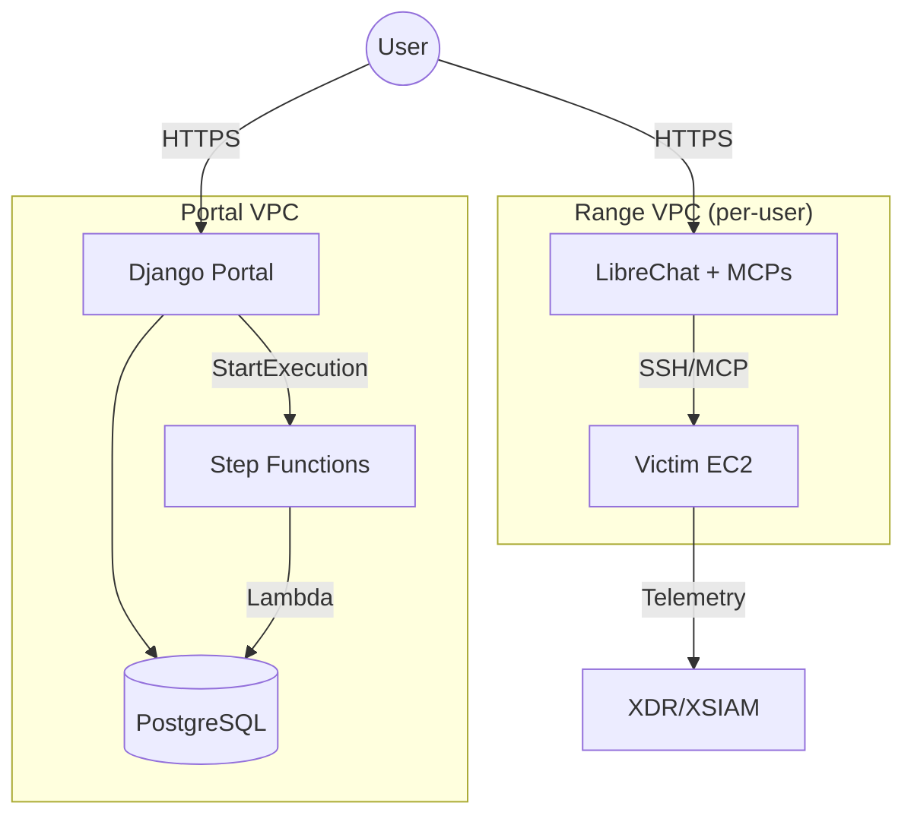
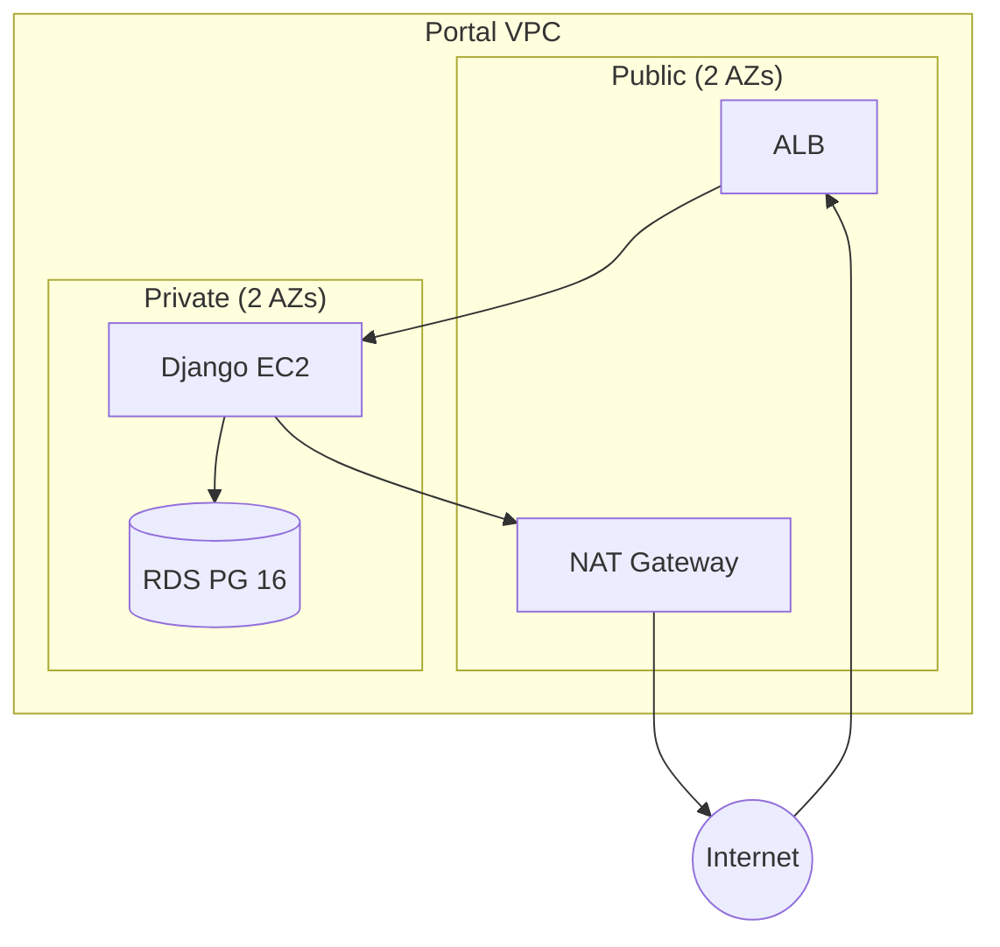
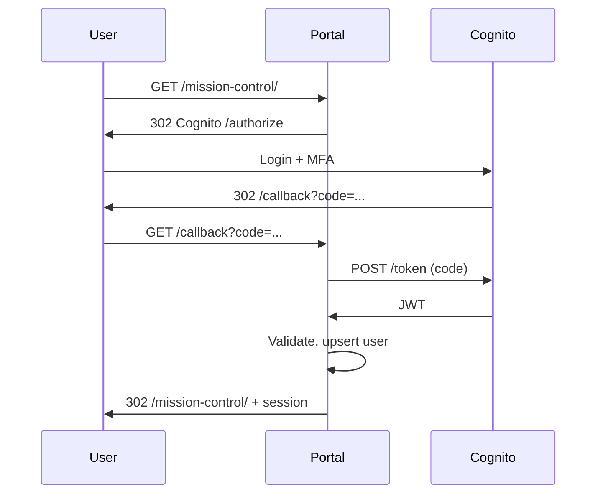

# Architecture

## System Overview

Three decoupled components:

- **Portal**: Django app (auth, agent upload, range UI)
- **Provisioner**: Lambda-based Step Functions (infra provisioning)
- **Range**: Per-user isolated VPC (LibreChat + victim VM)

**Communication**: Portal → Step Functions → Lambda → RDS (no callback needed)



## Portal Infrastructure

**Network**: VPC 10.0.0.0/16, 2 AZs (for RDS)



**Components**:

| Component | Details |
|-----------|---------|
| ALB | HTTPS (ACM cert), health check `/health/` |
| EC2 | Django container from ECR, IMDSv2 for secrets |
| RDS | PostgreSQL 16, encrypted, Multi-AZ optional |
| Cognito | OIDC auth, MFA required |
| S3 | Agent uploads (presigned URLs) |
| Step Functions | Provision/teardown state machines |

**Secrets**: RDS + Django secret in Secrets Manager. Retrieved by `entrypoint.sh` via IMDSv2.

## Authentication Flow



**Cognito config**: Email username, TOTP MFA, email verification, domain restriction Lambda (`@paloaltonetworks.com`).

**Django**: `mozilla-django-oidc`, session-based, email from JWT claims.

## Range Infrastructure

Per-user VPC provisioned by Lambda via Step Functions.

**Provisioning**:
1. Portal creates `Range(status='pending', subnet_index=X)`
2. Invokes Step Functions (`PROVISION_STATE_MACHINE_ARN`)
3. Lambda reads Range from RDS
4. Terraform applies:
   - VPC 10.1.{subnet_index}.0/24
   - Victim EC2 + security group
   - User-data downloads agent from S3
   - LibreChat deployment (ECS or EC2)
5. Lambda updates Range: `status='ready'`, `chat_url`, `victim_ip`

**Teardown**:
1. Portal sets `status='destroying'`, invokes teardown Step Functions
2. Lambda runs `terraform destroy`
3. Updates `status='destroyed'`

**Subnet allocation**: Range.allocate_subnet_index() uses SELECT FOR UPDATE to prevent race conditions. Indices 1-254 (max 254 concurrent ranges).

## Deployment

### Infrastructure (Terraform)

GitHub Actions: `terraform apply` on push to main via OIDC (no static creds).

### Portal Application

On push to `portal/**`:
1. Build Docker image
2. Push to ECR
3. SSM Run Command on EC2: pull image, restart container

### Secrets Sync

`.tfvars` files (gitignored) synced to GitHub secrets:
```bash
./scripts/sync-tfvars.sh
```

Creates: `TF_VARS_{ENV}_{COMPONENT}` (e.g., `TF_VARS_PROD_PORTAL`).

## MCP Integration

LibreChat uses MCP servers to execute commands on victim VM. Configuration generated per-range by provisioner Lambda:

```json
{
  "server": {"name": "range-{id}", "toolPrefix": "victim"},
  "containers": {
    "victim": {
      "container_ip": "{victim_ip}",
      "ssh_key": "/secrets/range-{id}.pem",
      "ssh_user": "ubuntu",
      "ssh_port": 22
    }
  },
  "mcp": {"allowed_networks": ["{vpc_cidr}"], "audit_enabled": true}
}
```

**Tools**: `victim_run_command`, `victim_interactive_session`, `victim_upload_file`, etc.

**Isolation**: MCP config limits access to victim IP only. No internet egress from range VPC.
