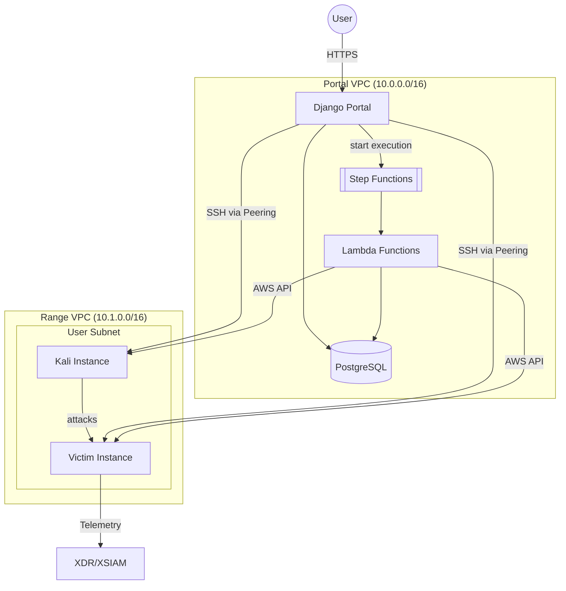
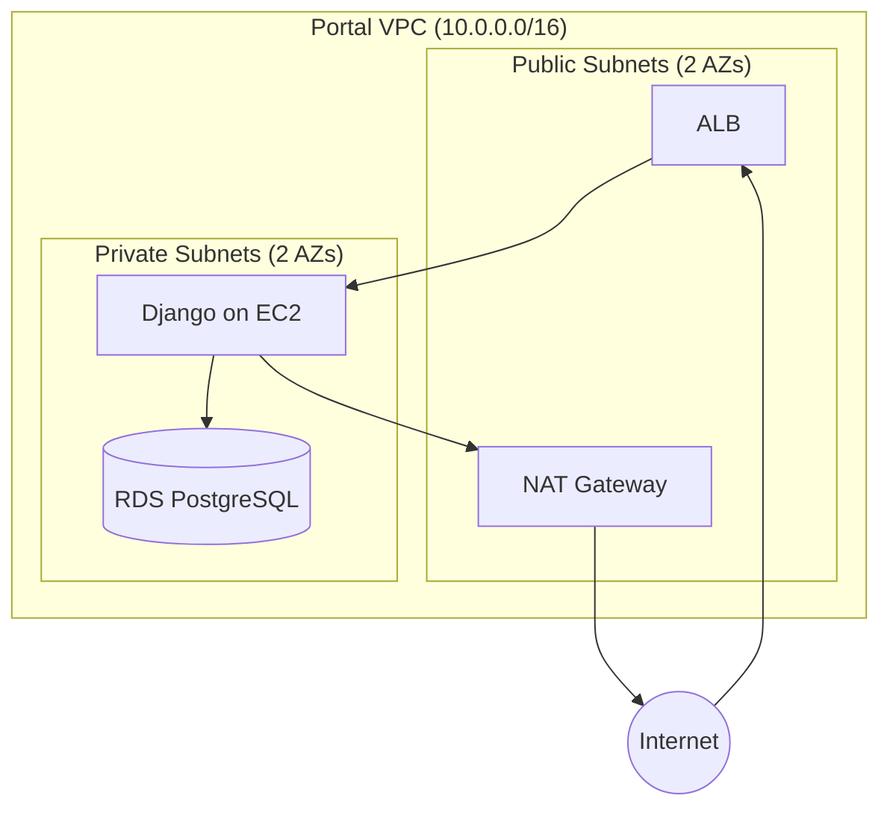
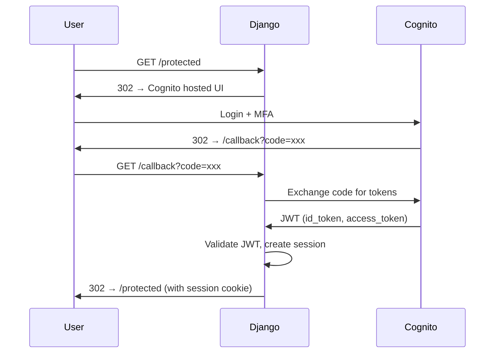
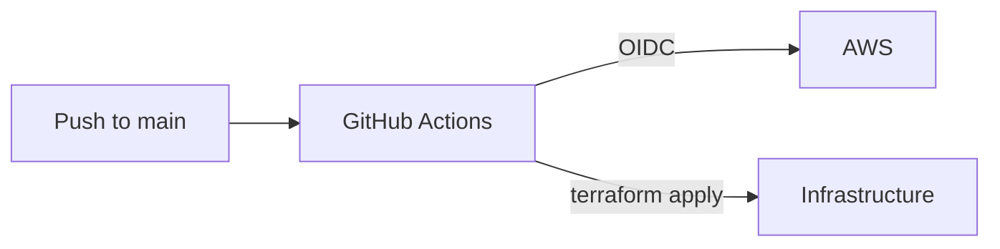
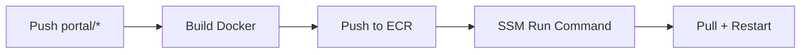

# Architecture

## Infrastructure Overview

Three components, decoupled via RDS:

- **Portal**: Django app for auth, agent upload, range status UI. Triggers Step Functions on launch.
- **Provisioning Service**: Step Functions + Lambda, provisions range infra (subnet, Kali, Victim)
- **Terminal UI**: Browser-based terminal for SSH access to range instances (planned)
- **Range**: Per-user subnet in Range VPC with Kali + Victim EC2



Portal writes to RDS and triggers Step Functions. Lambda functions create AWS resources and update RDS directly.

## Portal Infrastructure

### Network



Two AZs required for RDS subnet group. ALB in public subnets with ACM cert. EC2 in private subnet pulls container from ECR.

### Components

| Component | Purpose |
|-----------|---------|
| ALB | HTTPS termination, routes to EC2 |
| EC2 | Runs Django container, pulls from ECR |
| ECR | Container registry for Django image |
| VPC | Network isolation, public/private subnet separation |
| RDS | PostgreSQL 16, encrypted, credentials in Secrets Manager |
| Cognito | User authentication, MFA, email verification |

### Authentication



Cognito user pool configured with:

- Email as username
- MFA required (TOTP)
- Pre-signup Lambda for domain restriction (`@paloaltonetworks.com`)
- Email verification required

Django stores minimal user data (email from token claims). No passwords in DB.

### Secrets Management

RDS credentials auto-generated at provision time, stored in Secrets Manager. Secret configured with `recovery_window_in_days = 0` to allow immediate deletion and avoid naming conflicts on destroy/recreate cycles.

## Range Infrastructure

Per-user ephemeral subnets in Range VPC, provisioned by Step Functions + Lambda.

### Provisioning Flow

1. Portal writes `Range(status='provisioning', agent_id=X)` to RDS
2. Portal starts Step Functions execution with `{ range_id }`
3. Lambda functions execute sequentially:
   - `create_subnet`: Create /24 subnet in Range VPC
   - `create_kali`: Launch Kali EC2 from pre-baked AMI
   - `create_victim`: Launch Victim EC2, install XDR agent from S3
   - `mark_ready`: Update Range status to 'ready'
4. Each Lambda reads from RDS, creates AWS resources, writes back to RDS
5. On error: `cleanup` Lambda destroys any created resources

### Components

| Component | Location | Purpose |
|-----------|----------|---------|
| Kali EC2 | Range VPC | Attack tools, SSH accessible |
| Victim EC2 | Range VPC | Target with XDR agent |

### Isolation

- Each user gets a dedicated /24 subnet in Range VPC
- Security groups restrict traffic between subnets
- VPC peering connects Portal to Range for SSH terminal access only (port 22)
- Lambda functions provision resources via AWS APIs (not through peering)
- Victim VMs have no IAM role (can't call AWS APIs)

## Deployment Pipeline

### Infrastructure

GitHub Actions deploys infra via Terraform on merge to main.



### Portal Application

Portal deploys on push to `portal/**`:



EC2 user data bootstraps Docker and ECR auth. SSM pulls new image and restarts container.

IAM via OIDC federation. No static credentials. Role permissions scoped to shifter-* resources.

### Secrets Sync

Terraform variables stored locally in `.tfvars` files (gitignored). Synced to GitHub secrets before PR:

```bash
./scripts/sync-tfvars.sh
```

Creates namespaced secrets: `TF_VARS_{ENV}_{COMPONENT}` (e.g., `TF_VARS_PROD_PORTAL`).

## Range Access

Users access their range instances via browser-based terminal integrated into the Portal. Side-by-side terminal panes provide simultaneous SSH access to both instances:

- **Kali terminal (left)**: Run attack tools, execute pentesting workflows
- **Victim terminal (right)**: Configure vulnerabilities, check detections

The terminal uses Django Channels with WebSocket connections for real-time SSH interaction. See GitHub issue #267.
