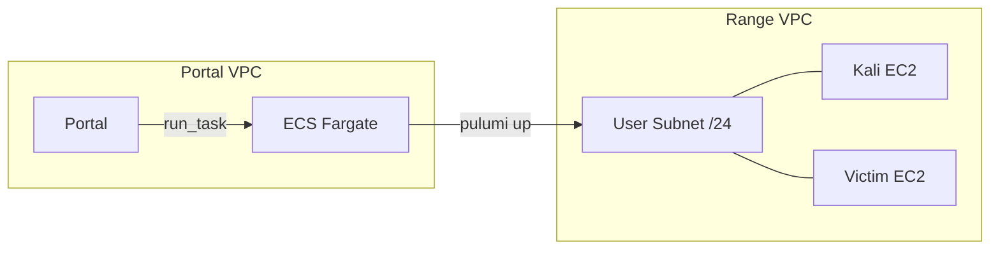

# Execution Plane

Infrastructure that runs ranges: provisioner and range runtime.

## Components

| Component | Purpose |
|-----------|---------|
| [Pulumi Provisioner](provisioner.md) | ECS task that creates/destroys range infrastructure |
| [Kali AMI](kali-ami.md) | Pre-baked attacker instance |
| [Victim AMI](victim-ami.md) | Pre-baked victim instance |

## Architecture

## Range Lifecycle

| Status | Meaning |
|--------|---------|
| `pending` | Portal created Range record |
| `provisioning` | Provisioner running `pulumi up` |
| `ready` | Infrastructure created, IPs available |
| `destroying` | Provisioner running `pulumi destroy` |
| `destroyed` | Infrastructure torn down |
| `failed` | Error during provisioning |

## Per-Range Resources

Each range creates:
- /24 subnet in Range VPC
- Kali EC2 instance
- Victim EC2 instance
- SSH key per instance (Secrets Manager)

## Terraform Modules

| Module | Purpose |
|--------|---------|
| `range/` | Range VPC, route tables, security groups |
| `pulumi-provisioner/` | ECS cluster, task definition, IAM |
| `pulumi-state/` | S3 bucket, DynamoDB lock table, KMS key |
