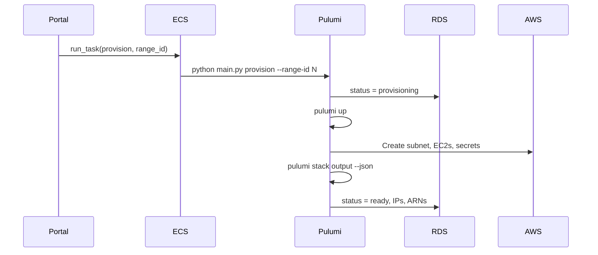

# Pulumi Provisioner

ECS Fargate task that provisions and destroys range infrastructure using Pulumi.

## How It Works



## Container Structure

```
pulumi-provisioner/
├── main.py           # Container entrypoint
├── __main__.py       # Pulumi program entry
├── config.py         # Config from env + DB
├── components/
│   ├── network.py    # Subnet creation
│   ├── instance.py   # EC2 + SSH key secrets
│   └── range_stack.py # Composes network + instances
└── templates/        # User data (Jinja2)
```

## Operations

**Provision** (`python main.py provision --range-id N`):
1. Connect to RDS via IAM auth
2. Update status → `provisioning`
3. Create/select Pulumi stack `range-{id}`
4. Set stack config from env vars
5. Run `pulumi up`
6. Read outputs (subnet_id, IPs, SSH key ARNs)
7. Update status → `ready` with resource details

**Destroy** (`python main.py destroy --range-id N`):
1. Update status → `destroying`
2. Run `pulumi destroy`
3. Remove Pulumi stack
4. Update status → `destroyed`

## What Gets Created

Per range:
- Subnet (/24 in Range VPC)
- Kali EC2 (from pre-baked AMI)
- Victim EC2 (from pre-baked AMI)
- SSH keys in Secrets Manager (per instance)

## State Backend

- **S3**: State files (`s3://{prefix}-pulumi-state`)
- **DynamoDB**: Locking (`{prefix}-pulumi-locks`)
- **KMS**: Secrets encryption (dedicated CMK)

## Config Flow

Environment vars (set by Terraform in ECS task definition):

| Var | Purpose |
|-----|---------|
| `RANGE_VPC_ID` | VPC for range subnets |
| `RANGE_VPC_CIDR` | CIDR for subnet calculation |
| `KALI_AMI_ID` | Pre-baked Kali AMI |
| `VICTIM_AMI_ID` | Pre-baked victim AMI |
| `AGENT_S3_BUCKET` | Bucket for XDR agent installers |
| `DB_HOST`, `DB_NAME`, `DB_USER` | RDS connection |
| `PULUMI_BACKEND_URL` | S3 state backend |
| `PULUMI_SECRETS_PROVIDER` | KMS key for secrets |

## Database Access

Provisioner connects to RDS using IAM Database Authentication:
- No static credentials
- Uses `provisioner_lambda` DB user
- Generates auth token via `rds.generate_db_auth_token()`

## Trigger

Portal calls `start_provisioning(range_id)` which runs:

```python
ecs.run_task(
    cluster=cluster_arn,
    taskDefinition=task_definition_arn,
    overrides={
        "containerOverrides": [{
            "name": "pulumi-provisioner",
            "command": ["provision", "--range-id", str(range_id)],
        }]
    },
)
```

## Error Handling

- On failure: status → `failed`, error_message saved
- In prod: auto-cleanup on provision failure (`pulumi destroy`)
- Errors logged to CloudWatch
