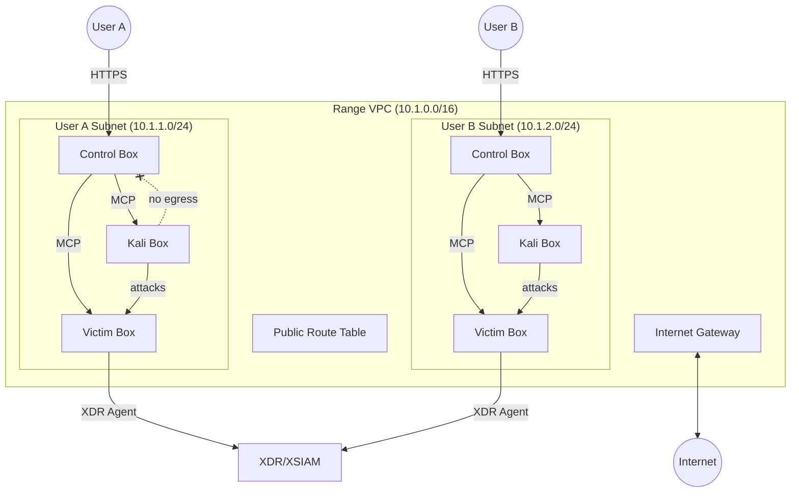

# Range Infrastructure

Stable VPC with ephemeral per-user subnets for XDR/XSIAM demo environments.

## Architecture



## Per-User Subnet

Each user gets one subnet with three instances:

| Instance | Purpose |
|----------|---------|
| Control Box | Kasm desktop, Cursor/Cline, MCP connections to Kali and Victim |
| Kali Box | Attack tools, MCP-controlled from Control |
| Victim Box | Target with XDR agent, MCP-configured from Control |

## Security Groups

Current implementation (Phase 1 - no Control Box yet):

| SG | Ingress | Egress |
|----|---------|--------|
| Kali | SSH from VPC CIDR, ALL from Victim SG | ALL (0.0.0.0/0) |
| Victim | SSH from VPC CIDR, ALL from Kali SG | ALL (0.0.0.0/0) |

**Traffic Matrix:**

| Source → Dest | Allowed | Purpose |
|---------------|---------|---------|
| Kali → Victim | ✅ All ports/protocols | Attacks, exploits, scans |
| Victim → Kali | ✅ All ports/protocols | Reverse shells, callbacks, C2 |
| VPC → Kali | ✅ SSH (22) | MCP/LibreChat access |
| VPC → Victim | ✅ SSH (22) | MCP configuration |
| Kali → Internet | ✅ All | apt updates, tool downloads |
| Victim → Internet | ✅ All | XDR agent callbacks, updates |

Both instances have unrestricted egress for operational flexibility. Victim-Kali traffic is fully bidirectional to support all attack scenarios including reverse shells.

**Future (Phase 2 - with Control Box):**

| SG | Ingress | Egress |
|----|---------|--------|
| Control | HTTPS from internet | SSH to Kali SG, Victim SG |
| Kali | SSH from Control SG, ALL from Victim SG | ALL to Victim SG only |
| Victim | ALL from Kali SG, SSH from Control SG | HTTPS (agent callbacks) |

In Phase 2, Kali egress will be restricted to Victim only (no internet access from Kali).

## CIDR

| VPC | CIDR |
|-----|------|
| Portal | `10.0.0.0/16` |
| Range | `10.1.0.0/16` |

255 usable `/24` subnets. AWS default 200 subnets/VPC (adjustable to 500).

## Components

### Stable

| Resource | Purpose |
|----------|---------|
| VPC | Network boundary |
| Internet Gateway | Internet access |
| Route Table | 0.0.0.0/0 → IGW |

### Ephemeral (per-user)

| Resource | Purpose |
|----------|---------|
| Subnet | `/24` per user |
| Control/Kali/Victim EC2 | User instances |
| 3x Security Groups | Traffic isolation |

## AMI Prerequisites

### Kali Linux

The Kali box uses the **official Kali Linux AMI from Offensive Security** via AWS Marketplace.

1. **Subscribe** (free): [AWS Marketplace - Kali Linux](https://aws.amazon.com/marketplace/pp/prodview-fznsw3f7mq7to)
2. **Query the latest AMI** after subscribing:

```bash
aws ec2 describe-images --region us-east-2 \
  --owners 679593333241 \
  --filters "Name=name,Values=kali-last-snapshot-amd64-*-804fcc46-63fc-4eb6-85a1-50e66d6c7215" \
  --query 'Images | sort_by(@, &CreationDate) | [-1].[ImageId,Name]' \
  --output table
```

The product ID `804fcc46-63fc-4eb6-85a1-50e66d6c7215` is embedded in the AMI name — this verifies you're using the official image, not a lookalike.

> **Note:** The AMI won't appear in `describe-images` until you subscribe.

### Victim

Uses a standard Amazon Linux 2023 AMI (no subscription required).

## Terraform

Stable module: `modules/range/vpc/` (VPC, IGW, route table)

Environment: `environments/prod/range/`

Future: `modules/range/user-subnet/` for ephemeral per-user resources.

## Deployment

`range-infra.yml` workflow:

- PR → `terraform plan`
- Merge to main → `terraform apply`
- Manual dispatch → plan/apply/destroy

State: `s3://shifter-infra-xxx/prod/range/terraform.tfstate`

Variables: `TF_VARS_PROD_RANGE` GitHub secret.
