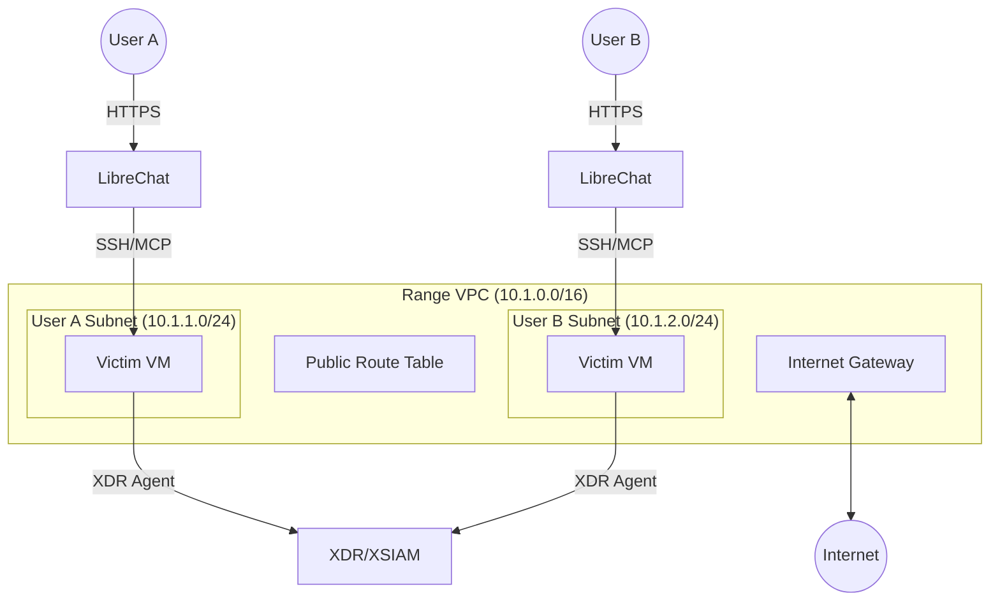

# Range Infrastructure

Shared VPC with per-user subnets. Each range contains a victim VM with user's XDR agent.

## Architecture

## Components

| Component | Purpose |
|----------|---------|
| Victim VM | Target EC2 instance with user's XDR agent |
| Subnet | Isolated /24 network per user (10.1.{index}.0/24) |
| LibreChat | Shared chat interface with MCP access to victim |

## Security

Victim security group allows SSH from VPC (for MCP) and all outbound (for XDR agent callbacks).

## Provisioning

Range provisioning is orchestrated by AWS Step Functions with Lambda handlers:

1. **create_subnet** - Allocates subnet from 10.1.{1-254}.0/24 pool
2. **create_victim** - Launches EC2 instance, installs XDR agent from S3
3. **create_kali** - Configures attack container (future)
4. **configure_librechat** - Sets up LibreChat user with MCP access to victim

All state stored in Portal RDS (Range model). Lambdas read/write directly to database.

## Lifecycle

| Status | Description |
|--------|-------------|
| pending | Initial state after user creates range |
| provisioning | Step Functions execution in progress |
| ready | All resources created, chat_url available |
| destroying | Teardown in progress |
| destroyed | All resources deleted |
| failed | Provisioning failed, resources cleaned up |

Ranges stuck in transitional states >30min automatically cleaned up by scheduled Lambda.

## Infrastructure

**Stable Resources** (created once):
- VPC (10.1.0.0/16)
- Internet Gateway
- Public route table (0.0.0.0/0 → IGW)
- Victim security group (SSH from VPC, all outbound)

**Ephemeral Resources** (per range):
- Subnet (10.1.{index}.0/24, index 1-254)
- EC2 victim instance
- Kali container (future)

Portal VPC = 10.0.0.0/16, Range VPC = 10.1.0.0/16. Max 254 concurrent ranges.

## Terraform

Modules:
- `modules/range/vpc` - VPC, IGW, route table, security groups
- `modules/range/provisioner` - Step Functions, Lambda functions

Environments: `environments/prod/range`

GitHub Actions workflow `range-infra.yml`:
- PR → `terraform plan`
- Merge to main → `terraform apply`
- Manual dispatch → plan/apply/destroy

State: S3 backend at `s3://shifter-infra-*/prod/range/terraform.tfstate`
