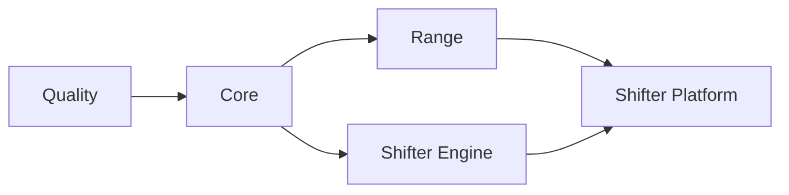

# CI/CD

GitHub Actions with self-hosted runners.

## Workflow Structure

```
.github/workflows/
├── deploy.yml              # AWS orchestrator (change detection, dependency chain)
├── _quality.yml            # Linting, security scanning
├── _core.yml               # Core infrastructure (ECR, budgets)
├── _range.yml              # Range VPC infrastructure
├── _shifter-engine.yml     # Engine container build and push
├── _shifter-platform.yml   # Portal infrastructure and app deployment
├── _gcp-dev.yml            # GCP validation/deploy workflow
├── packer.yml              # AMI builds (AWS)
└── packer-promote.yml      # AMI promotion to prod (AWS)
```

## Deployment Chain



Jobs run only when relevant files change. `deploy.yml` detects changes and triggers appropriate workflows.

## Change Detection

| Job | Triggers On |
|-----|-------------|
| **core** | `platform/terraform/modules/ecr/**`, `platform/terraform/environments/*/*.tf` |
| **range** | `platform/terraform/modules/range/**`, `platform/terraform/environments/*/range/**` |
| **shifter_engine** | `shifter/engine/provisioner/**`, `platform/terraform/modules/pulumi-provisioner/**` |
| **shifter_platform** | `platform/terraform/modules/portal/**`, `platform/terraform/modules/guacamole/**`, `platform/terraform/environments/*/portal/**` (Terraform only) |
| **portal_image** | `shifter/shifter_platform/**`, `shifter/cyberscript/**`, `shifter/installation/**` (portal image build/deploy, no Terraform) |

## Environment Targeting

Environment deploys are manual (`workflow_dispatch` with an `environment` input);
push and pull_request run validation only (#730).

- Pull request → Quality only
- Push to `dev` / `main` → Quality only; no deploy
- Manual dispatch `environment=aws-dev` → AWS dev deploy
- Manual dispatch `environment=aws-proof` → AWS proof deploy
- Manual dispatch `environment=gcp-dev` → GCP dev deploy

Run a deploy with `gh workflow run deploy.yml --ref <branch> -f environment=<env>`.

## Authentication

OIDC federation per cloud. No long-lived credentials.

| Secret | Purpose |
|--------|---------|
| `AWS_ROLE_ARN` | AWS prod IAM role |
| `AWS_ROLE_ARN_DEV` | AWS dev IAM role |
| `GCP_SERVICE_ACCOUNT` | GCP service account email |
| `GCP_WORKLOAD_IDENTITY_PROVIDER` | GCP Workload Identity Federation provider |

AWS roles defined in `platform/terraform/global/iam/github-oidc.tf`. GCP WIF configured in the GCP project.

## GCP Current State

GCP deploys through CI/CD via a manual `workflow_dispatch` with `environment=gcp-dev`
(`gh workflow run deploy.yml --ref <branch> -f environment=gcp-dev`). Branch names
no longer trigger deploys; `dev`/`main` are Quality-only integration branches (#730).

The GCP CI path:

1. validates Terraform and rendered manifests
2. applies GCP Terraform
3. builds and pushes control-plane images
4. renders secure Helm values from Terraform outputs and Secret Manager
5. installs or upgrades the Shifter Helm release

Every deploy dispatch runs the quality gate first as the safety gate before an apply.

The bootstrap path is security-gated and fails closed unless:

- `public_hostname` is set
- `enable_managed_tls = true`
- `gke_master_authorized_cidrs` is non-empty

`gdc-bootstrap` remains available for first-time bootstrap and controlled recovery, but it is not the normal deployment entrypoint.
