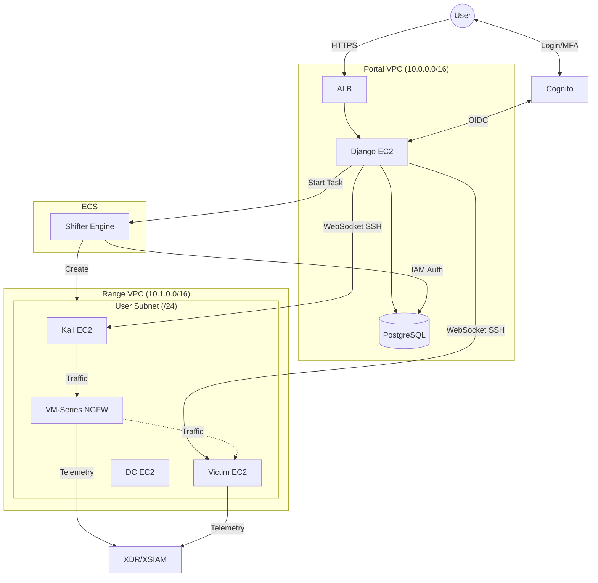
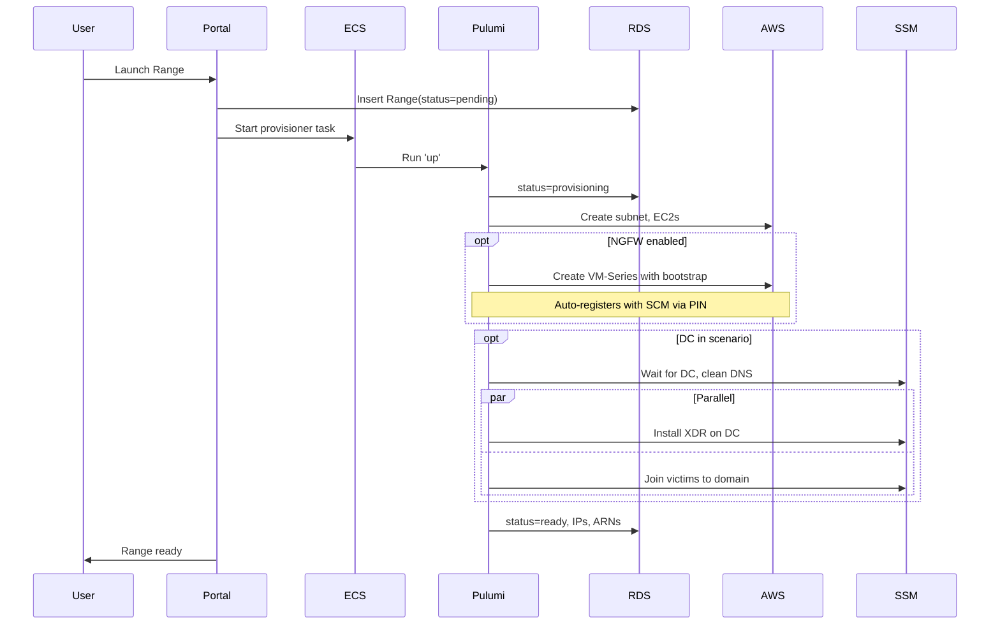
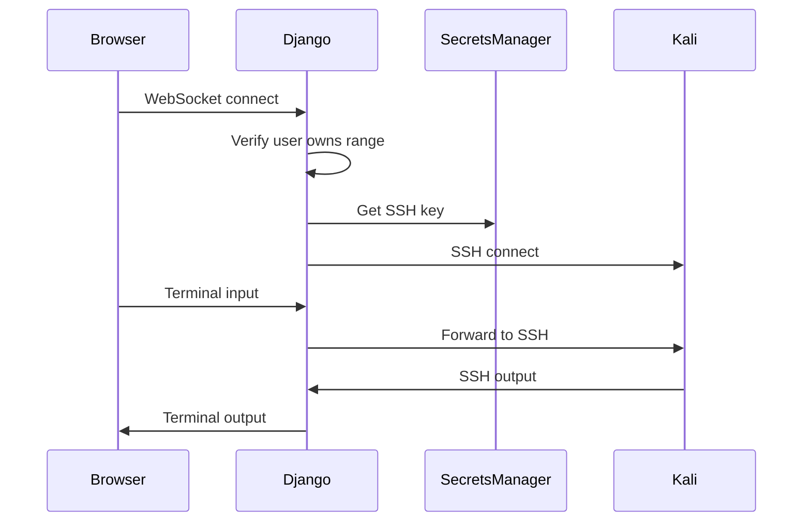
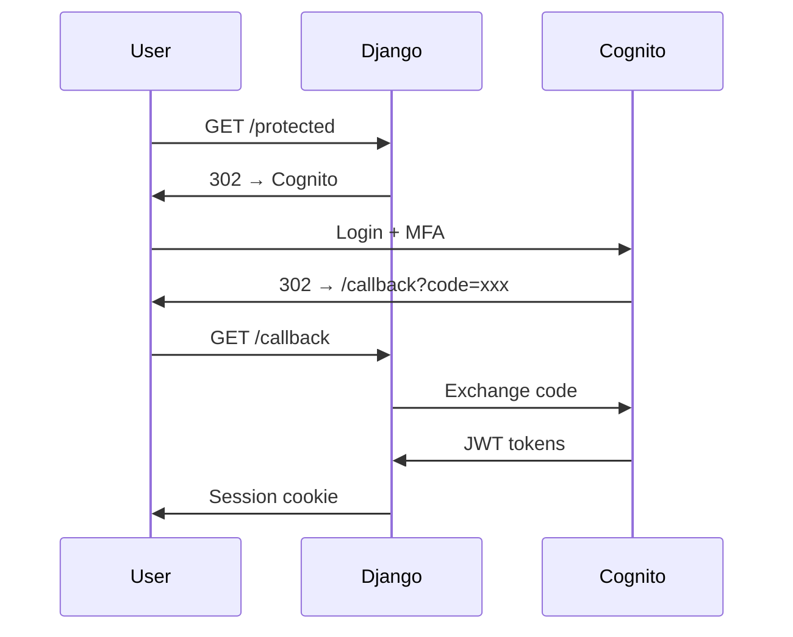

# Architecture

Current system architecture. Documents what exists, not what is planned.

## System Overview

DC and NGFW are optional. DC enables AD attack scenarios with domain-joined victims. NGFW (VM-Series) sits inline between Kali and Victim to generate network telemetry for XSIAM stitching.

## Components

### Portal (`portal/`)

Single Django codebase with two apps:

| App | Purpose |
|-----|---------|
| `mission_control` | Auth, agent config, range lifecycle, terminal UI |
| `risk_register` | Security risk tracking (admin-only) |

**Models in `mission_control`:**

| Model | Purpose |
|-------|---------|
| `UserProfile` | Cognito user metadata |
| `AgentConfig` | XDR agent installer configs (S3 references) |
| `StrataConfig` | SCM credentials for VM-Series auto-registration (PIN ID/value) |
| `OperatingSystem` | OS types available for ranges |
| `Range` | Range instance state and resource IDs |
| `ActivityLog` | Audit trail |

**Key services:**
- `services/ssh.py` - Async SSH connection management
- `services/secrets.py` - Secrets Manager retrieval
- `consumers.py` - WebSocket SSH terminal consumer

### Shifter Engine (`shifter-engine/`)

ECS Fargate task that provisions/destroys range infrastructure.

| File | Purpose |
|------|---------|
| `main.py` | Entrypoint, DB connection, Pulumi orchestration |
| `config.py` | Stack configuration from env/DB |
| `catalog/instances.py` | Instance type definitions |
| `components/instance.py` | EC2 creation, SSH keys, DC orchestration |
| `components/ssm_executor.py` | Generic SSM Run Command execution |
| `components/setup_orchestrator.py` | Runs setup plans step-by-step |
| `components/plans/` | Setup plans (bootstrap, dc_setup, domain_join, xdr_agent_install) |
| `templates/` | Bootstrap user data (Jinja2) |

**Instance catalog:**
- `kali-2024` - Kali Linux attacker
- `ubuntu-22.04-victim` - Ubuntu 22.04 victim
- `ubuntu-24.04-victim` - Ubuntu 24.04 victim
- `windows-server-2022-victim` - Windows Server 2022 victim
- `windows-server-2022-dc` - Windows Server 2022 Domain Controller
- `amazon-linux-2023-victim` - Amazon Linux 2023 victim

### Terraform (`terraform/`)

Infrastructure as code.

| Module | Purpose |
|--------|---------|
| `portal/` | Portal VPC, RDS, ALB, EC2, Cognito, S3 |
| `range/` | Range VPC, subnets, security groups |
| `pulumi-provisioner/` | ECS task definition, IAM roles |
| `pulumi-state/` | S3 bucket + DynamoDB for Pulumi state |
| `ecr/` | Container registries |
| `log-aggregation/` | CloudWatch log groups |

**Environments:** `dev`, `prod`

## Data Flow

### Range Provisioning

DC uses a prebaked AMI with AD DS ready. SSM orchestrates DNS cleanup, XDR installation, and domain joins. See [Shifter Engine docs](execution/engine.md#dc-setup-via-ssm) for details.

NGFW (VM-Series) uses bootstrap with init-cfg.txt containing SCM PIN credentials. Auto-registers with Strata Cloud Manager on first boot.

### Terminal Access

## Authentication

Cognito OIDC with domain restriction.

- Email as username
- MFA required (TOTP)
- Pre-signup Lambda restricts to `@paloaltonetworks.com`

## Network

### Portal VPC

| Subnet | Components |
|--------|------------|
| Public (2 AZs) | ALB, NAT Gateway |
| Private (2 AZs) | EC2, RDS |

### Range VPC

| Subnet | Components |
|--------|------------|
| Public | NAT Gateway |
| Private (/24 per user) | Kali EC2, Victim EC2, DC EC2 (optional), NGFW (optional) |

When NGFW is enabled, VM-Series has two interfaces:
- Untrust (eth1): Faces Kali
- Trust (eth2): Faces Victim

Route tables direct traffic through NGFW when enabled.

VPC peering connects Portal to Range for SSH access (port 22 only).

## Deployment

GitHub Actions on merge:

| Trigger | Action |
|---------|--------|
| `terraform/**` → main | `terraform apply` |
| `portal/**` → main | Build image → ECR → SSM restart EC2 |
| `shifter-engine/**` → main | Build image → ECR |

IAM via OIDC federation. No static credentials.
