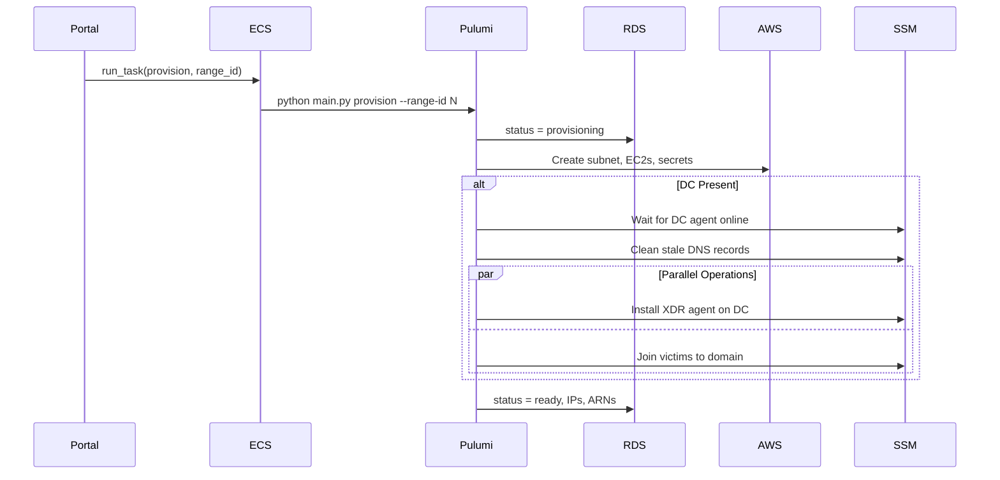
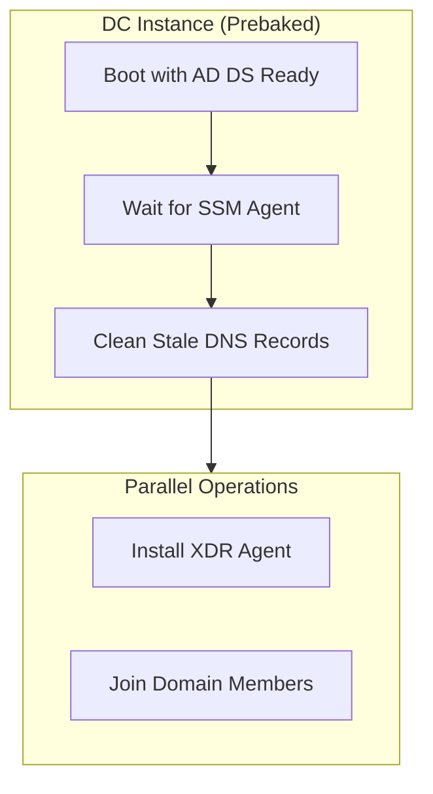

# Shifter Engine

ECS Fargate task that provisions and destroys range infrastructure using Pulumi.

## How It Works



## Container Structure

```
shifter-engine/
├── main.py              # Container entrypoint
├── __main__.py          # Pulumi program entry
├── config.py            # Config from env + DB
├── components/
│   ├── network.py       # Subnet creation
│   ├── instance.py      # EC2 + SSH key secrets + DC orchestration
│   ├── range_stack.py   # Composes network + instances
│   ├── ssm_executor.py  # Generic SSM command runner
│   ├── setup_orchestrator.py  # Executes setup plans step-by-step
│   ├── setup_plan.py    # SetupStep dataclass and SetupPlan protocol
│   └── plans/
│       ├── bootstrap.py       # Hostname + SSH setup (Windows)
│       ├── dc_setup.py        # AD DS promotion (if needed)
│       ├── domain_join.py     # Domain member join steps
│       └── xdr_agent_install.py  # XDR agent installation
└── templates/           # Bootstrap user data (Jinja2)
```

## Plans Architecture

The Shifter Engine uses a composable **Plans** architecture for instance configuration:

| Component | Purpose |
|-----------|---------|
| `SetupStep` | Single step: name, script, timeout, requires_reboot flag |
| `SetupPlan` | Protocol defining steps list, verify_step, get_context() |
| `SetupOrchestrator` | Executes plans step-by-step, handles reboots |
| `SSMExecutor` | Runs PowerShell/bash via SSM Run Command |

**Available Plans:**

| Plan | Purpose |
|------|---------|
| `BootstrapPlan` | Set hostname, configure SSH (Windows) |
| `DCSetupPlan` | Promote server to Domain Controller |
| `DomainJoinPlan` | Join Windows instance to AD domain |
| `XDRAgentInstallPlan` | Download and install Cortex XDR agent |

Plans are testable in isolation and composable for different scenarios.

## Operations

**Provision** (`python main.py provision --range-id N`):
1. Connect to RDS via IAM auth
2. Update status → `provisioning`
3. Create/select Pulumi stack `range-{id}`
4. Set stack config from env vars
5. Run `pulumi up`
6. Read outputs (subnet_id, IPs, SSH key ARNs)
7. Update status → `ready` with resource details

**Destroy** (`python main.py destroy --range-id N`):
1. Update status → `destroying`
2. Run `pulumi destroy`
3. Remove Pulumi stack
4. Update status → `destroyed`

## What Gets Created

Per range:
- Subnet (/24 in Range VPC)
- Kali EC2 (from pre-baked AMI)
- Victim EC2 (from pre-baked AMI, XDR agent installed via user data)
- DC EC2 (optional, from pre-baked AMI with AD DS ready)
- SSH keys in Secrets Manager (per instance)
- SSM Parameter for DC config (when DC present)

## DC Setup via SSM

DC instances use a **prebaked AMI** with AD DS already promoted. Post-boot orchestration via SSM:

1. **Instance Creation** - EC2 created from prebaked DC AMI (AD DS already running)
2. **Agent Wait** - Shifter Engine polls until SSM agent reports online
3. **DNS Cleanup** - Remove stale A records from AMI build environment
4. **Parallel Operations**:
   - **XDR Install** - Download and install Cortex XDR agent
   - **Domain Join** - Join victim instances to domain (parallel per victim)



**Why prebaked DC AMI:**
- AD DS promotion takes 10-15 minutes if done at runtime
- Prebaked AMI boots with AD DS already running
- Only DNS cleanup and XDR install needed post-boot
- Total DC setup time: ~2 minutes vs ~15 minutes

**Why SSM instead of user data:**
- User data runs fire-and-forget with no visibility
- SSM provides exit codes and output for each step
- Failures become Pulumi errors, triggering stack rollback
- Reboots can be handled with wait-and-retry logic

## Domain Join

Victim instances with `join_domain=True` are joined to the domain by the DC orchestration:

1. DC waits for SSM agent on each victim
2. Sets victim's DNS to point to DC IP
3. Runs `Add-Computer` to join domain
4. Reboots victim, waits for it to return
5. Verifies domain membership

All victims are joined **in parallel** using ThreadPoolExecutor.

## XDR Agent Installation

Both victims and DC instances can have XDR agents installed:

| Instance Type | Installation Method |
|--------------|---------------------|
| Linux Victim | User data script |
| Windows Victim | User data script |
| DC | SSM Run Command (XDRAgentInstallPlan) |

DC uses SSM because XDR install happens after DC is ready, not at boot time.

## State Backend

- **S3**: State files (`s3://{prefix}-pulumi-state`)
- **DynamoDB**: Locking (`{prefix}-pulumi-locks`)
- **KMS**: Secrets encryption (dedicated CMK)

## Config Flow

Environment vars (set by Terraform in ECS task definition):

| Var | Purpose |
|-----|---------|
| `RANGE_VPC_ID` | VPC for range subnets |
| `RANGE_VPC_CIDR` | CIDR for subnet calculation |
| `KALI_AMI_ID` | Pre-baked Kali AMI |
| `VICTIM_AMI_ID` | Pre-baked Ubuntu victim AMI |
| `WINDOWS_AMI_ID` | Windows Server AMI (victims) |
| `DC_AMI_ID` | Pre-baked DC AMI (AD DS ready) |
| `DC_DOMAIN_NAME` | Domain name (e.g., internal.shifter) |
| `DC_DOMAIN_PASSWORD` | Domain admin password |
| `AGENT_S3_BUCKET` | Bucket for XDR agent installers |
| `DB_HOST`, `DB_NAME`, `DB_USER` | RDS connection |
| `PULUMI_BACKEND_URL` | S3 state backend |
| `PULUMI_SECRETS_PROVIDER` | KMS key for secrets |

## Database Access

Shifter Engine connects to RDS using IAM Database Authentication:
- No static credentials
- Uses `provisioner_lambda` DB user
- Generates auth token via `rds.generate_db_auth_token()`

## Trigger

Portal calls `start_provisioning(range_id)` which runs:

```python
ecs.run_task(
    cluster=cluster_arn,
    taskDefinition=task_definition_arn,
    overrides={
        "containerOverrides": [{
            "name": "pulumi-provisioner",
            "command": ["provision", "--range-id", str(range_id)],
        }]
    },
)
```

## Error Handling

- On failure: status → `failed`, error_message saved
- In prod: auto-cleanup on provision failure (`pulumi destroy`)
- Errors logged to CloudWatch
- SSM command failures propagate as SetupError exceptions
