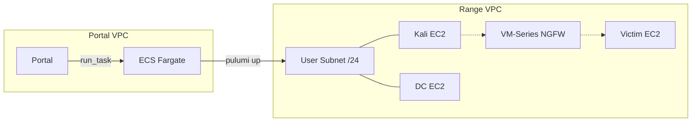

# Execution Plane

Infrastructure that runs ranges: Shifter Engine and range runtime.

## Components

| Component | Purpose |
|-----------|---------|
| [Shifter Engine](engine.md) | ECS task that creates/destroys range infrastructure |
| [Kali AMI](kali-ami.md) | Pre-baked attacker instance |
| [Victim AMI](victim-ami.md) | Pre-baked victim instance |

## Architecture



DC and NGFW are optional. DC enables AD attack scenarios with domain-joined victims. NGFW (VM-Series) sits inline between Kali and Victim to generate network telemetry.

## Range Lifecycle

| Status | Meaning |
|--------|---------|
| `pending` | Portal created Range record |
| `provisioning` | Shifter Engine running `pulumi up` |
| `ready` | Infrastructure created, IPs available |
| `destroying` | Shifter Engine running `pulumi destroy` |
| `destroyed` | Infrastructure torn down |
| `failed` | Error during provisioning |

## Per-Range Resources

Each range creates:
- /24 subnet in Range VPC
- Kali EC2 instance
- Victim EC2 instance(s)
- DC EC2 instance (optional, for AD scenarios)
- NGFW EC2 instance (optional, for network telemetry)
- SSH key per instance (Secrets Manager)
- SSM Parameter for DC config (when DC present)
- S3 bootstrap bucket for NGFW (when NGFW enabled)

DC instances use a prebaked AMI with AD DS already promoted. Post-boot SSM orchestration handles DNS cleanup and XDR agent installation. Victims use user data for initial setup; domain members are joined via SSM after DC is ready.

NGFW (VM-Series) uses bootstrap with init-cfg.txt containing SCM PIN credentials. Auto-registers with Strata Cloud Manager on first boot. Sits inline between Kali and Victim with untrust/trust interfaces.

## AMI Management

AMI IDs are stored in SSM Parameter Store, not hardcoded in tfvars. Terraform reads them via data sources.

| SSM Parameter | Purpose |
|---------------|---------|
| `/shifter/ami/kali` | Kali attacker instance |
| `/shifter/ami/victim` | Linux victim instance |
| `/shifter/ami/windows` | Windows victim instance |
| `/shifter/ami/dc` | Domain Controller instance |

### Build & Promote Workflow

```
┌─────────────┐    test    ┌─────────────┐
│  Build Dev  │ ────────►  │ Promote Prod│
│  (packer)   │            │   (copy)    │
└─────────────┘            └─────────────┘
      │                          │
      ▼                          ▼
 SSM /shifter/ami/*         SSM /shifter/ami/*
    (dev account)             (prod account)
```

**Build in dev:**
```bash
./scripts/ami.sh -b kali
```

**Promote to prod (after testing):**
```bash
./scripts/ami.sh -p kali
```

See [Kali AMI](kali-ami.md) for details.

## Terraform Modules

| Module | Purpose |
|--------|---------|
| `range/` | Range VPC, route tables, security groups |
| `pulumi-provisioner/` | ECS cluster, task definition, IAM |
| `pulumi-state/` | S3 bucket, DynamoDB lock table, KMS key |
