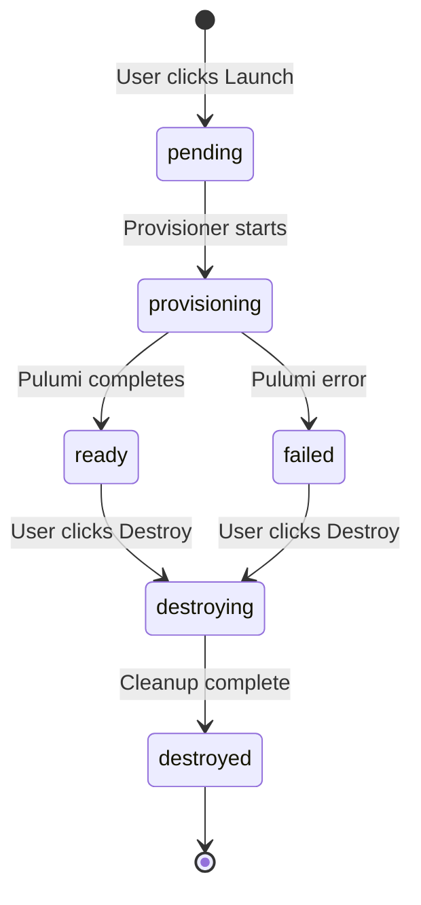

# Orchestration

Range lifecycle management. Currently embedded in Portal's `mission_control` app.

## Range Lifecycle

## Status Values

| Status | Meaning |
|--------|---------|
| `pending` | Range record created, provisioner not yet started |
| `provisioning` | Provisioner running `pulumi up` (includes DC setup for AD scenarios) |
| `ready` | Infrastructure created, terminal access available |
| `failed` | Provisioning error (can be destroyed) |
| `destroying` | Provisioner running `pulumi destroy` |
| `destroyed` | Infrastructure torn down |

Note: `paused` and `resuming` exist in the model but are not currently used. For AD scenarios, the `provisioning` state includes SSM-based DC setup after EC2 creation.

## Launch Flow

1. User selects agent, clicks Launch
2. Portal checks no active range exists for user
3. Portal allocates subnet_index (1-254, locked via `SELECT FOR UPDATE`)
4. Portal creates `Range(status=pending, subnet_index=N)`
5. Portal calls `start_provisioning(range_id)` → ECS task
6. Provisioner updates status as it runs

## Destroy Flow

1. User clicks Destroy
2. Portal sets `status=destroyed` immediately (instant UI feedback)
3. Portal calls `start_teardown(range_id)` → ECS task
4. Provisioner runs cleanup in background

## Constraints

- **One active range per user**: `get_active_for_user()` prevents launching while another is active
- **254 concurrent ranges max**: Subnet index pool (1-254) limits total ranges
- **Agent required**: Range must reference an uploaded XDR agent

## Database Fields

Key fields on `Range` model:

| Field | Purpose |
|-------|---------|
| `status` | Current lifecycle state |
| `subnet_index` | Allocated /24 subnet (1-254) |
| `agent_id` | FK to AgentConfig for XDR installer |
| `provisioned_instances` | JSON from Pulumi outputs (IPs, ARNs) |
| `pulumi_stack` | Stack name for destroy operations |
| `error_message` | Populated on failure |

## Where The Code Lives

| File | Purpose |
|------|---------|
| `mission_control/models.py` | Range model, status choices, subnet allocation |
| `mission_control/views.py` | `launch_range`, `destroy_range`, `get_range_status` |
| `mission_control/services/provisioner.py` | ECS task triggering |
