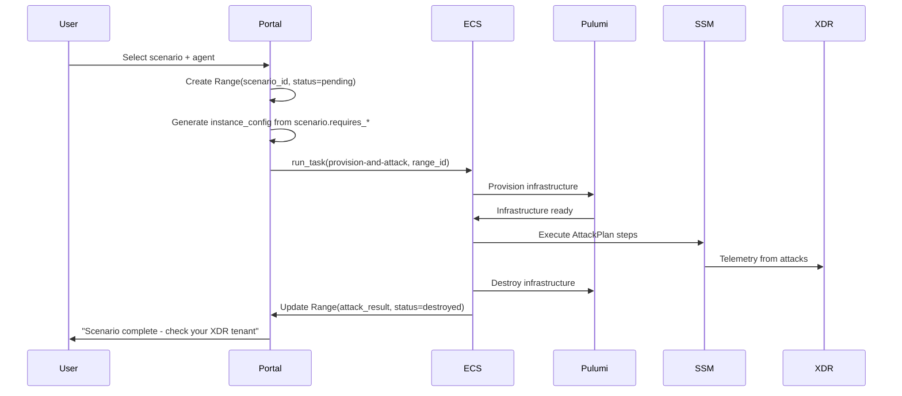

# Atomic Red Team Integration

Design for automated attack execution using Atomic Red Team. Enables "Case as Outcome" workflows where users receive XDR/XSIAM cases without manual range interaction.

## Use Case

**Case as Outcome**: User wants alerts/cases in their XDR tenant without operating a range manually.

```
User selects scenario → Range provisions → Attacks execute → Range destroys → User has cases
```

The range is ephemeral infrastructure, not the deliverable.

## Design Principles

1. **Extend existing patterns** - Use SetupPlan/SetupOrchestrator architecture
2. **No new infrastructure** - ART is a library, not a server
3. **Scripts as data** - Attack techniques are YAML/Python definitions, not runtime code
4. **Explicit failure** - Attack failures propagate as errors, not silent skips

## Architecture Overview

```
┌─────────────────────────────────────────────────────────────────┐
│                         Portal                                   │
│  ┌─────────────────┐    ┌─────────────────┐                     │
│  │ Scenario Model  │    │  Range Model    │                     │
│  │ (catalog)       │───▶│ (+ scenario_id) │                     │
│  └─────────────────┘    └─────────────────┘                     │
└─────────────────────────────────────────────────────────────────┘
                               │
                               │ ECS task: provision + attack
                               ▼
┌─────────────────────────────────────────────────────────────────┐
│                      Shifter Engine                              │
│  ┌─────────────────┐    ┌─────────────────┐                     │
│  │ AttackPlan      │    │ AttackOrchestrator                    │
│  │ (steps)         │───▶│ (execute via SSM)│                    │
│  └─────────────────┘    └─────────────────┘                     │
│           │                     │                                │
│           ▼                     ▼                                │
│  ┌─────────────────┐    ┌─────────────────┐                     │
│  │ AttackStep      │    │ SSMExecutor     │                     │
│  │ (technique)     │    │ (existing)      │                     │
│  └─────────────────┘    └─────────────────┘                     │
└─────────────────────────────────────────────────────────────────┘
```

## Component Design

### AttackStep (New Dataclass)

Extends the SetupStep pattern with ATT&CK metadata:

```python
@dataclass
class AttackStep:
    """A single attack technique execution."""

    name: str                    # Human-readable identifier
    technique_id: str            # ATT&CK ID (e.g., "T1003.001")
    tactic: str                  # ATT&CK tactic (e.g., "credential-access")
    script: str                  # PowerShell or Bash script
    platform: str                # "windows" or "linux"
    timeout_seconds: int = 120

    # Optional metadata
    description: str = ""        # What this technique does
    requires_admin: bool = False # Needs elevated privileges
    cleanup_script: str = ""     # Optional cleanup after execution
```

**Design notes:**

- `technique_id` is required - every attack maps to ATT&CK
- `platform` determines SSM document (`AWS-RunPowerShellScript` vs `AWS-RunShellScript`)
- `cleanup_script` is optional - some techniques leave artifacts for XDR detection
- No `requires_reboot` - attacks shouldn't need reboots

### AttackPlan (Protocol)

Follows SetupPlan protocol pattern:

```python
class AttackPlan(Protocol):
    """Protocol for attack scenario plans."""

    name: str
    description: str
    steps: List[AttackStep]

    def get_context(self, target: Any) -> Dict[str, Any]:
        """Get template variables for rendering scripts."""
        ...
```

**Key differences from SetupPlan:**

- No `verify_step` - attacks don't have a "verification" concept
- Steps may execute on different targets (Kali vs victim)
- Context includes target IP, credentials, paths

### AttackOrchestrator

Similar to SetupOrchestrator but with attack-specific behavior:

```python
class AttackOrchestrator:
    """Executes attack plans with telemetry-friendly timing."""

    def __init__(
        self,
        executor: SSMExecutor,
        min_delay_seconds: int = 5,
        max_delay_seconds: int = 30,
        jitter: bool = True,
    ):
        self.executor = executor
        self.min_delay = min_delay_seconds
        self.max_delay = max_delay_seconds
        self.jitter = jitter

    def orchestrate(
        self,
        plan: AttackPlan,
        targets: Dict[str, str],  # role -> instance_id mapping
        context: Dict[str, Any],
    ) -> AttackResult:
        """Execute attack plan against targets."""
        ...
```

**Behavioral differences from SetupOrchestrator:**

1. **Jitter between steps** - Adds random delay for realistic telemetry timing
2. **Multi-target execution** - Steps may run on attacker (Kali) or victim
3. **Logging for correlation** - Logs technique IDs for XDR alert matching
4. **No rollback** - Failures stop execution but don't undo previous steps

### Scenario Model (Portal)

New Django model for scenario catalog:

```python
class Scenario(models.Model):
    """Attack scenario definition."""

    slug = models.SlugField(unique=True)
    name = models.CharField(max_length=100)
    description = models.TextField()

    # ATT&CK coverage
    tactics = models.JSONField(default=list)      # ["credential-access", "lateral-movement"]
    techniques = models.JSONField(default=list)   # ["T1003.001", "T1021.002"]

    # Requirements
    requires_dc = models.BooleanField(default=False)
    requires_windows_victim = models.BooleanField(default=False)
    requires_linux_victim = models.BooleanField(default=False)

    # Lifecycle
    is_active = models.BooleanField(default=True)
    created_at = models.DateTimeField(auto_now_add=True)
```

**Design notes:**

- Scenarios are catalog entries, not executable code
- `tactics` and `techniques` are denormalized for filtering/display
- Requirements drive instance_config generation
- No versioning initially - add when needed

### Range Model Extension

Add scenario reference to Range:

```python
class Range(models.Model):
    # ... existing fields ...

    scenario = models.ForeignKey(
        Scenario,
        on_delete=models.SET_NULL,
        null=True,
        blank=True,
        related_name="ranges",
    )

    # Execution tracking
    attack_started_at = models.DateTimeField(null=True, blank=True)
    attack_completed_at = models.DateTimeField(null=True, blank=True)
    attack_result = models.JSONField(null=True, blank=True)  # Step results
```

## File Structure

```
shifter-engine/
├── components/
│   ├── attack_step.py           # AttackStep dataclass
│   ├── attack_plan.py           # AttackPlan protocol
│   ├── attack_orchestrator.py   # AttackOrchestrator
│   └── attacks/                  # Attack plan implementations
│       ├── __init__.py
│       ├── credential_dumping.py    # T1003.x techniques
│       ├── lateral_movement.py      # T1021.x techniques
│       ├── persistence.py           # T1547.x techniques
│       └── discovery.py             # T1082, T1016, etc.
```

Plans in `attacks/` follow same pattern as `plans/`:

```python
# attacks/credential_dumping.py

LSASS_DUMP_SCRIPT = '''
$ProcessId = (Get-Process lsass).Id
$DumpPath = "C:\\Windows\\Temp\\debug.dmp"
rundll32.exe C:\\windows\\System32\\comsvcs.dll, MiniDump $ProcessId $DumpPath full
'''

class CredentialDumpingPlan:
    """Credential access techniques from ATT&CK."""

    name = "Credential Dumping"
    description = "Extract credentials from LSASS memory"

    steps = [
        AttackStep(
            name="lsass_dump",
            technique_id="T1003.001",
            tactic="credential-access",
            script=LSASS_DUMP_SCRIPT,
            platform="windows",
            timeout_seconds=60,
            requires_admin=True,
        ),
    ]

    def get_context(self, target: Any) -> Dict[str, Any]:
        return {}  # No template variables needed
```

## Execution Flow

### Case-as-Outcome Workflow



### Engine Command Extension

New command for combined provision + attack + destroy:

```
python main.py case --range-id N --scenario-slug credential-theft
```

Or split into phases:

```
python main.py provision --range-id N
python main.py attack --range-id N
python main.py destroy --range-id N
```

The `case` command combines all three for atomic "case as outcome" execution.

## SSM Execution Strategy

### From Kali (Attacker-Initiated)

Some attacks run from Kali against victims (e.g., network scans, exploitation):

```python
# Context includes victim IP for targeting
context = {
    "target_ip": victim_instance.private_ip,
    "target_user": "Administrator",
    "target_password": "...",  # From DC or known credentials
}

# Script runs on Kali, attacks victim
orchestrator.orchestrate(
    plan=lateral_movement_plan,
    targets={"attacker": kali_instance_id},
    context=context,
)
```

### On Victim (Post-Compromise)

Most ART techniques run directly on victims (simulating post-compromise):

```python
# Execute directly on victim
orchestrator.orchestrate(
    plan=credential_dumping_plan,
    targets={"victim": victim_instance_id},
    context={},
)
```

### Decision: Where to Execute

| Technique Type | Execute On | Example |
|----------------|------------|---------|
| Network discovery | Kali | nmap, ping sweep |
| Exploitation | Kali | Metasploit, custom exploits |
| Post-compromise | Victim | Mimikatz, persistence |
| Lateral movement | Kali (initiates) → Victim (receives) | PsExec, WMI |

## Atomic Red Team Content

### Importing ART Tests

ART tests are YAML files. Import strategy:

1. **Curated subset** - Hand-pick techniques that work well with XDR
2. **Script extraction** - Pull `command` field from ART YAML
3. **Platform mapping** - Map ART `executor` to SSM document

Example ART YAML → AttackStep:

```yaml
# From atomic-red-team/atomics/T1003.001/T1003.001.yaml
attack_technique: T1003.001
atomic_tests:
  - name: Dump LSASS.exe Memory using comsvcs.dll
    executor:
      name: powershell
      elevation_required: true
      command: |
        rundll32.exe C:\windows\System32\comsvcs.dll, MiniDump ...
```

Becomes:

```python
AttackStep(
    name="Dump LSASS.exe Memory using comsvcs.dll",
    technique_id="T1003.001",
    tactic="credential-access",
    script="rundll32.exe C:\\windows\\System32\\comsvcs.dll, MiniDump ...",
    platform="windows",
    requires_admin=True,
)
```

### Content Curation Criteria

Include techniques that:

- Generate clear XDR/XSIAM alerts
- Work on supported OS versions (Windows Server 2022, Ubuntu 22.04+)
- Don't require external infrastructure (C2 servers, etc.)
- Complete within reasonable timeout (< 5 minutes)

Exclude techniques that:

- Require network egress to attacker infrastructure
- Depend on specific software not in AMIs
- Are destructive (ransomware, disk wipe) unless explicitly requested
- Require user interaction

## Error Handling

### Attack Failures

Attack step failures are logged but don't necessarily indicate a problem:

```python
class AttackResult:
    success: bool              # All steps completed (may have failures)
    steps_executed: int
    steps_failed: int
    step_results: List[StepResult]

@dataclass
class StepResult:
    step_name: str
    technique_id: str
    success: bool
    exit_code: int
    stdout: str
    stderr: str
    execution_time_seconds: float
```

**Failure modes:**

| Failure Type | Behavior | Reason |
|--------------|----------|--------|
| SSM command timeout | Stop, log, continue | May indicate detection/prevention |
| Non-zero exit code | Log, continue | Technique may have been blocked |
| SSM agent offline | Stop, fail range | Infrastructure problem |
| Script syntax error | Stop, fail range | Implementation bug |

### XDR Detection Correlation

Log technique executions with timestamps for XDR correlation:

```python
logger.info(
    "Attack step executed",
    extra={
        "range_id": range_id,
        "technique_id": step.technique_id,
        "tactic": step.tactic,
        "target_instance": instance_id,
        "timestamp": datetime.utcnow().isoformat(),
        "success": result.success,
    }
)
```

## Testing Strategy

### Unit Tests

Test AttackStep, AttackPlan, AttackOrchestrator in isolation:

```python
def test_attack_step_requires_technique_id():
    """AttackStep must have ATT&CK technique ID."""
    with pytest.raises(TypeError):
        AttackStep(name="test", script="echo test", platform="linux")

def test_attack_orchestrator_adds_jitter():
    """Orchestrator adds delay between steps."""
    # Mock time.sleep, verify it's called
```

### Integration Tests

Test full attack execution with mocked SSM:

```python
def test_credential_dumping_plan_executes():
    """CredentialDumpingPlan runs all steps."""
    mock_executor = MockSSMExecutor(always_succeed=True)
    orchestrator = AttackOrchestrator(mock_executor)

    result = orchestrator.orchestrate(
        plan=CredentialDumpingPlan(),
        targets={"victim": "i-test123"},
        context={},
    )

    assert result.steps_executed == len(CredentialDumpingPlan.steps)
```

### Live Testing

Test in dev environment with real instances:

1. Provision range with Windows victim
2. Execute credential dumping plan
3. Verify XDR tenant received alerts
4. Destroy range

## Migration Path

### Phase 1: Foundation

1. Add AttackStep, AttackPlan, AttackOrchestrator to engine
2. Implement one plan (credential dumping)
3. Add `attack` command to engine CLI
4. Test end-to-end in dev

### Phase 2: Portal Integration

1. Add Scenario model
2. Add scenario_id to Range model
3. Create scenario selection UI
4. Wire up "Generate Cases" button

### Phase 3: Content Library

1. Curate 10-15 high-value techniques
2. Organize into scenario bundles (credential theft, lateral movement, etc.)
3. Document expected XDR alerts per technique

### Phase 4: Case-as-Outcome Workflow

1. Add `case` command for atomic execution
2. Implement auto-teardown after attack completion
3. Add notification when cases are ready

## Open Questions

1. **Credential handling**: How do attacks that need victim credentials (lateral movement) get them? Options:
   - Fixed credentials in DC scenario (domain admin)
   - Credential harvesting step outputs feed into subsequent steps
   - Pre-configured credentials per scenario

2. **Timing requirements**: How long should we wait after attack for XDR to ingest? Options:
   - Fixed delay (5 minutes)
   - Poll XDR API for alert presence
   - Leave range running, user triggers teardown

3. **Multi-victim scenarios**: How do attacks target multiple victims? Options:
   - Sequential execution across all victims
   - Parallel execution with ThreadPoolExecutor
   - User selects specific target

## References

- [Atomic Red Team GitHub](https://github.com/redcanaryco/atomic-red-team)
- [ATT&CK Framework](https://attack.mitre.org/)
- [SetupPlan pattern](../execution/engine.md#plans-architecture)
