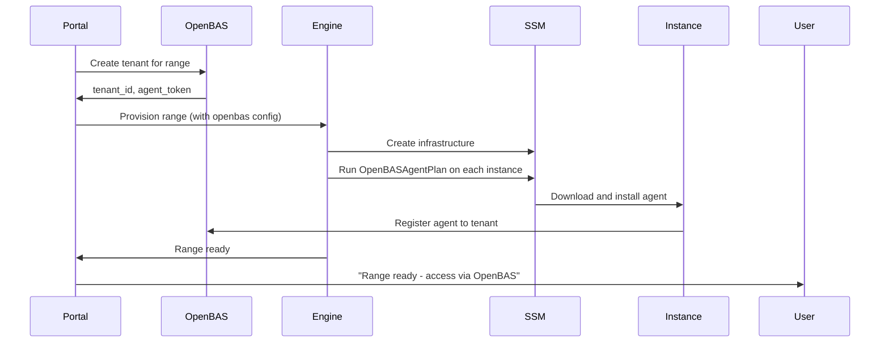
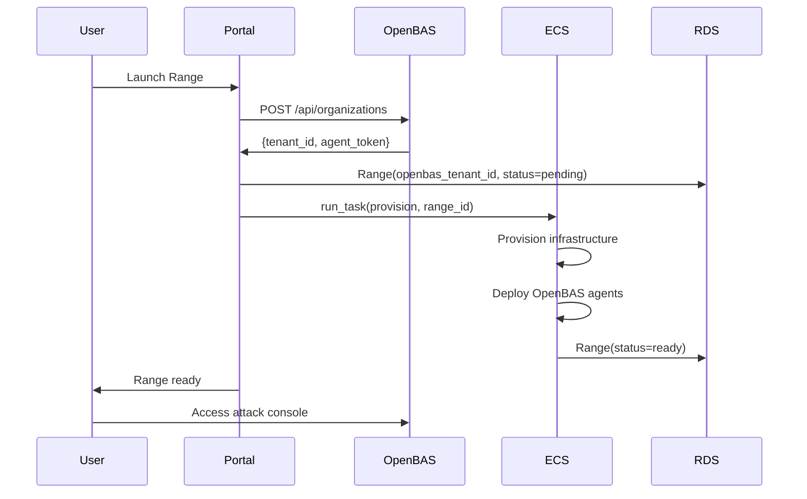
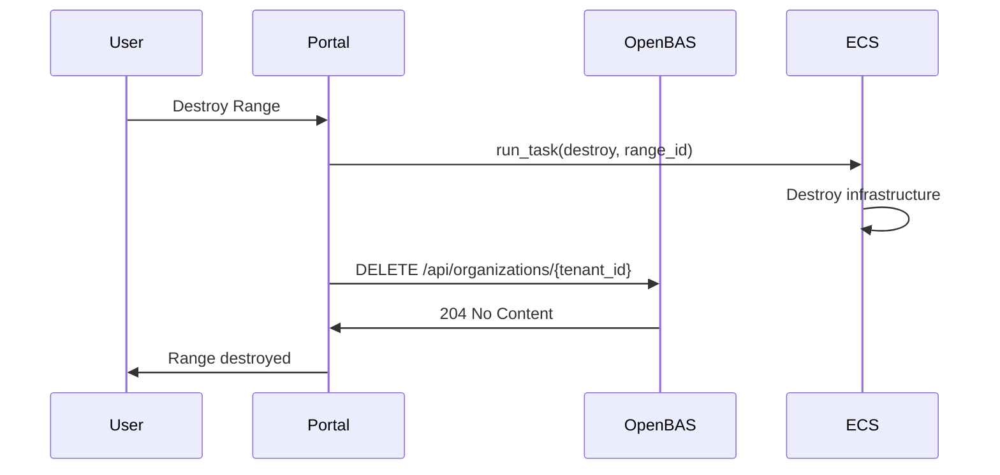

# OpenBAS Integration

Design for centralized adversary emulation using OpenBAS. Enables "Range as Outcome" workflows with interactive attack execution, scenario management, and multi-tenant isolation.

## Use Case

**Range as Outcome**: User wants an interactive range with rich attack capabilities, scenario library, and guided execution.

```
User launches range → Range provisions with OpenBAS agent → User operates via OpenBAS UI → Teardown
```

The range is the deliverable. OpenBAS provides the attack infrastructure.

## Why OpenBAS

| Requirement | OpenBAS | CALDERA | Build Custom |
|-------------|---------|---------|--------------|
| Multi-tenant | Native | Not supported | Build it |
| Central scenario library | Yes | Per-instance | Build it |
| API-first | Yes | Yes | Build it |
| Uses CALDERA agents | Yes (compatible) | Native | N/A |
| Atomic Red Team import | Yes | Via plugin | Manual |
| Active development | Yes (Filigran) | Yes (MITRE) | N/A |

OpenBAS is purpose-built for multi-tenant BAS with API-first design.

## Design Principles

1. **Central infrastructure** - One OpenBAS server for all ranges
2. **Tenant isolation** - Each range is an isolated OpenBAS tenant
3. **API integration** - Portal manages tenants via OpenBAS REST API
4. **Agent deployment** - OpenBAS agents deployed during range provisioning
5. **Scenario as data** - Attack scenarios managed in OpenBAS, not Shifter code

## Architecture Overview

```
┌─────────────────────────────────────────────────────────────────┐
│                         Portal VPC                               │
│                                                                  │
│  ┌─────────────────┐         ┌─────────────────────────────┐   │
│  │  Django Portal  │◀───────▶│  OpenBAS Server             │   │
│  │                 │  API    │  (ECS or EC2)               │   │
│  │  • Tenant mgmt  │         │  • Multi-tenant             │   │
│  │  • Range launch │         │  • Scenario library         │   │
│  │  • UI proxy     │         │  • Attack orchestration     │   │
│  └─────────────────┘         └─────────────────────────────┘   │
│                                        │                        │
└────────────────────────────────────────│────────────────────────┘
                                         │
                    VPC Peering (existing)
                                         │
┌────────────────────────────────────────│────────────────────────┐
│                         Range VPC      │                        │
│                                        ▼                        │
│  ┌─────────────────────────────────────────────────────────┐   │
│  │                    User Range                            │   │
│  │  ┌─────────────┐       ┌─────────────┐                  │   │
│  │  │    Kali     │       │   Victim    │                  │   │
│  │  │ + OB Agent  │──────▶│ + OB Agent  │                  │   │
│  │  └─────────────┘       └─────────────┘                  │   │
│  │         │                     │                          │   │
│  │         └──────────┬──────────┘                          │   │
│  │                    │                                      │   │
│  │                    ▼                                      │   │
│  │           Reports to OpenBAS                              │   │
│  └─────────────────────────────────────────────────────────┘   │
└─────────────────────────────────────────────────────────────────┘
```

## OpenBAS Server Deployment

### Infrastructure

Deploy OpenBAS as shared infrastructure alongside Portal:

| Component | Resource | Purpose |
|-----------|----------|---------|
| OpenBAS API | ECS Fargate or EC2 | Core platform |
| PostgreSQL | RDS (separate or shared) | OpenBAS data |
| RabbitMQ | Amazon MQ or container | Message queue |
| MinIO/S3 | S3 bucket | Object storage |
| Elasticsearch | OpenSearch | Search/indexing |

### Terraform Module

New module for OpenBAS infrastructure:

```
terraform/
└── modules/
    └── openbas/
        ├── main.tf           # ECS task or EC2 instance
        ├── database.tf       # RDS PostgreSQL
        ├── messaging.tf      # RabbitMQ
        ├── storage.tf        # S3 bucket
        ├── search.tf         # OpenSearch (optional)
        ├── networking.tf     # Security groups, ALB
        ├── variables.tf
        └── outputs.tf
```

### Deployment Options

**Option A: ECS Fargate (Recommended)**

```hcl
resource "aws_ecs_service" "openbas" {
  name            = "openbas"
  cluster         = aws_ecs_cluster.portal.id
  task_definition = aws_ecs_task_definition.openbas.arn
  desired_count   = 1
  launch_type     = "FARGATE"

  network_configuration {
    subnets          = var.private_subnet_ids
    security_groups  = [aws_security_group.openbas.id]
    assign_public_ip = false
  }

  load_balancer {
    target_group_arn = aws_lb_target_group.openbas.arn
    container_name   = "openbas"
    container_port   = 8080
  }
}
```

**Option B: EC2 with Docker Compose**

For simpler deployment or if ECS complexity isn't warranted:

```hcl
resource "aws_instance" "openbas" {
  ami           = var.amazon_linux_ami_id
  instance_type = "t3.large"  # 2 vCPU, 8GB RAM
  subnet_id     = var.private_subnet_id

  user_data = templatefile("openbas-init.sh", {
    db_host     = aws_db_instance.openbas.address
    db_password = random_password.openbas_db.result
  })
}
```

### Resource Sizing

| Environment | OpenBAS | PostgreSQL | RabbitMQ |
|-------------|---------|------------|----------|
| Dev | t3.medium (2 vCPU, 4GB) | db.t3.micro | t3.micro |
| Prod | t3.large (2 vCPU, 8GB) | db.t3.small | t3.small |

## Multi-Tenancy Model

### OpenBAS Tenant Structure

OpenBAS supports organizations/tenants. Map Shifter ranges to OpenBAS tenants:

```
OpenBAS Server
├── Organization: range-123-user-abc
│   ├── Agents: kali-123, victim-123
│   ├── Campaigns: (user's attack runs)
│   └── Scenarios: (inherited from global)
├── Organization: range-456-user-xyz
│   ├── Agents: kali-456, victim-456-1, victim-456-2
│   ├── Campaigns: (user's attack runs)
│   └── Scenarios: (inherited from global)
└── Global Scenarios: (shared attack library)
```

### Tenant Lifecycle

| Range Event | OpenBAS Action |
|-------------|----------------|
| Range created | Create tenant via API |
| Range provisioning | Deploy agents with tenant token |
| Range ready | Agents registered to tenant |
| Range destroyed | Delete tenant and all data |

## Portal Integration

### OpenBAS Service

New service in Portal for OpenBAS API communication:

```python
# portal/mission_control/services/openbas.py

class OpenBASService:
    """Client for OpenBAS REST API."""

    def __init__(self):
        self.base_url = settings.OPENBAS_API_URL
        self.api_key = settings.OPENBAS_API_KEY

    def create_tenant(self, range_id: int, user_id: int) -> dict:
        """Create isolated tenant for a range."""
        ...

    def delete_tenant(self, tenant_id: str) -> None:
        """Delete tenant and all associated data."""
        ...

    def get_agent_token(self, tenant_id: str) -> str:
        """Get agent registration token for tenant."""
        ...

    def list_scenarios(self) -> List[dict]:
        """List available attack scenarios."""
        ...

    def start_campaign(self, tenant_id: str, scenario_id: str) -> dict:
        """Start attack campaign in tenant."""
        ...

    def get_campaign_status(self, campaign_id: str) -> dict:
        """Get campaign execution status."""
        ...
```

### Settings

```python
# portal/config/settings.py

OPENBAS_API_URL = env("OPENBAS_API_URL", default="")
OPENBAS_API_KEY = env("OPENBAS_API_KEY", default="")
OPENBAS_ENABLED = bool(OPENBAS_API_URL and OPENBAS_API_KEY)
```

### Range Model Extension

```python
class Range(models.Model):
    # ... existing fields ...

    # OpenBAS integration
    openbas_tenant_id = models.CharField(
        max_length=100,
        blank=True,
        default="",
        help_text="OpenBAS organization/tenant ID",
    )
    openbas_agent_token = models.CharField(
        max_length=500,
        blank=True,
        default="",
        help_text="Agent registration token (encrypted)",
    )
```

## Agent Deployment

### Agent Installation Plan

New setup plan for deploying OpenBAS agents:

```python
# shifter-engine/components/plans/openbas_agent.py

LINUX_AGENT_INSTALL = '''#!/bin/bash
set -euo pipefail

OPENBAS_URL="{{ openbas_url }}"
AGENT_TOKEN="{{ agent_token }}"
TENANT_ID="{{ tenant_id }}"

# Download agent
curl -sSL "${OPENBAS_URL}/api/agent/download/linux" -o /tmp/openbas-agent

# Install and register
chmod +x /tmp/openbas-agent
/tmp/openbas-agent install \
  --server "${OPENBAS_URL}" \
  --token "${AGENT_TOKEN}" \
  --organization "${TENANT_ID}"

# Start agent service
systemctl enable openbas-agent
systemctl start openbas-agent
'''

class OpenBASAgentPlan:
    """Deploy OpenBAS agent to instance."""

    steps = [
        SetupStep(
            name="install_openbas_agent",
            script=LINUX_AGENT_INSTALL,
            timeout_seconds=120,
        ),
    ]

    verify_step = SetupStep(
        name="verify_agent_running",
        script='systemctl is-active openbas-agent',
        timeout_seconds=30,
        is_verification=True,
    )

    def get_context(self, config: Any) -> Dict[str, Any]:
        return {
            "openbas_url": config.openbas_url,
            "agent_token": config.agent_token,
            "tenant_id": config.tenant_id,
        }
```

### Deployment Sequence



## User Interface Integration

### Option A: Proxy OpenBAS UI

Embed OpenBAS UI within Portal via iframe or reverse proxy:

```python
# portal/mission_control/views.py

class OpenBASProxyView(LoginRequiredMixin, View):
    """Proxy requests to OpenBAS with tenant isolation."""

    def dispatch(self, request, *args, **kwargs):
        range_id = kwargs.get("range_id")
        range_obj = get_object_or_404(Range, id=range_id, user=request.user)

        # Proxy to OpenBAS with tenant context
        openbas_url = f"{settings.OPENBAS_API_URL}/tenant/{range_obj.openbas_tenant_id}"
        return proxy_request(request, openbas_url)
```

**Pros:** Full OpenBAS functionality, no custom UI work
**Cons:** Requires UI integration, may have auth complexity

### Option B: Custom Attack UI

Build simplified attack UI in Portal:

```
/mission-control/range/{id}/attacks/
├── Scenario selection (from OpenBAS API)
├── Target selection (agents in range)
├── Execute button
└── Results view
```

**Pros:** Consistent UX, simpler integration
**Cons:** Limited to implemented features, more development

### Option C: Direct Link

Simplest approach - link to OpenBAS with SSO:

```html
<a href="{{ openbas_url }}/organizations/{{ range.openbas_tenant_id }}"
   target="_blank">
  Open Attack Console
</a>
```

**Pros:** No integration work, full OpenBAS features
**Cons:** Separate UI, user must understand OpenBAS

**Recommendation:** Start with Option C, evolve to Option A or B based on user feedback.

## Scenario Management

### Scenario Library

OpenBAS manages the scenario library. Shifter doesn't duplicate this:

```
OpenBAS Scenario Library
├── Credential Theft
│   ├── LSASS Memory Dump (T1003.001)
│   ├── SAM Database Extraction (T1003.002)
│   └── DCSync Attack (T1003.006)
├── Lateral Movement
│   ├── PsExec (T1021.002)
│   ├── WMI Execution (T1047)
│   └── Remote Service Installation (T1021.002)
├── Persistence
│   ├── Registry Run Keys (T1547.001)
│   ├── Scheduled Task (T1053.005)
│   └── Service Installation (T1543.003)
└── Full Kill Chain
    └── Combines multiple tactics
```

### Importing Atomic Red Team

OpenBAS can import Atomic Red Team tests. Use this for content:

1. Clone Atomic Red Team repository
2. Import tests to OpenBAS via API or UI
3. Curate and organize into scenarios
4. Scenarios become available to all tenants

### Scenario Visibility

| Scenario Type | Visibility | Management |
|---------------|------------|------------|
| Global | All tenants | Shifter admin |
| Tenant-specific | Single range | User (if allowed) |

Start with global-only scenarios for simplicity.

## Security Considerations

### Network Isolation

```
┌─────────────────────────────────────────────────────────────┐
│ Portal VPC                                                   │
│                                                              │
│   ┌─────────────┐     ┌─────────────┐                       │
│   │   Portal    │────▶│  OpenBAS    │                       │
│   │  (private)  │     │  (private)  │                       │
│   └─────────────┘     └─────────────┘                       │
│          │                   │                               │
│          │                   │ Port 443 only                 │
│          │                   │ (agent communication)         │
└──────────│───────────────────│───────────────────────────────┘
           │                   │
           │ VPC Peering       │
           ▼                   ▼
┌─────────────────────────────────────────────────────────────┐
│ Range VPC                                                    │
│                                                              │
│   ┌─────────────┐     ┌─────────────┐                       │
│   │    Kali     │     │   Victim    │                       │
│   │  + Agent    │     │  + Agent    │                       │
│   └─────────────┘     └─────────────┘                       │
└─────────────────────────────────────────────────────────────┘
```

Security group rules:

| From | To | Port | Purpose |
|------|----|------|---------|
| Range instances | OpenBAS | 443 | Agent → Server |
| Portal | OpenBAS | 8080 | API calls |
| OpenBAS | RDS | 5432 | Database |

### Tenant Isolation

OpenBAS provides tenant isolation. Verify:

- [ ] Agents only see their tenant's campaigns
- [ ] Users cannot access other tenants via API
- [ ] Tenant deletion removes all data
- [ ] API key scoped to admin operations

### Agent Security

OpenBAS agents have neutral behavior - they don't execute attacks directly. Attacks are executed via implants that agents coordinate. This prevents security tools from flagging the agent itself.

## Data Flow

### Provisioning with OpenBAS



### Teardown with OpenBAS



## Configuration

### Environment Variables

```bash
# Portal
OPENBAS_API_URL=https://openbas.internal.shifter
OPENBAS_API_KEY=<admin-api-key>

# Shifter Engine (for agent deployment)
OPENBAS_API_URL=https://openbas.internal.shifter
```

### Pulumi Config

```yaml
# For Shifter Engine
config:
  shifter:openbasEnabled: "true"
  shifter:openbasUrl: "https://openbas.internal.shifter"
```

## Migration Path

### Phase 1: Infrastructure

1. Create Terraform module for OpenBAS
2. Deploy to dev environment
3. Verify OpenBAS UI accessible
4. Test API authentication

### Phase 2: Integration

1. Add OpenBAS service to Portal
2. Implement tenant creation/deletion
3. Add Range model fields
4. Test tenant lifecycle

### Phase 3: Agent Deployment

1. Create OpenBASAgentPlan
2. Integrate into instance provisioning
3. Verify agents register to correct tenant
4. Test agent → OpenBAS communication

### Phase 4: User Access

1. Implement direct link approach
2. Test user workflow end-to-end
3. Document OpenBAS usage for users

### Phase 5: Content

1. Import Atomic Red Team tests
2. Create curated scenarios
3. Test scenario execution against XDR
4. Document expected alerts

## Operational Considerations

### Monitoring

| Metric | Source | Alert Threshold |
|--------|--------|-----------------|
| OpenBAS API latency | ALB | > 5s p99 |
| Agent registration failures | OpenBAS logs | > 0 per hour |
| Tenant count | OpenBAS API | Capacity warning |
| Database connections | RDS | > 80% |

### Backup and Recovery

| Data | Backup Strategy | Recovery |
|------|-----------------|----------|
| Scenarios | Export via API, store in Git | Import via API |
| Tenant data | RDS automated backups | Point-in-time restore |
| Agent binaries | S3 with versioning | Restore from S3 |

### Upgrades

OpenBAS releases frequently. Upgrade strategy:

1. Test new version in dev
2. Backup production database
3. Deploy new version with blue-green
4. Verify API compatibility
5. Monitor for issues

## Cost Estimate

### Infrastructure (Monthly)

| Component | Dev | Prod |
|-----------|-----|------|
| ECS Fargate (OpenBAS) | $15 | $60 |
| RDS PostgreSQL | $15 | $50 |
| Amazon MQ (RabbitMQ) | $0 (container) | $30 |
| OpenSearch | $0 (skip) | $80 |
| **Total** | **$30** | **$220** |

### vs. Per-Range CALDERA

| Approach | 10 Ranges | 50 Ranges | 100 Ranges |
|----------|-----------|-----------|------------|
| Central OpenBAS | $220/mo | $220/mo | $220/mo |
| CALDERA per range | $50/mo | $250/mo | $500/mo |

Central OpenBAS scales better for multiple concurrent ranges.

## Open Questions

1. **Authentication**: How do users authenticate to OpenBAS UI?
   - Option A: Portal proxies with service account
   - Option B: SSO integration (OIDC)
   - Option C: Separate OpenBAS accounts per user

2. **Scenario ownership**: Can users create custom scenarios?
   - Option A: Global scenarios only (simpler)
   - Option B: Users can create tenant-local scenarios (more complex)

3. **Agent lifecycle**: What happens to agents if OpenBAS server is unavailable?
   - Agents should operate in degraded mode
   - Attacks may fail but shouldn't crash instances

4. **CALDERA compatibility**: OpenBAS supports CALDERA agents - should we use them?
   - OpenBAS native agent is newer and Rust-based
   - CALDERA Sandcat is more mature
   - Test both, choose based on XDR compatibility

## References

- [OpenBAS GitHub](https://github.com/OpenBAS-Platform/openbas)
- [OpenBAS Documentation](https://docs.openbas.io/)
- [Filigran (OpenBAS maintainer)](https://filigran.io/)
- [CALDERA Documentation](https://caldera.readthedocs.io/)
- [Atomic Red Team](https://github.com/redcanaryco/atomic-red-team)
