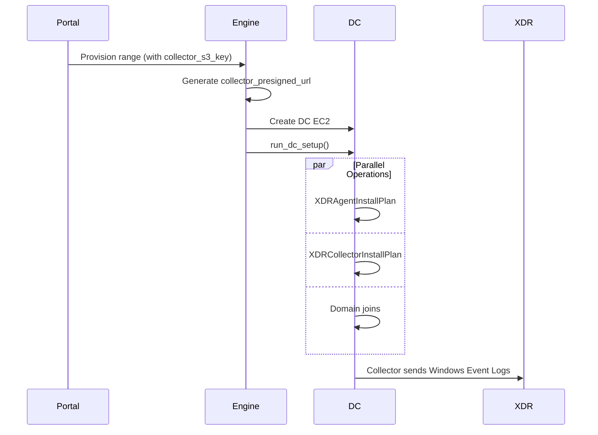

# XDR Collector on Domain Controller Design

Design for adding Cortex XDR Collector (XDRC) installation as a new setup plan for Domain Controller instances.

**Status:** Draft
**Scope:** XDRC installation plan only (no Broker VM, no log forwarding config)

## Overview

The Cortex XDR Collector (XDRC) is a lightweight data collector that gathers logs from endpoints and streams them to XDR/XSIAM. Unlike the XDR Agent (endpoint protection), the Collector focuses purely on log collection using Filebeat/Winlogbeat.

For Domain Controllers, XDRC collects Windows Event Logs (Security, System, Application, AD DS logs) and forwards them to the user's XDR/XSIAM tenant for analysis.

## Current State

The DC already has the **XDR Agent** installed via `XDRAgentInstallPlan` during `run_dc_setup()`. This provides endpoint protection but not the dedicated log collection that XDRC offers.

**Relevant code:** `shifter-engine/components/instance.py:488-508`

```python
def install_xdr_agent() -> None:
    """Install XDR agent on DC using plan."""
    xdr_plan = XDRAgentInstallPlan()
    # ... runs after DC boot, parallel with domain joins
```

## XDR Agent vs XDR Collector

| Aspect | XDR Agent | XDR Collector (XDRC) |
|--------|-----------|---------------------|
| Purpose | Endpoint protection (prevent, detect, respond) | Log collection only |
| Engine | Prevention + detection engine | Filebeat/Winlogbeat |
| Footprint | Heavier | Lightweight |
| Data collected | Process, file, network events | Log files, Windows Event Logs |
| Configuration | Policy from XDR console | YAML profile (Filebeat config) |
| Installer | `cortex_xdr_*.msi` | `xdr_collector_*.msi` |

For DC scenarios, having **both** is valuable:
- **Agent**: Detects attacks on the DC itself
- **Collector**: Forwards AD/Security logs to XSIAM for correlation

## Design

### New Setup Plan: `XDRCollectorInstallPlan`

Following the existing plan pattern in `shifter-engine/components/plans/`:

```python
# shifter-engine/components/plans/xdr_collector_install.py

class XDRCollectorInstallPlan:
    """Setup plan for installing XDR Collector on Windows instances.

    Steps:
    1. Download XDRC installer from S3 presigned URL
    2. Install MSI silently

    Verification:
    - Check XDR Collector service is running
    """

    steps: List[SetupStep] = [
        SetupStep(
            name="download_xdr_collector",
            script=DOWNLOAD_XDRC_SCRIPT,
            timeout_seconds=300,
        ),
        SetupStep(
            name="install_xdr_collector",
            script=INSTALL_XDRC_SCRIPT,
            timeout_seconds=600,
        ),
    ]

    verify_step: SetupStep = SetupStep(
        name="verify_xdr_collector",
        script=VERIFY_XDRC_SCRIPT,
        timeout_seconds=120,
        is_verification=True,
    )

    def get_context(self, instance: Any) -> Dict[str, Any]:
        """Get template variables for XDRC install scripts."""
        return {"collector_presigned_url": instance.collector_presigned_url}
```

### Scripts

**Download script** (similar to XDR Agent):
```powershell
$ErrorActionPreference = "Stop"
$presignedUrl = "{{ collector_presigned_url }}"
$installerPath = "C:\Windows\Temp\xdr_collector_installer.msi"

[Net.ServicePointManager]::SecurityProtocol = [Net.SecurityProtocolType]::Tls12
Invoke-WebRequest -Uri $presignedUrl -OutFile $installerPath -UseBasicParsing

if (Test-Path $installerPath) {
    Write-Host "Download complete: $installerPath"
} else {
    throw "Failed to download installer"
}
```

**Install script**:
```powershell
$ErrorActionPreference = "Stop"
$installerPath = "C:\Windows\Temp\xdr_collector_installer.msi"

# Silent install - XDRC uses standard MSI parameters
Start-Process msiexec.exe -ArgumentList "/i", $installerPath, "/qn", "/norestart" -Wait -PassThru

# Cleanup
Remove-Item $installerPath -Force -ErrorAction SilentlyContinue
Write-Host "XDR Collector installed"
```

**Verify script**:
```powershell
$ErrorActionPreference = "Stop"

# Check for XDR Collector service (typically "CortexCollector" or similar)
$service = Get-Service -Name "xdr_collector*" -ErrorAction SilentlyContinue
if ($service -and $service.Status -eq "Running") {
    Write-Host "XDR Collector service is running"
    exit 0
}

# Check for Filebeat service (XDRC uses Filebeat internally)
$filebeat = Get-Service -Name "filebeat" -ErrorAction SilentlyContinue
if ($filebeat -and $filebeat.Status -eq "Running") {
    Write-Host "Filebeat service is running"
    exit 0
}

Write-Host "XDR Collector service not found"
exit 1
```

### Integration Point

Modify `run_dc_setup()` in `instance.py` to run XDRC install alongside XDR Agent install:

```python
# In run_dc_setup() parallel execution block:

def install_xdr_collector() -> None:
    """Install XDR Collector on DC using plan."""
    if not dc_collector_presigned_url:
        pulumi.log.info("No XDR Collector URL provided, skipping")
        return

    pulumi.log.info(f"Installing XDR Collector on DC {instance_id}...")

    xdrc_plan = XDRCollectorInstallPlan()
    context = xdrc_plan.get_context(collector_config)

    result = orchestrator.orchestrate(instance_id, xdrc_plan, context)
    if not result.success:
        raise SetupError(f"XDR Collector install failed: {result.error}")

# Execute all three tasks in parallel:
with ThreadPoolExecutor(max_workers=3) as pool:
    futures = [
        pool.submit(install_xdr_agent),
        pool.submit(install_xdr_collector),  # NEW
        pool.submit(join_domain_members_task),
    ]
```

### Data Flow

```
User uploads XDRC installer to S3
         │
         ▼
Portal stores collector_s3_key in AgentConfig
         │
         ▼
config.py generates collector_presigned_url
         │
         ▼
run_dc_setup() calls XDRCollectorInstallPlan
         │
         ▼
XDRC installed on DC, sends logs to XDR/XSIAM
```

### Model Changes

Extend `AgentConfig` model (or create new `CollectorConfig`):

```python
# portal/mission_control/models.py

class AgentConfig(models.Model):
    # Existing fields...
    agent_s3_key = models.CharField(...)

    # New field for XDRC
    collector_s3_key = models.CharField(
        max_length=512,
        blank=True,
        null=True,
        help_text="S3 key for XDR Collector installer (optional)"
    )
```

### Config Changes

Add to `RangeConfig` dataclass:

```python
# shifter-engine/config.py

@dataclass
class InstanceConfig:
    # Existing...
    agent_presigned_url: Optional[str] = None

    # New
    collector_presigned_url: Optional[str] = None
```

### Environment Variables

No new env vars needed - the collector URL is per-range config from the database, similar to the agent URL.

## User Flow

### Upload Flow

1. User downloads XDRC installer from Palo Alto customer portal
2. User uploads to Shifter Portal (new upload field or reuse agent upload with type selector)
3. Portal stores in S3, saves `collector_s3_key` in database

### Provisioning Flow



## Implementation Plan

### Phase 1: New Plan File

1. Create `shifter-engine/components/plans/xdr_collector_install.py`
2. Define `DOWNLOAD_XDRC_SCRIPT`, `INSTALL_XDRC_SCRIPT`, `VERIFY_XDRC_SCRIPT`
3. Implement `XDRCollectorInstallPlan` class
4. Add to `plans/__init__.py`

### Phase 2: Instance Integration

1. Add `collector_presigned_url` to `InstanceConfig`
2. Import `XDRCollectorInstallPlan` in `instance.py`
3. Add `install_xdr_collector()` function in `run_dc_setup()`
4. Add to parallel execution block

### Phase 3: Config Pipeline

1. Add `collector_s3_key` field to portal model
2. Update `config.py` to generate presigned URL for collector
3. Pass through to `InstanceConfig`

### Phase 4: Portal UI

1. Add upload field for XDRC installer (optional)
2. Display collector status on range details

## Open Questions

1. **Service Name**: What is the exact Windows service name for XDRC?
   - Need to verify: `xdr_collector`, `CortexCollector`, or `filebeat`?
   - Action: Test with actual XDRC installer

2. **Profile Configuration**: XDRC requires a Filebeat YAML profile configured in XDR console. Should Shifter:
   - A. Assume user pre-configured the profile (simplest)
   - B. Provide default Windows Event Log profile
   - **Recommendation:** Option A for MVP

3. **Optional vs Required**: Should XDRC be:
   - A. Always installed on DC (if installer provided)
   - B. User toggle per-range
   - **Recommendation:** Option A - if user uploads collector, install it

4. **Separate Upload**: Should collector have its own upload flow or share with agent?
   - Agent and Collector are different installers
   - **Recommendation:** Separate upload field with clear labels

## Risks

| Risk | Impact | Mitigation |
|------|--------|------------|
| Service name varies by version | Verify step fails | Test multiple versions; use fallback checks |
| XDRC conflicts with Agent | Both fail to start | Unlikely - they serve different purposes; test |
| Profile not pre-configured | Logs don't flow | Document requirement; verify in XDR console |
| MSI requires license acceptance | Silent install fails | Test; add `/ACCEPTLICENSE=1` if needed |

## Out of Scope (Future)

- Broker VM deployment
- Syslog forwarding from other victims to Broker VM
- Custom Filebeat YAML configuration
- Log forwarding verification (checking logs arrive in XDR)
- XDRC on non-DC instances

## File Changes Summary

| File | Change |
|------|--------|
| `shifter-engine/components/plans/xdr_collector_install.py` | New file |
| `shifter-engine/components/plans/__init__.py` | Export new plan |
| `shifter-engine/components/instance.py` | Add collector install to DC setup |
| `shifter-engine/config.py` | Add `collector_presigned_url` |
| `portal/mission_control/models.py` | Add `collector_s3_key` field |
| Portal templates | Add upload field |

## References

- [Install the XDR Collector on Windows Using Msiexec](https://docs-cortex.paloaltonetworks.com/r/Cortex-XDR/Cortex-XDR-Pro-Administrator-Guide/Install-the-XDR-Collector-on-Windows-Using-Msiexec)
- [XDR Collector (XDRC) Overview](https://docs-cortex.paloaltonetworks.com/r/Cortex-XDR/Cortex-XDR-Documentation/XDR-Collector-XDRC)
- [Add an XDR Collector profile for Windows](https://docs-cortex.paloaltonetworks.com/r/Cortex-XDR/Cortex-XDR-4.x-Documentation/Add-an-XDR-Collector-profile-for-Windows)
- [Microsoft Windows Event Logs Collection](https://cortex.marketplace.pan.dev/marketplace/details/MicrosoftWindowsEvents/)
