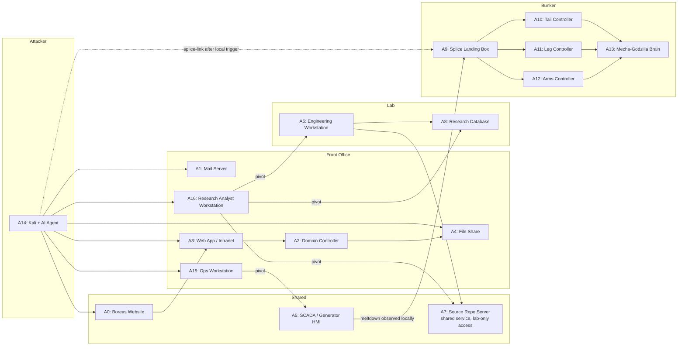

# Operation NORTHSTORM - Scenario Architecture

## Zone Layout

## Flags Per Zone

| Zone | Easy | Medium | Hard | Expert | Total |
|------|------|--------|------|--------|-------|
| Shared / Boreas | 5 | 1 | - | - | 6 |
| Front Office | 6 | 5 | 3 | 1 | 15 |
| Lab | 3 | 5 | 2 | 1 | 11 |
| Bunker | - | 1 | 3 | 2 | 6 |
| **Total** | **14** | **12** | **8** | **4** | **38** |

> **Note (SCADA sub-zone):** Flags 18 and 19 are listed under Front Office totals because they belong to the Lights Out mission chain that begins in the corporate network. Physically they live on A5, which sits on VLAN 40 and is only reachable after compromising A15 (flag 37). The zone layout diagram calls out SCADA as its own sub-zone for clarity.
>
> **Splice model:** Flag 19 is no longer a room-wide collective unlock. Each participant must trip the A5 meltdown in their own range. The participant's Polaris VM watches that terminal failure state and locally enables the `splice-link` from A14 to A9.

## Missions

- **Mission 1 — Boreas**
  Who are Boreas?
- **Mission 2 — Inside Boreas**
  How do we get inside?
- **Mission 3 — The Lab**
  What are they building?
- **Mission 4 — Lights Out**
  How do we create the opening?
- **Mission 5 — Bunker**
  How do we take control?

## Flag Breakdown

| # | Flag | Zone | Diff | Mission |
|---|------|------|------|---------|
| 1 | Company Info | Shared | E | Mission 1 — Boreas |
| 2 | Employee Directory | Shared | E | Mission 1 — Boreas |
| 3 | Tech Stack Revealed | Shared | E | Mission 1 — Boreas |
| 4 | Client Contracts | Shared | E | Mission 1 — Boreas |
| 5 | DNS Reconnaissance | Shared | E | Mission 1 — Boreas |
| 6 | Follow the Money | Shared | M | Mission 1 — Boreas |
| 7 | Configuration Leak | FO | E | Mission 2 — Inside Boreas |
| 8 | Project Hints | FO | E | Mission 2 — Inside Boreas |
| 9 | Terminated Engineer | FO | E | Mission 2 — Inside Boreas |
| 10 | Password Reuse | FO | E | Mission 2 — Inside Boreas |
| 11 | Mundane File Share | FO | E | Mission 2 — Inside Boreas |
| 12 | The Project | FO | E | Mission 2 — Inside Boreas |
| 13 | Procurement Trail | FO | M | Mission 2 — Inside Boreas |
| 14 | Hidden Group | FO | M | Mission 2 — Inside Boreas |
| 15 | Lateral Movement | FO | M | Mission 2 — Inside Boreas |
| 16 | Unreliable Guard | FO | M | Mission 2 — Inside Boreas |
| 17 | Domain Admin | FO | H | Mission 2 — Inside Boreas |
| 37 | On Call | FO | H | Mission 4 — Lights Out |
| 18 | Control Room | FO | H | Mission 4 — Lights Out |
| 19 | Lights Out | FO | X | Mission 4 — Lights Out |
| 38 | The Analyst's Desk | FO | M | Mission 3 — The Lab |
| 20 | Old Defaults | Lab | E | Mission 3 — The Lab |
| 21 | Compartment A | Lab | E | Mission 3 — The Lab |
| 22 | Heavy Delivery | Lab | E | Mission 3 — The Lab |
| 23 | MIDNIGHT-7 | Lab | M | Mission 3 — The Lab |
| 24 | What Git Remembers | Lab | M | Mission 3 — The Lab |
| 25 | After Hours | Lab | M | Mission 3 — The Lab |
| 26 | Balance Point | Lab | M | Mission 3 — The Lab |
| 27 | Compartment B | Lab | M | Mission 3 — The Lab |
| 28 | What's Built | Lab | H | Mission 3 — The Lab |
| 29 | What Was Erased | Lab | H | Mission 3 — The Lab |
| 30 | Full Run | Lab | X | Mission 3 — The Lab |
| 31 | Underground Signals | Bunker | M | Mission 5 — Bunker |
| 32 | First Motion | Bunker | H | Mission 5 — Bunker |
| 33 | Walking Pattern | Bunker | H | Mission 5 — Bunker |
| 34 | Response Window | Bunker | H | Mission 5 — Bunker |
| 35 | Control Channel | Bunker | X | Mission 5 — Bunker |
| 36 | Full Override | Bunker | X | Mission 5 — Bunker |

## Expected Progression (4 hours, with AI agent)

| Participant Level | Likely Missions | Flags |
|---|---|---|
| Novice | Mission 1 complete, Mission 2 partial | 10-16 |
| Intermediate | Missions 1-3 with some Mission 4 setup | 18-26 |
| Advanced | Missions 1-5 with Bunker attempt | 28-36 |

## Asset Map

## Flags by Asset

| Asset | Flags |
|-------|-------|
| A0: Boreas Website | 1, 2, 3, 4, 5, 6 |
| A1: Mail Server | 8, 10, 15 |
| A2: Domain Controller | 14, 16, 17 |
| A3: Web App / Intranet | 7, 12 |
| A4: File Share | 9, 11, 13 |
| A5: SCADA / Generator HMI | 18, 19 |
| A6: Engineering Workstation | 20, 22, 23, 25, 26, 30 |
| A7: Source Repo Server | 24, 29 |
| A8: Research Database | 21, 27, 28 |
| A9: Splice Landing Box | 31 |
| A10: Tail Controller | 32 |
| A11: Leg Controller | 33 |
| A12: Arms Controller | 34 |
| A13: Mecha-Godzilla Brain | 35, 36 |
| A15: Ops Workstation | 37 |
| A16: Research Analyst Workstation | 38 |

*38 total flags*

## Infrastructure

- Single GKE cluster on GCP
- One namespace per participant (~110 namespaces), each containing A1, A3, A4, A6, A8-A13, A14, A15, A16
- Shared services for A0 (Boreas website), A5 (SCADA / Generator HMI), A7 (Source Repo Server, lab-only network attachment), DNS, and CTFd scoreboard
- A2 (Domain Controller): **Shared Windows Server 2022 VM** on GCE (not a container). Samba AD DC was tested and cannot support Impacket Kerberoasting / DCSync. Pre-baked GCE custom image (`ctf-a2-windc-base-v1`). See `temp/a2-samba-ad-spike.md` for spike details.
- Network policies isolate participant namespaces from each other
- Participant topology now uses A15 for SCADA reachback and A16 for Lab reachback; A3 is corporate-only
- A7 is a shared service but is no longer directly reachable from Kali; all Gitea access goes through the Lab pivot

> **Implementation note:** The current Polaris VM direction for implementation is per-range, not room-shared, for A5. The flag 19 meltdown state and the resulting splice trigger are participant-local.
