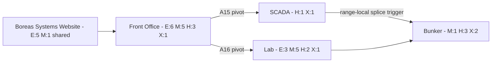
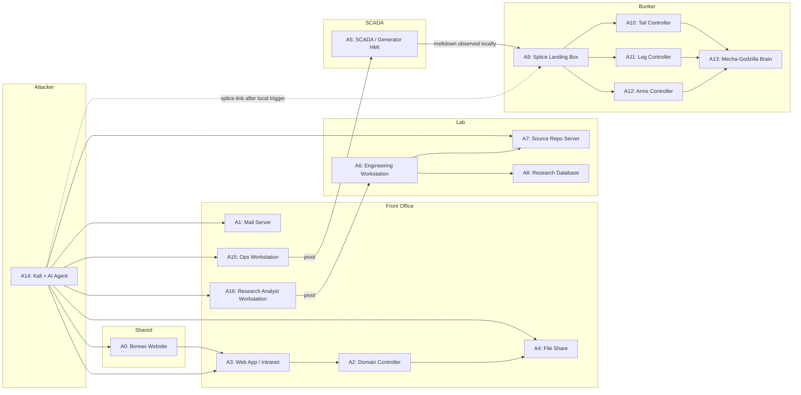

# Operation NORTHSTORM - Scenario Architecture

## Zone Layout

## Flags Per Zone

| Zone | Easy | Medium | Hard | Expert | Total |
|------|------|--------|------|--------|-------|
| Shared OSINT | 5 | 1 | - | - | 6 |
| Front Office | 6 | 5 | 3 | 1 | 15 |
| Lab | 3 | 5 | 2 | 1 | 11 |
| Bunker | - | 1 | 3 | 2 | 6 |
| **Total** | **14** | **12** | **8** | **4** | **38** |

> **Note (SCADA sub-zone):** Flags 18 and 19 are listed under Front Office totals because they belong to the Lights Out mission chain that begins in the corporate network. Physically they live on A5, which sits on VLAN 40 and is only reachable after compromising A15 (flag 37). The zone layout diagram calls out SCADA as its own sub-zone for clarity.
>
> **Splice model:** Flag 19 is no longer a room-wide collective unlock. Each participant must trip the A5 meltdown in their own range. The participant's Polaris VM watches that terminal failure state and locally enables the `splice-link` from A14 to A9.

## Missions

- **M1: Who are they?** — Identify the organization and its people. OSINT + Front Office. Easy/Medium.
- **M2: What are they building?** — Piece together the project from fragments. Front Office + Lab. Medium/Hard.
- **M3: Lights out** — Disrupt operations, kill the generator. Front Office. Hard/Expert. Per-range splice trigger.
- **M4: Into the bunker** — Reach the buried control path and take it over. Lab + Bunker. Expert.

## Flag Breakdown

| # | Flag | Zone | Diff | M1 | M2 | M3 | M4 |
|---|------|------|------|:--:|:--:|:--:|:--:|
| 1 | Boreas Systems company info | OSINT | E | x | | | |
| 2 | Employee directory / org chart | OSINT | E | x | | | |
| 3 | Job posting reveals tech stack | OSINT | E | x | | | |
| 4 | Client list / cover contracts | OSINT | E | x | | | |
| 5 | DNS records reveal internal hostnames | OSINT | E | x | | | |
| 6 | Supplier identified from public filings | OSINT | M | x | x | | |
| 7 | Creds in web app config | FO | E | x | | | |
| 8 | Employee email with project hints | FO | E | x | x | | |
| 9 | HR records — terminated engineer | FO | E | x | | | |
| 10 | Password reuse gives mail access | FO | E | x | | | |
| 11 | Cafeteria menu / mundane file share | FO | E | x | | | |
| 12 | Internal wiki — "the project" references | FO | E | x | x | | |
| 13 | Procurement orders — hydraulic actuators | FO | M | x | x | | |
| 14 | AD enumeration — suspicious accounts | FO | M | | x | | |
| 15 | Lateral movement to second host | FO | M | | | x | |
| 16 | Guard rotation logs — unreliable guard | FO | M | x | | x | |
| 17 | Privilege escalation — domain admin | FO | H | | | x | |
| 18 | Control Room | FO | H | | | x | |
| 19 | Lights Out | FO | X | | | x | |
| 37 | On Call | FO | H | | | x | |
| 38 | The Analyst's Desk | FO | M | | x | | |
| 20 | Old Defaults | Lab | E | | x | | |
| 21 | Compartment A | Lab | E | | x | | |
| 22 | Heavy Delivery | Lab | E | | x | | |
| 23 | MIDNIGHT-7 | Lab | M | | x | | |
| 24 | What Git Remembers | Lab | M | | x | | x |
| 25 | After Hours | Lab | M | | x | | |
| 26 | Balance Point | Lab | M | | x | | |
| 27 | Compartment B | Lab | M | | x | | |
| 28 | What's Built | Lab | H | | x | | x |
| 29 | What Was Erased | Lab | H | | x | | |
| 30 | Full Run | Lab | X | | x | | |
| 31 | Underground Signals | Bunker | M | | | | x |
| 32 | First Motion | Bunker | H | | x | | x |
| 33 | Walking Pattern | Bunker | H | | x | | x |
| 34 | Response Window | Bunker | H | | x | | x |
| 35 | Control Channel | Bunker | X | | | | x |
| 36 | Full Override | Bunker | X | | | | x |

## Expected Progression (4 hours, with AI agent)

| Participant Level | Likely Missions | Flags |
|---|---|---|
| Novice | M1 complete | 10-14 |
| Intermediate | M1 + M2 partial | 16-22 |
| Advanced | M1 + M2 + M3 + M4 attempt | 25-35 |

## Asset Map

## Flags by Asset

| Asset | Flags |
|-------|-------|
| A0: Boreas Website | 1, 2, 3, 4, 5, 6 |
| A1: Mail Server | 8, 10, 15 |
| A2: Domain Controller | 14, 16, 17 |
| A3: Web App / Intranet | 7, 12 |
| A4: File Share | 9, 11, 13 |
| A5: SCADA / Generator HMI | 18, 19 |
| A6: Engineering Workstation | 20, 22, 23, 25, 26, 30 |
| A7: Source Repo Server | 24, 29 |
| A8: Research Database | 21, 27, 28 |
| A9: Splice Landing Box | 31 |
| A10: Tail Controller | 32 |
| A11: Leg Controller | 33 |
| A12: Arms Controller | 34 |
| A13: Mecha-Godzilla Brain | 35, 36 |
| A15: Ops Workstation | 37 |
| A16: Research Analyst Workstation | 38 |

*38 total flags*

## Infrastructure

- Single GKE cluster on GCP
- One namespace per participant (~110 namespaces), each containing A1, A3, A4, A6, A8-A13, A14 (Kali) — 11 pods each
- Shared namespace for A0 (Boreas website), A5 (SCADA/Generator HMI), A7 (Source Repo Server), and CTFd scoreboard
- A2 (Domain Controller): **Shared Windows Server 2022 VM** on GCE (not a container). Samba AD DC was tested and cannot support Impacket Kerberoasting/DCSync. Pre-baked GCE custom image (`ctf-a2-windc-base-v1`). See `temp/a2-samba-ad-spike.md` for spike details.
- Network policies isolate participant namespaces from each other
- ~110 namespaces x 11 pods = ~1210 pods + shared pods + 1 shared Windows VM

> **Implementation note:** The current Polaris VM direction for implementation is per-range, not room-shared, for A5. The flag 19 meltdown state and the resulting splice trigger are participant-local.
