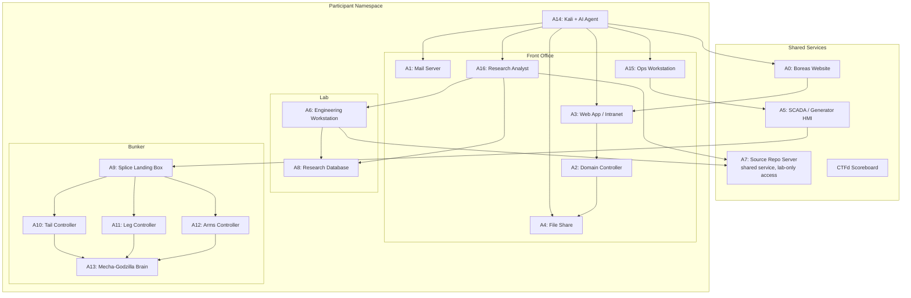

# Operation NORTHSTORM - Single Participant Range

```mermaid
graph TD
    subgraph Shared Services
        A0[A0: Boreas Website]
        A5[A5: SCADA / Generator HMI]
        A7[A7: Source Repo Server<br/>shared service, lab-only access]
        CTFd[CTFd Scoreboard]
    end

    subgraph Participant Namespace
        A14[A14: Kali + AI Agent]

        subgraph Front Office
            A1[A1: Mail Server]
            A2[A2: Domain Controller]
            A3[A3: Web App / Intranet]
            A4[A4: File Share]
            A15[A15: Ops Workstation]
            A16[A16: Research Analyst]
        end

        subgraph Lab
            A6[A6: Engineering Workstation]
            A8[A8: Research Database]
        end

        subgraph Bunker
            A9[A9: Splice Landing Box]
            A10[A10: Tail Controller]
            A11[A11: Leg Controller]
            A12[A12: Arms Controller]
            A13[A13: Mecha-Godzilla Brain]
        end
    end

    A14 --> A0
    A14 --> A1
    A14 --> A3
    A14 --> A4
    A14 --> A15
    A14 --> A16
    A0 --> A3
    A3 --> A2
    A2 --> A4
    A15 --> A5
    A16 --> A6
    A16 --> A7
    A16 --> A8
    A6 --> A7
    A6 --> A8
    A5 --> A9
    A9 --> A10
    A9 --> A11
    A9 --> A12
    A10 --> A13
    A11 --> A13
    A12 --> A13
```
