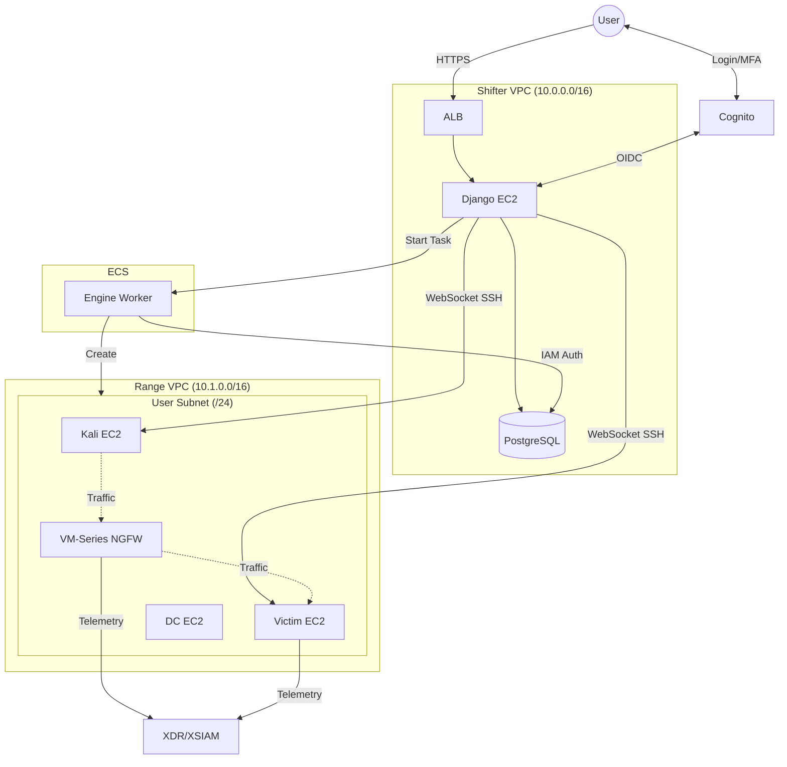
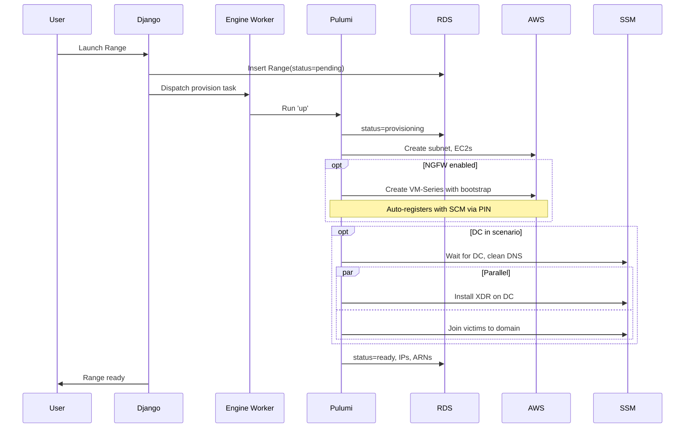
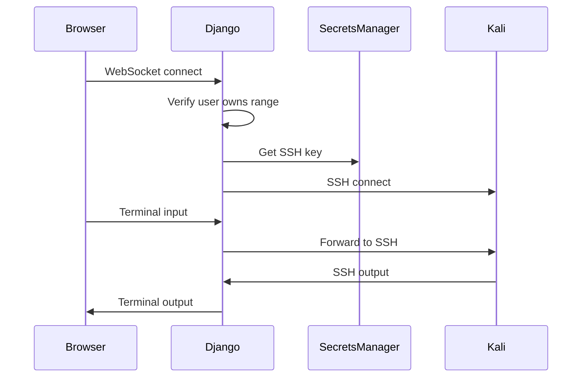
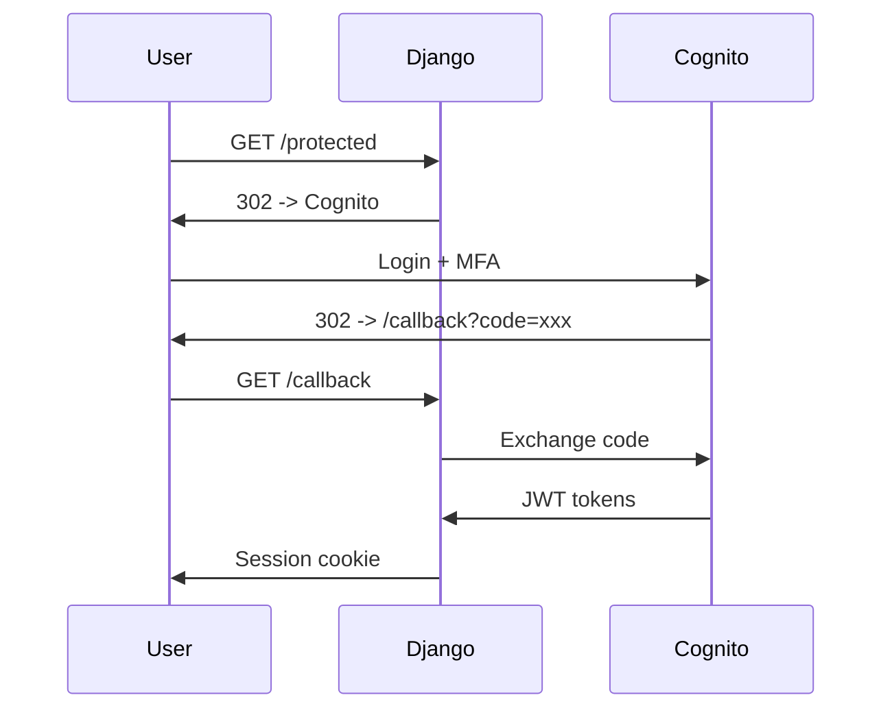

# Architecture

Current system architecture. Documents what exists, not what is planned.

## System Overview

DC and NGFW are optional. DC enables AD attack scenarios with domain-joined victims. NGFW (VM-Series) sits inline between Kali and Victim to generate network telemetry for XSIAM stitching.

## Components

### Django Project (`shifter/`)

| App | Purpose |
|-----|---------|
| `engine` | Orchestration, business logic, lifecycle management |
| `mission_control` | UI, views, templates |
| `risk_register` | Security risk tracking |
| `documentation` | Internal docs |

### Engine Worker (`shifter-engine/`)

ECS Fargate container that executes infrastructure operations (Pulumi, SSM).

| File | Purpose |
|------|---------|
| `main.py` | Entrypoint, receives commands |
| `config.py` | Stack configuration from env/DB |
| `stacks/` | Pulumi stack definitions |
| `components/` | Reusable Pulumi components |
| `plans/` | Multi-step execution plans |
| `catalog/instances.py` | Instance type definitions |
| `templates/` | Bootstrap user data (Jinja2) |

**Instance catalog:**
- `kali-2024` - Kali Linux attacker
- `ubuntu-22.04-victim` - Ubuntu 22.04 victim
- `ubuntu-24.04-victim` - Ubuntu 24.04 victim
- `windows-server-2022-victim` - Windows Server 2022 victim
- `windows-server-2022-dc` - Windows Server 2022 Domain Controller
- `amazon-linux-2023-victim` - Amazon Linux 2023 victim

### Terraform (`terraform/`)

| Module | Purpose |
|--------|---------|
| `portal/` | Shifter VPC, RDS, ALB, EC2, Cognito, S3 |
| `range/` | Range VPC, subnets, security groups |
| `pulumi-provisioner/` | ECS task definition, IAM roles |
| `pulumi-state/` | S3 bucket + DynamoDB for Pulumi state |
| `ecr/` | Container registries |
| `log-aggregation/` | CloudWatch log groups |

**Environments:** `dev`, `prod`

## Data Flow

### Range Provisioning

DC uses a prebaked AMI with AD DS ready. SSM orchestrates DNS cleanup, XDR installation, and domain joins. See [Engine docs](execution/engine.md#dc-setup-via-ssm) for details.

NGFW (VM-Series) uses bootstrap with init-cfg.txt containing SCM PIN credentials. Auto-registers with Strata Cloud Manager on first boot.

### Terminal Access

## Authentication

Cognito OIDC with domain restriction.

- Email as username
- MFA required (TOTP)
- Pre-signup Lambda restricts to `@paloaltonetworks.com`

## Network

### Shifter VPC

| Subnet | Components |
|--------|------------|
| Public (2 AZs) | ALB, NAT Gateway |
| Private (2 AZs) | EC2, RDS |

### Range VPC

| Subnet | Components |
|--------|------------|
| Public | NAT Gateway |
| Private (/24 per user) | Kali EC2, Victim EC2, DC EC2 (optional), NGFW (optional) |

When NGFW is enabled, VM-Series has two interfaces:
- Untrust (eth1): Faces Kali
- Trust (eth2): Faces Victim

Route tables direct traffic through NGFW when enabled.

VPC peering connects Shifter to Range for SSH access (port 22 only).

## Deployment

GitHub Actions on merge:

| Trigger | Action |
|---------|--------|
| `terraform/**` -> main | `terraform apply` |
| `shifter/**` -> main | Build image -> ECR -> SSM restart EC2 |
| `shifter-engine/**` -> main | Build image -> ECR |

IAM via OIDC federation. No static credentials.
