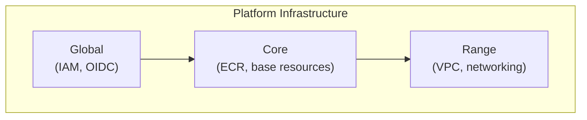
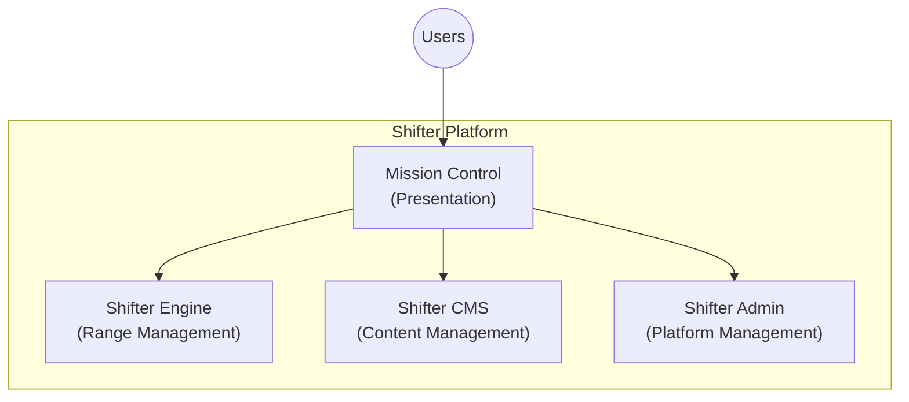

# Shifter Architecture

Enterprise, multi-user, extensible cyber range platform.

## Platform Infrastructure

Two AWS accounts: `dev` and `prod`.

| Component | Location | Purpose |
|-----------|----------|---------|
| **Global** | `terraform/global/` | IAM roles, OIDC providers, cross-account resources. |
| **Core** | `terraform/modules/ecr/`, `terraform/environments/` | ECR, base environment resources. |
| **Range** | `terraform/modules/range/` | Range VPC, shared networking foundation. |
| **Portal*** | `terraform/modules/portal/` | Shifter application infrastructure (ALB, ECS, RDS, S3). |

*Portal is a legacy name. This module deploys the Shifter Django application infrastructure.

### Identity

Cognito user pool configured with:
- Email as username
- MFA required (TOTP)
- Pre-signup Lambda for domain restriction (`@paloaltonetworks.com`)
- Email verification required

### Hosting

CI/CD via GitHub Actions with self-hosted runners. DNS hosted on Cloudflare (`dev.shifter.keplerops.com`, `shifter.keplerops.com`).

## Shifter (Django)

Django monorepo. Users interact via Mission Control; backend apps expose REST APIs.

| Element | App | Purpose |
|---------|-----|---------|
| **Mission Control** | `mission_control` | Presentation layer. Single UI for all users. |
| **Shifter Engine** | `engine` | Range management. |
| **Shifter CMS** | `cms` | Content management. |
| **Shifter Admin** | `management` | Platform management. |

## Design Decisions

| Decision | Choice | Rationale |
|----------|--------|-----------|
| UI separation | Mission Control is presentation only | Migrating to Angular + PrimeNG to align with Cortex UI practices. Current Django templates are temporary. |
| API style | REST via Django REST Framework | Proven, simple, mature Django ecosystem support. |
| Identity | Cognito | Project initiated by Cortex Domain Consultant; will be replaced by PANW SSO if officially adopted. |
| Domains | keplerops.com | Project initiated by Cortex Domain Consultant; will be replaced by paloaltonetworks.com if officially adopted. |
