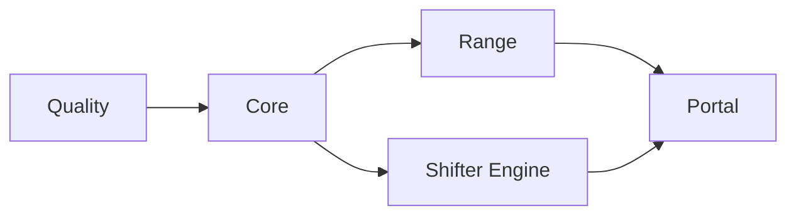

# CI/CD

GitHub Actions with self-hosted runners.

## Workflow Structure

```
.github/workflows/
├── deploy.yml           # Orchestrator (change detection, dependency chain)
├── _quality.yml         # Linting, security scanning
├── _core.yml            # Core infrastructure (ECR, budgets)
├── _range.yml           # Range VPC infrastructure
├── _shifter-engine.yml  # Engine container build and push
├── _portal.yml          # Portal infrastructure and app deployment
├── packer.yml           # AMI builds
└── packer-promote.yml   # AMI promotion to prod
```

## Deployment Chain



Jobs run only when relevant files change. `deploy.yml` detects changes and triggers appropriate workflows.

## Change Detection

| Job | Triggers On |
|-----|-------------|
| **core** | `terraform/modules/ecr/**`, `terraform/environments/*/*.tf` |
| **range** | `terraform/modules/range/**`, `terraform/environments/*/range/**` |
| **shifter_engine** | `shifter-engine/**`, `terraform/modules/pulumi-provisioner/**` |
| **portal** | `terraform/modules/portal/**`, `shifter/**` |

## Environment Targeting

- Push to `dev` → deploys to dev
- Push to `main` → deploys to prod
- PRs to `dev` → plan and apply to dev
- PRs to `main` → plan only (no apply)
- Manual dispatch → targets dev (safety default)

## Authentication

OIDC federation with AWS. No long-lived credentials.

| Secret | Purpose |
|--------|---------|
| `AWS_ROLE_ARN` | Prod environment IAM role |
| `AWS_ROLE_ARN_DEV` | Dev environment IAM role |

Roles defined in `terraform/global/iam/github-oidc.tf`.
