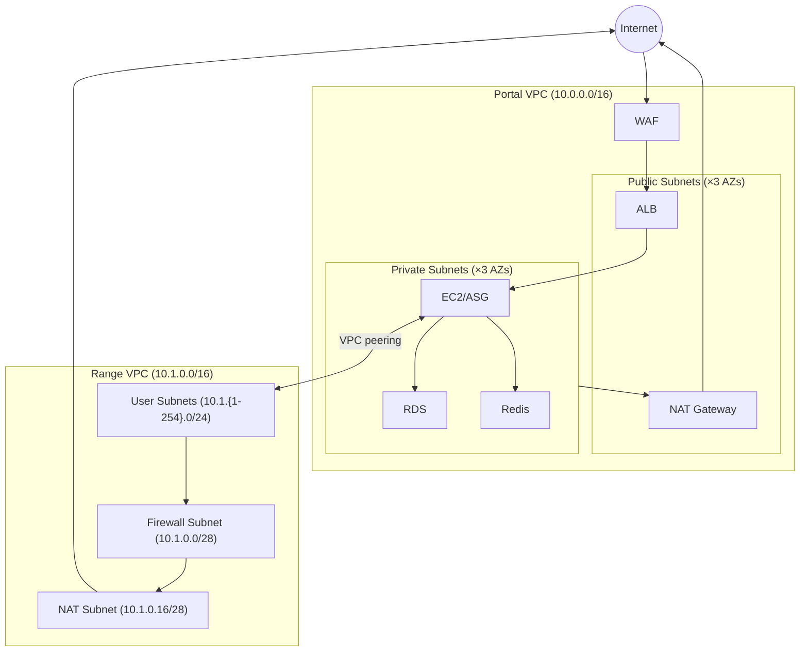

# Networking

Two VPCs per environment, connected via VPC peering.

## VPC Architecture

## Portal VPC

| Subnet Type | CIDR | Components |
|-------------|------|------------|
| Public (×3 AZs) | `/20` subnets | ALB, NAT Gateway (single) |
| Private (×3 AZs) | `/20` subnets | EC2 or ASG*, RDS subnet group, Redis subnet group |

*Dev uses ASG (multi-AZ). Prod uses single EC2 (one subnet).

Components:
- **WAF** - Rate limiting, IP reputation, OWASP rules. Attached to ALB.
- **ALB** - Public-facing. HTTPS only (HTTP redirects). Blocks `/admin`.
- **NAT Gateway** - Single, in one public subnet (cost-optimized).
- **RDS** - Subnet group spans all private subnets (Multi-AZ capable).
- **Redis** - Subnet group spans all private subnets.

Defined in `terraform/modules/portal/vpc/` and `terraform/modules/portal/alb/`.

## Range VPC

| Component | CIDR | Purpose |
|-----------|------|---------|
| Firewall Subnet | `10.1.0.0/28` | AWS Network Firewall endpoint (single AZ) |
| NAT Subnet | `10.1.0.16/28` | NAT Gateway for egress |
| User Subnets | `10.1.{1-254}.0/24` | Range instances (created by Engine) |

Traffic flow: `User Subnet → Network Firewall → NAT Gateway → IGW → Internet`

Network Firewall applies domain-based egress filtering. User subnets created at runtime by Pulumi, not Terraform.

Defined in `terraform/modules/range/vpc/`.

## VPC Peering

Bidirectional peering between Portal and Range VPCs. Enables SSH from Portal to range instances (terminal UI).

| Direction | Route |
|-----------|-------|
| Portal → Range | Portal private subnets route `10.1.0.0/16` via peering |
| Range → Portal | Range private route table routes `10.0.0.0/16` via peering |

Peering connection created in `terraform/environments/{env}/portal/main.tf`.

## Security Groups

| Location | Groups |
|----------|--------|
| Portal | ALB, EC2, RDS, Redis |
| Range | Defined per instance type (see Engine docs) |

Range security groups allow SSH ingress from Portal VPC CIDR for terminal access.
