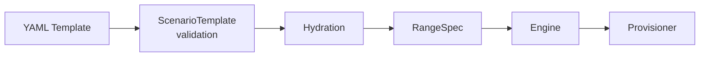

# CyberScript Language Reference

YAML-based DSL for defining cyber range scenarios. A scenario template describes the instances, networking, and configuration that make up a demo environment.

## How It Works

1. Author writes a YAML template defining instances and subnets
2. `ScenarioTemplate` (Pydantic) validates the YAML on load
3. Hydration resolves `from_agent` OS types and embeds agent details
4. Engine receives the `RangeSpec` and dispatches to the Provisioner
5. Provisioner creates cloud infrastructure

Source: `cms/scenarios/schema.py`, `cms/scenarios/hydrator.py`

## Template Sources

| Source | Location | Managed By |
|--------|----------|------------|
| **YAML defaults** | `cms/scenarios/templates/{id}.yaml` | Code (version-controlled) |
| **DB customs** | `cms.models.Scenario` | Staff (via admin UI) |

The registry (`cms/scenarios/registry.py`) merges both sources. YAML defaults take precedence -- DB customs with a colliding `scenario_id` are skipped. Metadata overlays (`ScenarioMetadata`) control `enabled` and `staff_only` flags independently of the template.

## File Format

Templates are YAML files. The filename stem is the `id` field (e.g., `basic.yaml` has `id: basic`). Loaded via `yaml.safe_load` and validated against `ScenarioTemplate`.

## Reference Pages

| Page | Content |
|------|---------|
| [Scenario Templates](scenario-templates.md) | Top-level template schema (`ScenarioTemplate`) |
| [Instances](instances.md) | Instance configuration (`InstanceConfig`) |
| [Networking](networking.md) | Subnet topology (`SubnetConfig`) |
| [Template Variables](template-variables.md) | `{{Instance.property}}` syntax for experiment prompts |
| [Examples](examples.md) | Annotated examples from simple to complex |
