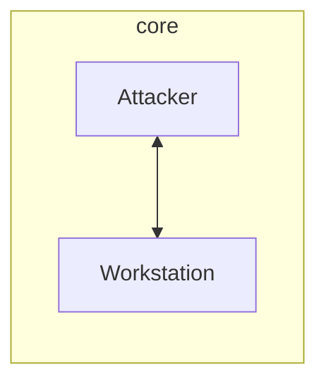
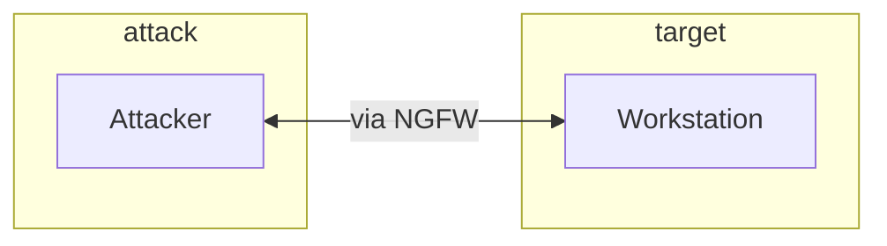
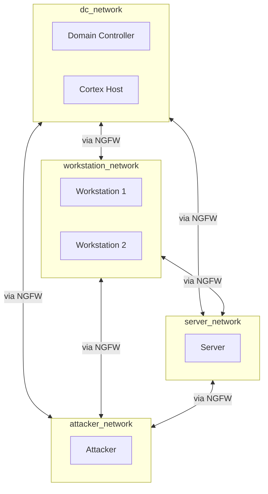

# Network Topology

Field reference for `SubnetConfig` in `cms/scenarios/schema.py`. Subnets define logical network segments that group instances and control inter-segment connectivity.

## Fields

| Field | Type | Required | Default | Description |
|-------|------|----------|---------|-------------|
| **`name`** | string | yes | -- | Subnet identifier (e.g., `dc_network`, `attacker_network`). |
| **`instances`** | list of strings | yes | -- | Instance names belonging to this subnet. Must be non-empty. |
| **`connected_to`** | list of strings | no | `[]` | Other subnet names this subnet can communicate with. |

## Validation

- `instances` must contain at least one entry.
- Every string in `instances` must match an `instances[].name` in the parent scenario template.

## Connectivity Model

### Same Subnet

Instances in the same subnet communicate freely. No explicit connectivity declaration needed.

### Cross-Subnet

Cross-subnet communication requires `connected_to` declarations. Connections are **unidirectional**: if subnet A lists subnet B in `connected_to`, traffic can flow from A to B. For bidirectional communication, both subnets must list each other.

```yaml
subnets:
  - name: attack
    instances: [Attacker]
    connected_to: [target]    # attack -> target

  - name: target
    instances: [Workstation]
    connected_to: [attack]    # target -> attack
```

### NGFW vs No NGFW

| Scenario | `connected_to` Effect |
|----------|----------------------|
| **`ngfw: true`** | Creates firewall rules. Inter-subnet traffic routes through the NGFW. |
| **`ngfw: false`** | Defines security group rules for logical reachability. |

## Default Subnet

When no `subnets` are defined in the template, the hydrator creates a single `default` subnet containing all instances with no `connected_to` entries. All instances can communicate freely.

```yaml
# No subnets defined - equivalent to:
subnets:
  - name: default
    instances: [all instances]
```

Source: `cms/scenarios/hydrator.py :: hydrate_scenario()`

## Topology Patterns

### Flat Network

All instances in one subnet. Simplest topology.

```yaml
subnets:
  - name: core
    instances: [Attacker, Workstation]
```



### Segmented with NGFW

Attacker and target in separate subnets. Traffic routed through NGFW.

```yaml
ngfw: true
subnets:
  - name: attack
    instances: [Attacker]
    connected_to: [target]
  - name: target
    instances: [Workstation]
    connected_to: [attack]
```



### Enterprise (Full Mesh)

Multiple subnets with full mesh connectivity. Used for complex enterprise scenarios.

```yaml
ngfw: true
subnets:
  - name: dc_network
    instances: [Domain Controller, Cortex Host]
    connected_to: [workstation_network, server_network, attacker_network]
  - name: workstation_network
    instances: [Workstation 1, Workstation 2]
    connected_to: [dc_network, server_network, attacker_network]
  - name: server_network
    instances: [Server]
    connected_to: [dc_network, workstation_network, attacker_network]
  - name: attacker_network
    instances: [Attacker]
    connected_to: [dc_network, workstation_network, server_network]
```



## Schema Source

```
cms/scenarios/schema.py :: SubnetConfig
cyberscript/schemas/subnet.py :: SubnetSpec
```
