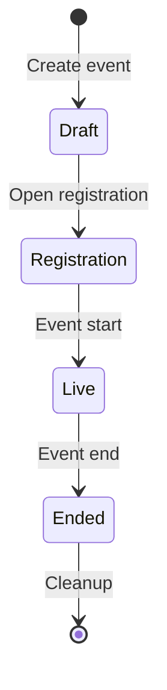

# CTF Organizer Guide

How to run a capture-the-flag event end to end. The organizer surface lives under the
**CTF Admin** area of the portal (`/ctf/admin/`) and is restricted to users with CTF
organizer access.

## Event Lifecycle

## 1. Create the Event

From **CTF Admin → Events → Create**, set the core parameters:

| Setting | Purpose |
|---------|---------|
| Name / description | Shown to participants |
| Scenario | The range scenario each participant gets |
| Event start / end | Competition window |
| Registration deadline | Latest time a participant may register |
| Max participants | Capacity limit |
| Team mode / team size | Individual vs. team competition |
| Range spin-up minutes | Lead time to provision ranges before start |
| Submission cooldown / attempt limit | Anti-brute-force throttles |
| Scoreboard visibility / freeze | Whether and when standings are shown |
| Auto cleanup / cleanup delay | Whether ranges are torn down after the event |

## 2. Add Challenges

Under an event, **Challenges → Create**. For each challenge set its name, category,
description, points, difficulty, and the flag. Flags are stored as a salted hash, so
the plaintext flag is never persisted after creation.

Additional controls:

- **Release time**: schedule a challenge to appear partway through the event.
- **Prerequisite**: lock a challenge until another is solved.
- **Visibility**: hide a challenge from the participant list until you release it.
- **Target instance / port**: point participants at the right host in their range.
- **Files**: upload challenge attachments.
- **Hints**: optional, point-reducing hints.

A challenge can carry multiple flags (for multi-stage solves), each validated
independently.

## 3. Manage Participants

From an event's **Participants** page you can add participants individually or bulk
import a roster. Each participant is tracked through registration, range assignment,
and scoring. Use **Brackets** to group participants into ranked cohorts, and (in team
mode) manage team membership.

Participant magic links remain reusable by default and expire at the event end, so
participants can return through the same invitation link for the full active CTF
window. Resending a magic link rotates the token while keeping the same event-end
expiry. If an unusually long event needs a stricter bearer-token lifetime, operators
can set `MAGIC_LINK_EVENT_MAX_EXPIRY_HOURS` to cap event-backed magic links.

## 4. Ranges

The **Ranges** page shows the provisioning state of every participant's range. The
platform provisions ranges automatically around the spin-up window and, when auto
cleanup is enabled, tears them down after the event. The CTF scheduler drives batch
provisioning; see the technical
[CTF documentation](../technical/shifter_platform/ctf) for how it runs.

### Recovering a destroyed range

Live-fire scenarios can leave a participant's range unrecoverable in place (the
participant or their agent may encrypt, wipe, or corrupt it). From the **Ranges** page
you can recover a single participant's range without editing any records by hand:

- **Rebuild** provisions a fresh range for the same event and scenario.
- **Reassign spare** hands the participant a prewarmed spare range from the event's spare
  pool, when one is available.

The old range is always destroyed so it can no longer receive the
participant's traffic, and the participant keeps their scoreboard identity,
submissions, awards, team and bracket membership, and registration. Recovery is safe
to retry after a partial failure. The current recovery phase and any failure reason are
shown on the Ranges page. A participant cannot recover their own range; recovery is
organizer-only.

### Setting the spare pool

The **Spare pool** panel on the Ranges page controls how many prewarmed ranges are
kept ready for **Reassign spare** recovery. Set the target pool size and update it;
the platform provisions any shortfall under managed system accounts (never
counted as participants) and shows the current target, available, provisioning,
and failed counts. The pool only grows on request; it does not shrink automatically.
Unconsumed spares are torn down along with the rest of the event's ranges during
event cleanup.

## 5. Notifications

Use **Notifications** to send announcements during the event and **Email Templates**
to configure reminder messages. Events can also send registration reminders at the
hour offsets you configure.

## 6. During and After the Event

- The **Scoreboard** updates as submissions land. Freeze it near the end to keep final
  standings suspended until close.
- **Analytics** summarizes solves, attempts, and challenge difficulty in practice.
- After the event, scoring can be recomputed authoritatively if needed (see the
  technical docs for the leaderboard recompute command).

## See Also

- [CTF](ctf): the participant experience.
- [CTF technical documentation](../technical/shifter_platform/ctf): models, services,
  scheduling, and range provisioning.
