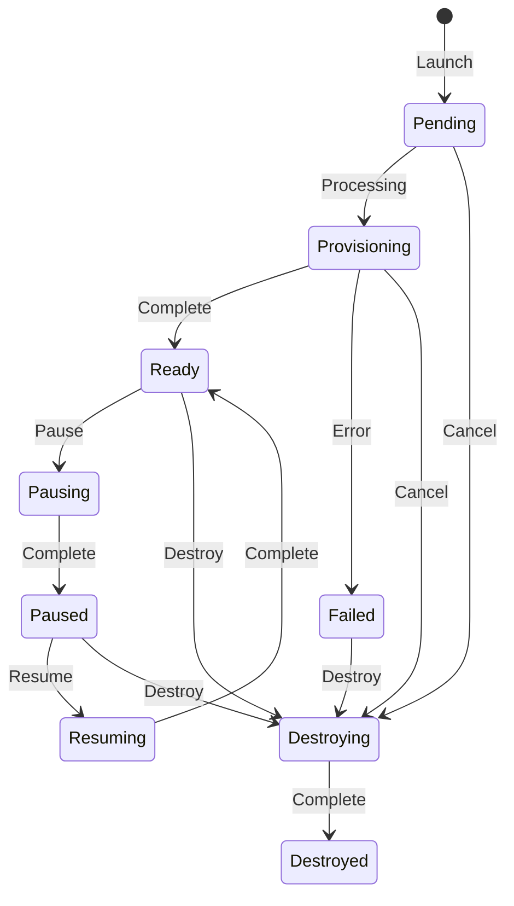

# Ranges

Launch and manage isolated demo environments.

## Range Lifecycle

## Status Reference

| Status | Meaning |
|--------|---------|
| Pending | Queued for provisioning |
| Provisioning | Infrastructure being created |
| Ready | Range is live, accessible |
| Pausing | Range is being paused |
| Paused | Range is paused (instances stopped) |
| Resuming | Range is being resumed |
| Destroying | Range infrastructure being torn down |
| Failed | Provisioning error occurred |
| Destroyed | Range terminated |

## Launch a Range

1. Go to **Ranges page**
2. Select a scenario
3. Select an agent
4. Click **Launch Range**

Provisioning takes about 10 minutes.

## Monitor Provisioning

The Ranges page shows real-time status updates during provisioning. You'll see progress as instances are created and configured.

## Access a Range

Once Ready:

1. Go to **Terminal**
2. Select an instance
3. Use SSH or RDP to connect

See [Terminal](terminal) for details.

## Cancel a Range

While in Pending or Provisioning status:

1. Go to **Ranges page**
2. Click **Cancel** on the range

## Pause a Range

While in Ready status:

1. Go to **Ranges page**
2. Click **Pause** on the range

Instances are stopped. Resume when needed.

## Resume a Range

While in Paused status:

1. Go to **Ranges page**
2. Click **Resume** on the range

## Destroy a Range

When finished:

1. Go to **Ranges page**
2. Click **Destroy** on the range

This is irreversible. All range data is deleted.

## Limits

- One active range at a time per user
