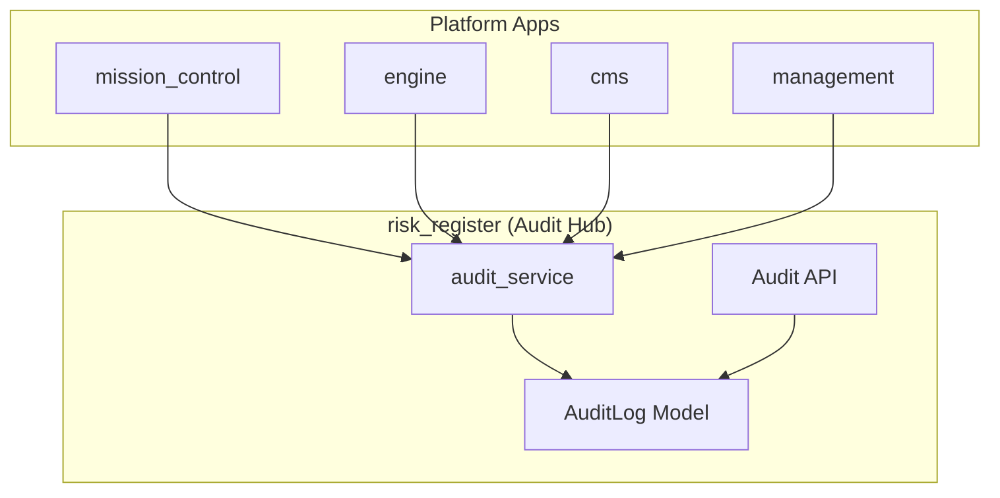

# Platform Audit System

Centralized audit logging for all Shifter platform operations via `risk_register.AuditLog`.

## Architecture



All apps call `risk_register.services.audit_log()` to record events. AuditLog is the single source of truth.

## AuditLog Model

### Entity Types

| Entity Type | Description |
|-------------|-------------|
| `risk` | Risk Register risks |
| `comment` | Risk comments |
| `apikey` | API keys |
| `range` | Cyber range instances |
| `credential` | CMS credentials (SCM, deployment profiles) |
| `agent` | XDR agent binaries |
| `user` | User accounts |
| `session` | Terminal/RDP sessions |
| `ngfw` | NGFW instances |
| `config` | System configuration |
| `experiment` | Experiments |
| `scenario` | Scenarios |
| `script` | Scripts |

### Action Types

| Action | Description |
|--------|-------------|
| `create` | Entity created |
| `update` | Entity modified |
| `delete` | Entity deleted |
| `restore` | Entity restored |
| `close` | Entity closed |
| `reopen` | Entity reopened |
| `login` | Authentication success |
| `logout` | Session end |
| `login_failed` | Authentication failure |
| `access_denied` | Authorization failure |
| `connect` | Session established (terminal/RDP) |
| `disconnect` | Session ended |
| `provision` | Resource provisioning started |
| `deprovision` | Resource teardown started |
| `ready` | Resource became available |
| `failed` | Operation failed |

### Actor Types

| Actor Type | Description |
|------------|-------------|
| `user` | Authenticated user |
| `apikey` | API key |
| `system` | Automated processes (provisioner, event handlers) |
| `cognito` | Identity provider events |

### Fields

| Field | Type | Description |
|-------|------|-------------|
| `entity_type` | string | What entity was affected |
| `entity_id` | integer | ID of the entity |
| `action` | string | What happened |
| `actor_type` | string | Who/what performed the action |
| `actor_id` | integer (nullable) | ID of the actor |
| `timestamp` | datetime | When it happened |
| `previous_state` | JSON (nullable) | State before change |
| `new_state` | JSON (nullable) | State after change |
| `context` | text | Optional reason or notes |
| `source_ip` | IP (nullable) | Client IP address |
| `user_agent` | string | Client user agent |
| `request_id` | string | Trace correlation ID |

## Service Layer

### `audit_log()`

Primary function. Called by all platform apps.

```python
# risk_register/services.py
def audit_log(
    entity_type: str,
    entity_id: int,
    action: str,
    *,
    actor_type: str = "system",
    actor_id: int | None = None,
    previous_state: dict | None = None,
    new_state: dict | None = None,
    context: str = "",
    source_ip: str | None = None,
    user_agent: str = "",
    request_id: str = "",
) -> AuditLog
```

### `audit_log_from_request()`

Extracts user/apikey, source IP, user agent, and request ID from an HTTP request.

### `audit_log_system_event()`

For provisioner, event handlers, and scheduled tasks.

## Integration Points

### Authentication Events

| Event | Source | Actor Type | Action |
|-------|--------|------------|--------|
| OIDC login success | `config/oidc.py` | cognito | login |
| OIDC login failure | `config/oidc.py` | cognito | login_failed |
| API key auth success | `risk_register/api/authentication.py` | apikey | login |
| API key auth failure | `risk_register/api/authentication.py` | apikey | login_failed |

### Range Lifecycle Events

| Event | Source | Actor Type | Action |
|-------|--------|------------|--------|
| Range requested | `cms/services.py:create_range` | user | provision |
| Range ready | `engine/handlers.py` | system | ready |
| Range failed | `engine/handlers.py` | system | failed |
| Range destroyed | `cms/services.py:destroy_range` | user | deprovision |

### Session Events

| Event | Source | Actor Type | Action |
|-------|--------|------------|--------|
| Terminal connect | `mission_control/consumers.py` | user | connect |
| Terminal disconnect | `mission_control/consumers.py` | user | disconnect |

### Resource Events

| Event | Source | Actor Type | Action |
|-------|--------|------------|--------|
| Credential created | `cms/services.py` | user | create |
| Credential deleted | `cms/services.py` | user | delete |
| Agent uploaded | `cms/assets/services.py` | user | create |
| Agent deleted | `cms/assets/services.py` | user | delete |
| NGFW provisioned | `cms/services.py` | user | provision |
| NGFW destroyed | `cms/services.py` | user | deprovision |

## Query Interface

### Django Admin

`risk_register/admin.py` - AuditLogAdmin:
- Filter by entity_type, action, actor_type, timestamp
- Search by context, entity_id, request_id
- Date hierarchy by timestamp
- Read-only (no add/change/delete)

### REST API

`risk_register/api/views.py` - AuditLogViewSet:
- `GET /api/v1/audit/` - List with filters
- `GET /api/v1/audit/{id}/` - Detail
- Query params: `entity_type`, `entity_id`, `action`, `actor_type`, `actor_id`, `from_date`, `to_date`
- Admin users only

## Retention and Archival

90 days in database, archived to the log-aggregation S3 bucket thereafter.

### Storage

```
logs bucket (from Terraform log-aggregation module)
├── logs/year=YYYY/month=MM/day=DD/  (CloudWatch → Firehose operational logs)
└── audit-archive/YYYY/MM/           (AuditLog database records)
```

### Management Command

```bash
python manage.py audit_archive              # Archive records older than 90 days
python manage.py audit_archive --dry-run    # Preview without changes
python manage.py audit_archive --retention-days 30
python manage.py audit_archive --no-delete  # Archive but keep in database
```

Archives to: `s3://{bucket}/audit-archive/{year}/{month}/audit_{timestamp}.jsonl.gz`

## Security

1. **Immutability**: AuditLog has no update/delete in admin or API
2. **Access Control**: Audit API restricted to admin users
3. **Sensitive Data**: Credentials, API keys, and secrets must never appear in state fields

## Compliance Mapping

| Requirement | AuditLog Field |
|-------------|----------------|
| Who | actor_type, actor_id |
| What | entity_type, entity_id, action |
| When | timestamp |
| Where | source_ip |
| How | user_agent, context |
| Before/After | previous_state, new_state |
