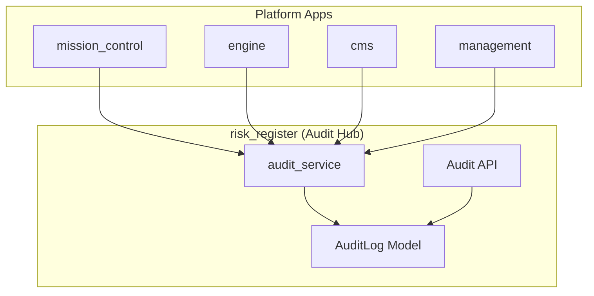

# Platform Audit System Architecture

Centralized audit logging for Shifter, extending `risk_register.AuditLog` to all platform domains.

## Current State

Two audit mechanisms exist:

| Mechanism | Location | Scope | Storage |
|-----------|----------|-------|---------|
| `AuditLog` | `risk_register/models.py` | Risk, Comment, APIKey entities | Database |
| `ActivityLog` | `management/models.py` | Agent upload/delete only | Database |

**Gaps**: Range lifecycle, credentials, authentication, user management, configuration changes unaudited.

## Target Architecture



All apps call `risk_register.services.audit_log()` to record events. AuditLog becomes the single source of truth.

## Extended AuditLog Model

### Entity Types

Current:
- `risk` - Risk Register risks
- `comment` - Risk comments
- `apikey` - API keys

New:
- `range` - Cyber range instances
- `credential` - CMS credentials (SCM, deployment profiles)
- `agent` - XDR agent binaries
- `user` - User accounts
- `session` - Terminal/RDP sessions
- `ngfw` - NGFW instances
- `config` - System configuration

### Action Types

Current:
- `create`, `update`, `delete`, `restore`, `close`, `reopen`

New:
- `login` - Authentication success
- `logout` - Session end
- `login_failed` - Authentication failure
- `access_denied` - Authorization failure
- `connect` - Session established (terminal/RDP)
- `disconnect` - Session ended
- `provision` - Resource provisioning started
- `deprovision` - Resource teardown started
- `ready` - Resource became available
- `failed` - Operation failed

### Actor Types

Current:
- `user` - Authenticated user
- `apikey` - API key

New:
- `system` - Automated processes (provisioner, event handlers)
- `cognito` - Identity provider events

### Schema Extension

```python
# risk_register/models.py additions

class AuditLog(models.Model):
    class EntityType(models.TextChoices):
        # Existing
        RISK = "risk", "Risk"
        COMMENT = "comment", "Comment"
        APIKEY = "apikey", "API Key"
        # New
        RANGE = "range", "Range"
        CREDENTIAL = "credential", "Credential"
        AGENT = "agent", "Agent"
        USER = "user", "User"
        SESSION = "session", "Session"
        NGFW = "ngfw", "NGFW"
        CONFIG = "config", "Configuration"

    class Action(models.TextChoices):
        # Existing
        CREATE = "create", "Create"
        UPDATE = "update", "Update"
        DELETE = "delete", "Delete"
        RESTORE = "restore", "Restore"
        CLOSE = "close", "Close"
        REOPEN = "reopen", "Reopen"
        # New - Authentication
        LOGIN = "login", "Login"
        LOGOUT = "logout", "Logout"
        LOGIN_FAILED = "login_failed", "Login Failed"
        ACCESS_DENIED = "access_denied", "Access Denied"
        # New - Sessions
        CONNECT = "connect", "Connect"
        DISCONNECT = "disconnect", "Disconnect"
        # New - Lifecycle
        PROVISION = "provision", "Provision"
        DEPROVISION = "deprovision", "Deprovision"
        READY = "ready", "Ready"
        FAILED = "failed", "Failed"

    class ActorType(models.TextChoices):
        USER = "user", "User"
        APIKEY = "apikey", "API Key"
        SYSTEM = "system", "System"
        COGNITO = "cognito", "Cognito"

    # New optional fields
    source_ip = models.GenericIPAddressField(null=True, blank=True)
    user_agent = models.CharField(max_length=500, blank=True)
    request_id = models.CharField(max_length=64, blank=True)  # Trace correlation
```

## Service Layer

### Audit Service API

Location: `risk_register/services.py`

```python
def audit_log(
    entity_type: str,
    entity_id: int,
    action: str,
    *,
    actor_type: str = "system",
    actor_id: int | None = None,
    previous_state: dict | None = None,
    new_state: dict | None = None,
    context: str = "",
    source_ip: str | None = None,
    user_agent: str = "",
    request_id: str = "",
) -> AuditLog:
    """
    Record an audit event.

    Called by all platform apps for auditable operations.
    """
```

### Request Context Helper

Location: `risk_register/services.py`

```python
def audit_log_from_request(
    request: HttpRequest,
    entity_type: str,
    entity_id: int,
    action: str,
    **kwargs,
) -> AuditLog:
    """
    Record audit event with HTTP request context.

    Extracts: user/apikey, source IP, user agent, request ID.
    """
```

### Event Handler Helper

Location: `risk_register/services.py`

```python
def audit_log_system_event(
    entity_type: str,
    entity_id: int,
    action: str,
    source: str,  # e.g., "provisioner", "event_handler"
    **kwargs,
) -> AuditLog:
    """
    Record system-initiated audit event.

    For provisioner, event handlers, scheduled tasks.
    """
```

## Integration Points

### Authentication Events

| Event | Source | Actor Type | Action |
|-------|--------|------------|--------|
| OIDC login success | `config/oidc.py` | cognito | login |
| OIDC login failure | `config/oidc.py` | cognito | login_failed |
| API key auth success | `risk_register/api/authentication.py` | apikey | login |
| API key auth failure | `risk_register/api/authentication.py` | apikey | login_failed |
| Session timeout | Middleware | user | logout |

### Range Lifecycle Events

| Event | Source | Actor Type | Action |
|-------|--------|------------|--------|
| Range requested | `cms/services.py:create_range` | user | provision |
| Range ready | `engine/handlers.py` | system | ready |
| Range failed | `engine/handlers.py` | system | failed |
| Range destroyed | `cms/services.py:destroy_range` | user | deprovision |

### Session Events

| Event | Source | Actor Type | Action |
|-------|--------|------------|--------|
| Terminal connect | `mission_control/consumers.py` | user | connect |
| Terminal disconnect | `mission_control/consumers.py` | user | disconnect |
| RDP connect | `mission_control/consumers.py` | user | connect |
| Access denied | `mission_control/consumers.py` | user | access_denied |

### Resource Events

| Event | Source | Actor Type | Action |
|-------|--------|------------|--------|
| Credential created | `cms/services.py` | user | create |
| Credential deleted | `cms/services.py` | user | delete |
| Agent uploaded | `cms/assets/services.py` | user | create |
| Agent deleted | `cms/assets/services.py` | user | delete |
| NGFW provisioned | `cms/services.py` | user | provision |
| NGFW destroyed | `cms/services.py` | user | deprovision |

## Deprecation: ActivityLog

`management.ActivityLog` will be deprecated once AuditLog covers agent events. Migration path:

1. Add `agent` entity type to AuditLog
2. Update `cms/assets/services.py` to use `audit_log()`
3. Keep ActivityLog read-only for historical data
4. Remove ActivityLog writes from codebase

## Query Interface

### Admin Interface

`risk_register/admin.py` - Extended AuditLogAdmin:
- Filter by entity_type, action, actor_type, timestamp
- Search by context, entity_id, request_id
- Date hierarchy by timestamp
- Read-only (no add/change/delete)

### REST API

`risk_register/api/views.py` - AuditLogViewSet:
- `GET /api/v1/audit/` - List with filters
- `GET /api/v1/audit/{id}/` - Detail
- Query params: `entity_type`, `entity_id`, `action`, `actor_type`, `actor_id`, `from_date`, `to_date`
- Admin users only

### Export

Future: CSV/JSON export for compliance reporting.

## Retention and Archival

Default: 90 days in database, archived to existing logs bucket thereafter.

### Infrastructure Integration

Uses the existing log-aggregation S3 bucket (`{name_prefix}-logs-{environment}`):

```
logs bucket (from Terraform log-aggregation module)
├── logs/year=YYYY/month=MM/day=DD/  (CloudWatch → Firehose operational logs)
└── audit-archive/YYYY/MM/           (AuditLog database records)
```

### Configuration Required

Add to portal container environment (user_data.sh):
```bash
COMMON_ENV="$COMMON_ENV -e LOGS_BUCKET_NAME=$LOGS_BUCKET_NAME"
```

Where `$LOGS_BUCKET_NAME` is the output from `module.log_aggregation.logs_bucket_name`.

### Management Command

```bash
python manage.py audit_archive              # Archive records older than 90 days
python manage.py audit_archive --dry-run    # Preview without changes
python manage.py audit_archive --retention-days 30
python manage.py audit_archive --no-delete  # Archive but keep in database
```

Archives to: `s3://{bucket}/audit-archive/{year}/{month}/audit_{timestamp}.jsonl.gz`

## Security Considerations

1. **Immutability**: AuditLog has no update/delete in admin or API
2. **Tampering Detection**: Consider adding HMAC signature field for high-security deployments
3. **Access Control**: Audit API restricted to admin users
4. **PII**: User emails in actor context; anonymization required for GDPR compliance on user deletion
5. **Sensitive Data**: Never log credentials, API keys, or secrets in state fields

## Compliance Mapping

| Requirement | AuditLog Field |
|-------------|----------------|
| Who | actor_type, actor_id |
| What | entity_type, entity_id, action |
| When | timestamp |
| Where | source_ip |
| How | user_agent, context |
| Before/After | previous_state, new_state |

## Files to Modify

| File | Changes |
|------|---------|
| `risk_register/models.py` | Extend EntityType, Action, ActorType; add source_ip, user_agent, request_id |
| `risk_register/services.py` | Add audit_log(), audit_log_from_request(), audit_log_system_event() |
| `risk_register/admin.py` | Extend AuditLogAdmin filters |
| `risk_register/api/views.py` | Add AuditLogViewSet |
| `risk_register/api/serializers.py` | Add AuditLogSerializer |
| `config/oidc.py` | Add authentication event logging |
| `cms/services.py` | Add range/credential/ngfw audit logging |
| `cms/assets/services.py` | Migrate from ActivityLog to AuditLog |
| `engine/handlers.py` | Add range lifecycle audit logging |
| `mission_control/consumers.py` | Add session audit logging |
| `management/services.py` | Add user audit logging |
