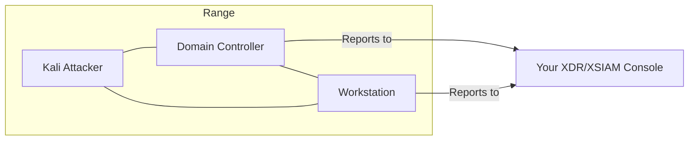

# AD Attack Lab

Active Directory environment with domain controller, Kali attacker, and domain-joined victim. Requires NGFW.

## Architecture

## Instances

| Instance | OS | Role | Agent | Domain |
|----------|-----|------|-------|--------|
| Attacker | Kali Linux | Attack machine | No | No |
| Domain Controller | Windows Server | AD DC | Yes | `internal.shifter` |
| Workstation | Windows/Linux* | Domain victim | Yes | Joined |

*Workstation OS determined by your uploaded agent type.

## Network

Single subnet with NGFW. All instances can communicate directly. The NGFW inspects traffic to/from the range but there is no inter-subnet segmentation.

## Prerequisites

- NGFW set up and ready (see [NGFW Guide](../features/ngfw))
- SCM device association complete
- Log forwarding configured to XDR/XSIAM

## Domain Configuration

- **Domain**: `internal.shifter`
- **NetBIOS**: `INTSHIFTER`
- Workstation automatically joins domain during provisioning

## Access

- **Attacker (Kali)**: SSH terminal, RDP
- **Domain Controller**: SSH terminal, RDP
- **Workstation**: SSH terminal, RDP

## Use Cases

- Active Directory enumeration and attacks
- Credential harvesting demos
- Lateral movement scenarios
- Kerberos attack demonstrations
- Domain privilege escalation

## Launch Steps

1. Ensure NGFW is set up and ready
2. Go to **Ranges** in the sidebar
3. Select **AD Attack Lab** scenario
4. Select victim OS (Windows or Linux)
5. Select your agent
6. Click **Launch Range**
7. Wait for provisioning (longer than Basic Range due to domain setup)

## What's Installed

### Kali Attacker

Standard Kali tools plus AD attack utilities:

- Impacket
- BloodHound
- CrackMapExec
- Mimikatz
- Rubeus

### Domain Controller

- Windows Server with AD DS role
- Your XDR/XSIAM agent
- Standard domain configuration

### Workstation

- Domain-joined machine
- Your XDR/XSIAM agent
- Standard user account
