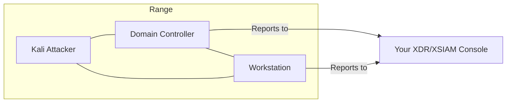

# AD Attack Lab

Active Directory environment with domain controller, Kali attacker, and domain-joined victim.

## Architecture

## Instances

| Instance | OS | Role | Agent | Domain |
|----------|-----|------|-------|--------|
| Attacker | Kali Linux | Attack machine | No | No |
| Domain Controller | Windows Server | AD DC | Yes | `basicadlab.lab` |
| Workstation | Windows/Linux* | Domain victim | Yes | Joined |

*Workstation OS determined by your uploaded agent type.

## Network

Single subnet. All instances can communicate directly.

## Domain Configuration

- **Domain**: `basicadlab.lab`
- **NetBIOS**: `BASICADLAB`
- Workstation automatically joins domain during provisioning

## Access

- **Attacker (Kali)**: SSH terminal, RDP for GUI
- **Domain Controller**: SSH terminal, RDP
- **Workstation**: SSH terminal, RDP if Windows

## Use Cases

- Active Directory enumeration and attacks
- Credential harvesting demos
- Lateral movement scenarios
- Kerberos attack demonstrations
- Domain privilege escalation

## Launch Steps

1. Go to **Ranges** in the sidebar
2. Select **AD Attack Lab** scenario
3. Select victim OS (Windows or Linux)
4. Select your agent
5. Click **Launch Range**
6. Wait for provisioning (longer than Basic Range due to domain setup)

## What's Installed

### Kali Attacker

Standard Kali tools plus AD attack utilities:
- Impacket
- BloodHound
- CrackMapExec
- Mimikatz
- Rubeus

### Domain Controller

- Windows Server with AD DS role
- Your XDR/XSIAM agent
- Standard domain configuration

### Workstation

- Domain-joined machine
- Your XDR/XSIAM agent
- Standard user account
