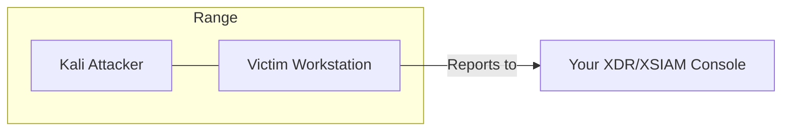

# Basic Range

Minimal attacker-victim setup. One Kali Linux attacker, one victim workstation with your XDR/XSIAM agent.

## Architecture

## Instances

| Instance | OS | Role | Agent |
|----------|-----|------|-------|
| Attacker | Kali Linux | Attack machine | No |
| Workstation | Windows/Linux* | Victim | Yes |

*OS determined by your uploaded agent type.

## Network

Single subnet. Attacker and victim can communicate directly.

## Access

- **Attacker (Kali)**: SSH terminal, RDP
- **Workstation**: SSH terminal, RDP

## Use Cases

- Quick XDR/XSIAM demos
- Single-machine attack scenarios
- Agent deployment verification
- Simple malware execution tests

## Launch Steps

1. Go to **Ranges** in the sidebar
2. Select **Basic Range** scenario
3. Select victim OS (Windows or Linux)
4. Select your agent
5. Click **Launch Range**
6. Wait 2-5 minutes for provisioning

## What's Installed

### Kali Attacker

Standard Kali tools including:

- Metasploit
- Nmap
- Burp Suite
- Common attack utilities

### Victim Workstation

- Your XDR/XSIAM agent (auto-installed during provisioning)
- Standard OS configuration
