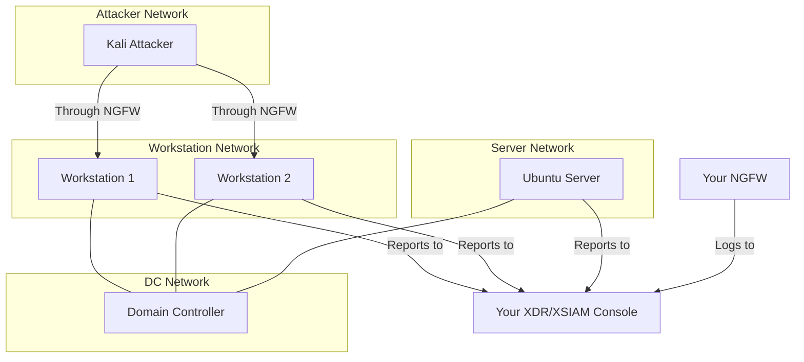

# Cortex BYOT

Full enterprise simulation with domain controller, multiple workstations, server, attacker, and NGFW integration.

## Architecture

## Instances

| Instance | OS | Role | Agent | Domain |
|----------|-----|------|-------|--------|
| Attacker | Kali Linux | Attack machine | No | No |
| Domain Controller | Windows Server | AD DC | No | `internal.shifter` |
| Workstation 1 | Windows | Victim | Yes | Joined |
| Workstation 2 | Windows | Victim | Yes | Joined |
| Server | Ubuntu | Victim | Yes | Joined |

## Network

Four segmented subnets with NGFW routing:

- **Attacker network**: Kali (isolated, routes through NGFW)
- **Workstation network**: Windows workstations
- **Server network**: Ubuntu server
- **DC network**: Domain controller (connected to workstation and server networks)

## Domain Configuration

- **Domain**: `internal.shifter`
- **NetBIOS**: `INTSHIFTER`
- All victims domain-joined

## Prerequisites

Before launching this scenario:

1. Set up an NGFW (see [NGFW Guide](../features/ngfw))
2. Complete SCM device association
3. Configure log forwarding to XDR/XSIAM
4. Have a Windows agent uploaded

## Access

- **Kali, Windows instances**: SSH terminal and RDP
- **Ubuntu Server**: SSH terminal only

## Use Cases

- Full enterprise attack simulations
- Multi-stage attack demonstrations
- Lateral movement across systems
- Cross-platform detection (Windows + Linux)
- Network segmentation demos
- Complete XDR/XSIAM capability showcase

## Launch Steps

1. Ensure NGFW is set up and ready
2. Go to **Ranges** in the sidebar
3. Select **Cortex BYOT** scenario
4. Select your Windows agent
5. Select your Linux agent
6. Click **Launch Range**
7. Wait for provisioning (longest of all scenarios)

## What's Installed

### Kali Attacker

Full attack toolkit with AI assistant for guided scenarios.

### Domain Controller

- Windows Server with AD DS
- Domain configuration
- AI assistant

### Workstations

- Domain-joined Windows machines
- Your XDR/XSIAM agent
- AI assistant for attack simulation

### Server

- Domain-joined Ubuntu server
- Your XDR/XSIAM agent (Linux)
- AI assistant
