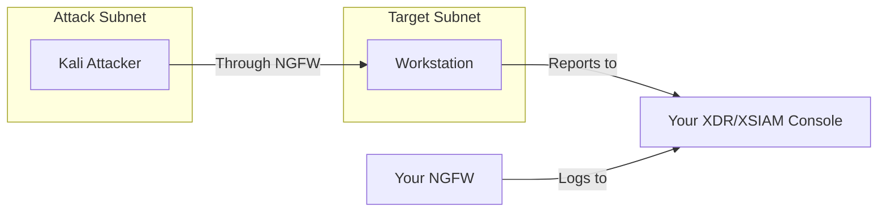

# Basic Range with NGFW

Basic attacker-victim setup with traffic routed through your Next-Generation Firewall for network visibility in XDR/XSIAM.

## Architecture

## Instances

| Instance | OS | Role | Agent |
|----------|-----|------|-------|
| Attacker | Kali Linux | Attack machine | No |
| Workstation | Windows/Linux* | Victim | Yes |

*Workstation OS determined by your uploaded agent type.

## Network

Two subnets with NGFW routing between them:

- **Attack subnet**: Kali attacker
- **Target subnet**: Victim workstation

All traffic between subnets passes through your NGFW.

## Prerequisites

Before launching this scenario:

1. Set up an NGFW (see [NGFW Guide](../features/ngfw))
2. Complete SCM device association
3. Configure log forwarding to XDR/XSIAM

## Access

- **Attacker (Kali)**: SSH terminal, RDP for GUI
- **Workstation**: SSH terminal, RDP if Windows

## Use Cases

- Network-level threat detection demos
- Correlating endpoint and network alerts
- Firewall policy testing
- Traffic analysis demonstrations

## Launch Steps

1. Ensure NGFW is set up and ready
2. Go to **Ranges** in the sidebar
3. Select **Basic Range with NGFW** scenario
4. Select victim OS (Windows or Linux)
5. Select your agent
6. Click **Launch Range**
7. Wait for provisioning

## What You See in XDR/XSIAM

With NGFW integration, you get:

- Endpoint alerts from your agent
- Network alerts from firewall logs
- Correlated view of attack activity
- Traffic metadata and session information
