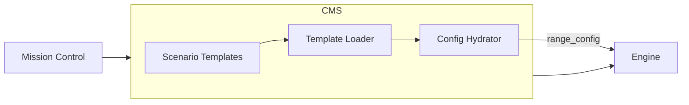

# Shifter CMS

Content and asset management.

## Responsibility

- Scenario catalog (declarative templates)
- Asset management (agents, credentials)
- Range content tracking (scenario associations)
- Config hydration for Engine

CMS owns **what** gets deployed. Engine owns **how** it gets provisioned.

## Architecture



## Scenario Templates

Declarative YAML definitions in `cms/scenarios/templates/`.

### Template Schema

```yaml
id: string                    # Unique identifier
name: string                  # Display name
description: string           # User-facing description

requirements:
  agent:
    required: boolean         # Must provide agent
    os: string | null         # OS constraint (null = any)

instances:
  - role: string              # attacker, victim, dc
    os_type: string           # kali, windows, ubuntu, from_agent
    agent_slot: string | null # primary, secondary, null
    domain_controller: bool   # DC-specific
    join_domain: bool         # Domain-join victim
    dc_config:                # DC configuration
      domain_name: string
      netbios_name: string
```

### Available Scenarios

| ID | Name | Instances | Agent Requirement |
|----|------|-----------|-------------------|
| `basic` | Basic Range | attacker, victim | Any OS |
| `ad_attack_lab` | AD Attack Lab | attacker, dc, victim | Windows |

## Hydrated Range Config

CMS hydrates templates with user-specific data before calling Engine.

```python
range_config = {
    "scenario_id": "basic",
    "subnet_index": 5,
    "instances": [
        {"role": "attacker", "os_type": "kali"},
        {
            "role": "victim",
            "os_type": "ubuntu",
            "agent": {
                "s3_key": "agents/123/abc.deb",
                "filename": "agent.deb",
                "sha256": "...",
            }
        }
    ],
}
```

## Models

| Model | Purpose |
|-------|---------|
| `Credential` | Unified credential (SCM, deployment profile) |
| `RangeScenario` | Tracks range_id to scenario_id associations |

## Internal Modules

| Module | Purpose |
|--------|---------|
| `cms/scenarios/loader.py` | Template loading and validation |
| `cms/scenarios/schema.py` | Pydantic models for templates |
| `cms/scenarios/hydrator.py` | Config hydration logic |
| `cms/assets/services.py` | Agent CRUD, storage quota |

## Service Interface

#### Agents

| Function | Purpose |
|----------|---------|
| `create_agent(user, ...)` | Create agent record |
| `delete_agent(user, agent_id)` | Soft delete agent |
| `list_agents(user)` | Get user's agents |
| `get_agent(user, agent_id)` | Get single agent |

#### Credentials

| Function | Purpose |
|----------|---------|
| `create_credential(user, type, ...)` | Create credential (scm, authcode) |
| `delete_credential(user, credential_id)` | Delete credential |
| `list_credentials(user)` | Get user's credentials (includes type) |
| `get_credential(user, credential_id)` | Get single credential |

#### Ranges

| Function | Purpose |
|----------|---------|
| `create_range(user, scenario_id, agent_id, ...)` | Hydrate template, call Engine |
| `destroy_range(user, range_id)` | Tear down range |
| `list_ranges(user)` | Get user's ranges |
| `get_range(user, range_id)` | Get single range |
| `cancel_range(user, range_id)` | Cancel provisioning range |
| `pause_range(user, range_id)` | Pause range |
| `resume_range(user, range_id)` | Resume range |

#### Uploads

| Function | Purpose |
|----------|---------|
| `initiate_upload(user, name, filename, file_size)` | Validate, generate presigned URL |
| `complete_upload(user, upload_token, sha256)` | Verify and finalize upload |
| `cancel_upload(user, upload_token)` | Clean up failed upload |

#### User Quota

| Function | Purpose |
|----------|---------|
| `get_storage_used(user)` | Check storage quota |

#### Scenarios

| Function | Purpose |
|----------|---------|
| `list_scenarios(user)` | Get available scenarios with metadata |
| `get_scenario(scenario_id)` | Get single scenario template |
| `validate_scenario_requirements(scenario_id, agent)` | Check agent meets requirements |
