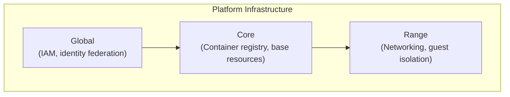
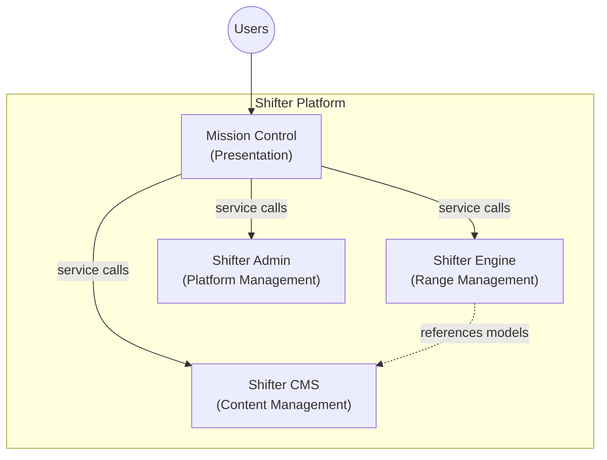
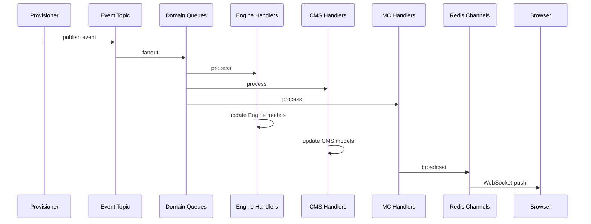

# Shifter Architecture

Enterprise, multi-user, extensible cyber range platform. Deploys to AWS or GCP.

## Platform Infrastructure

Infrastructure is defined per cloud provider. A `CLOUD_PROVIDER` environment variable selects the active provider at runtime.

| Component | Purpose |
|-----------|---------|
| **Global** | IAM roles, cloud identity services, CI/CD identity federation. |
| **Core** | Container registries, base environment resources. |
| **Range** | Range networking and guest isolation. |
| **Portal*** | Shifter application infrastructure (load balancer, compute, database, object storage). |

*Portal is a legacy name. This component deploys the Shifter Django application infrastructure.

| | AWS | GCP |
|---|---|---|
| **IaC** | Terraform (`platform/terraform/modules/`, `environments/`) | Terraform (`platform/terraform/gcp/`) + Helm (`platform/charts/shifter/`) with bootstrap-generated values |
| **Compute** | EC2 (configurable ASG) + ECS Fargate | GKE (node pools: web, workers, provisioner) |
| **Database** | RDS PostgreSQL | Cloud SQL PostgreSQL |
| **Cache** | ElastiCache Redis | Memorystore Redis |
| **Object Storage** | S3 | GCS |
| **Messaging** | SNS (fanout) → SQS (per-domain queues) | Pub/Sub (topic → per-domain subscriptions) |
| **Container Registry** | ECR | Artifact Registry |
| **Secrets** | Secrets Manager + SSM Parameter Store | Secret Manager |
| **Identity** | Cognito hosted UI via OIDC | Identity Platform browser-side auth via FirebaseUI/Google SDKs + TOTP |
| **Range Guests** | EC2 instances in isolated VPC subnets | GDC VM Runtime (KubeVirt) with optional lower-fidelity pod execution on GDC cluster |
| **Egress Filtering** | AWS Network Firewall (domain-based rules) | Per-range namespace and L2 network isolation |

### Identity

AWS and GCP keep provider-specific identity stacks behind a shared auth seam:

- AWS uses Cognito through `mozilla-django-oidc`
- GCP uses Identity Platform through FirebaseUI/browser-side Google auth flows. Django only exchanges verified identity tokens for Shifter sessions.

Common operator requirements:
- Email as username
- MFA required (TOTP)
- Domain restriction for allowed email domains
- Email verification required
- CTF participant magic links remain separate from the corporate identity-provider flow

### Hosting

CI/CD via GitHub Actions with self-hosted runners. Separate workflow per cloud target.

## Shifter (Django)

Django monorepo. Users interact via Mission Control; backend apps expose service interfaces.

| Element | App | Purpose |
|---------|-----|---------|
| **Mission Control** | `mission_control` | Presentation layer. Single UI for all users. |
| **Shifter Engine** | `engine` | Range management. Owns Range lifecycle, references CMS assets. |
| **Shifter CMS** | `cms` | Content management. Assets, credentials, scenario catalog. |
| **Shifter Admin** | `management` | Platform management. Audit logging, user profiles. |

### Event-Driven Communication

Provisioner publishes status events to a message topic. All domains subscribe via per-domain queues and process events through domain-specific handlers.

On AWS this is SNS → SQS. On GCP this is Pub/Sub topic → subscriptions. The application code uses cloud adapter interfaces (see [Cloud Adapters](dev/cloud-adapters)) and does not reference provider APIs directly.

- **Engine handlers**: Update `Range` status, timestamps
- **CMS handlers**: Update `RangeInstance`, `Instance`, `App` status
- **MC handlers**: Broadcast to WebSocket for real-time UI updates

## Cloud Adapters

The platform and provisioner use protocol-based abstractions to isolate cloud-specific code. `CLOUD_PROVIDER` selects the implementation at runtime via factory functions.

See [Cloud Adapters](dev/cloud-adapters) for the full interface reference.

## Design Decisions

| Decision | Choice | Rationale |
|----------|--------|-----------|
| UI separation | Mission Control is presentation only | Clean separation of presentation from domain logic. Views handle HTTP; services own business rules. |
| API style | REST via Django REST Framework | Proven, simple, mature Django ecosystem support. |
| Cloud abstraction | Protocol-based adapters per provider | Same Django app runs on AWS or GCP. Cloud-specific code isolated behind interfaces. |
| Identity | Provider seam with per-cloud implementations | AWS keeps Cognito/OIDC. GCP uses Identity Platform with FirebaseUI/browser auth. Both require MFA, email-based usernames, and keep provider-specific auth details behind the app auth seam. |
| Domains | keplerops.com | Operator-owned domain. DNS may be hosted externally or in cloud-managed DNS. Current `gcp-dev` hostname is `shifter.keplerops.com`. |
