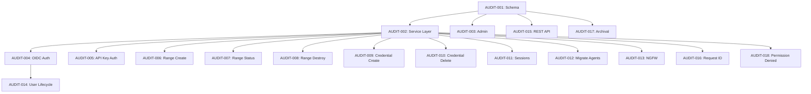

# Audit Logging Backlog

Prioritized issues for implementing unified platform audit logging. See [Architecture](../risk/audit-system-architecture.md).

## Priority Levels

- **P0**: Foundation - blocks all other work
- **P1**: Critical gaps - enterprise compliance blockers
- **P2**: Important - security visibility
- **P3**: Enhancement - operational excellence

---

## P0: Foundation

### AUDIT-001: Extend AuditLog Model Schema

**Summary**: Add entity types, actions, and metadata fields to support platform-wide auditing.

**Files**:
- `risk_register/models.py`
- `risk_register/migrations/` (new migration)

**Changes**:

1. Extend `EntityType` choices:
   ```python
   RANGE = "range", "Range"
   CREDENTIAL = "credential", "Credential"
   AGENT = "agent", "Agent"
   USER = "user", "User"
   SESSION = "session", "Session"
   NGFW = "ngfw", "NGFW"
   CONFIG = "config", "Configuration"
   ```

2. Extend `Action` choices:
   ```python
   LOGIN = "login", "Login"
   LOGOUT = "logout", "Logout"
   LOGIN_FAILED = "login_failed", "Login Failed"
   ACCESS_DENIED = "access_denied", "Access Denied"
   CONNECT = "connect", "Connect"
   DISCONNECT = "disconnect", "Disconnect"
   PROVISION = "provision", "Provision"
   DEPROVISION = "deprovision", "Deprovision"
   READY = "ready", "Ready"
   FAILED = "failed", "Failed"
   ```

3. Extend `ActorType` choices:
   ```python
   SYSTEM = "system", "System"
   COGNITO = "cognito", "Cognito"
   ```

4. Add metadata fields:
   ```python
   source_ip = models.GenericIPAddressField(null=True, blank=True)
   user_agent = models.CharField(max_length=500, blank=True)
   request_id = models.CharField(max_length=64, blank=True, db_index=True)
   ```

5. Add index on `request_id` for trace correlation queries.

**Acceptance Criteria**:
- [x] Migration runs without errors
- [x] Existing AuditLog records unaffected
- [x] All new choices validate correctly
- [x] Admin displays new fields

**Estimate**: Small

---

### AUDIT-002: Create Audit Service Layer

**Summary**: Centralized service functions for audit logging, callable from any app.

**Files**:
- `risk_register/services.py` (new file or extend existing)

**Functions**:

1. `audit_log()` - Core logging function:
   ```python
   def audit_log(
       entity_type: str,
       entity_id: int,
       action: str,
       *,
       actor_type: str = "system",
       actor_id: int | None = None,
       previous_state: dict | None = None,
       new_state: dict | None = None,
       context: str = "",
       source_ip: str | None = None,
       user_agent: str = "",
       request_id: str = "",
   ) -> AuditLog:
   ```

2. `audit_log_from_request()` - Extract context from HttpRequest:
   ```python
   def audit_log_from_request(
       request: HttpRequest,
       entity_type: str,
       entity_id: int,
       action: str,
       **kwargs,
   ) -> AuditLog:
   ```
   - Extract user or API key from request
   - Extract source IP (handle X-Forwarded-For)
   - Extract User-Agent header
   - Extract request ID from headers or generate

3. `audit_log_system_event()` - For background processes:
   ```python
   def audit_log_system_event(
       entity_type: str,
       entity_id: int,
       action: str,
       source: str,
       **kwargs,
   ) -> AuditLog:
   ```
   - actor_type always "system"
   - source stored in context field

4. `get_actor_from_request()` - Helper to identify actor:
   ```python
   def get_actor_from_request(request: HttpRequest) -> tuple[str, int]:
       """Return (actor_type, actor_id) from request."""
   ```

**Acceptance Criteria**:
- [x] All functions have type hints
- [x] All functions have docstrings
- [x] Unit tests for each function
- [x] X-Forwarded-For parsing handles ALB format
- [x] API key authentication detected correctly

**Estimate**: Medium

---

### AUDIT-003: Extend Admin Interface for AuditLog

**Summary**: Update AuditLogAdmin to filter/search new fields.

**Files**:
- `risk_register/admin.py`

**Changes**:

1. Add to `list_filter`:
   - All new entity_type values
   - All new action values
   - source_ip (as boolean: "Has IP" / "No IP")

2. Add to `search_fields`:
   - `request_id`
   - `source_ip`

3. Add to `list_display`:
   - `source_ip`
   - `request_id` (truncated)

4. Add `readonly_fields` for new fields (maintain immutability).

**Acceptance Criteria**:
- [ ] Can filter by all entity types
- [ ] Can filter by all actions
- [ ] Can search by request_id
- [ ] No add/change/delete permissions remain

**Estimate**: Small

---

## P1: Critical Gaps - Authentication

### AUDIT-004: Log Authentication Events from OIDC

**Summary**: Audit successful and failed authentication via Cognito OIDC.

**Files**:
- `config/oidc.py`

**Integration Points**:

1. In `ShifterOIDCBackend.authenticate()` or signal handler:
   - On success: Log `action=login`, `actor_type=cognito`, `entity_type=user`
   - On failure: Log `action=login_failed`, `actor_type=cognito`

2. Capture from OIDC flow:
   - Cognito subject ID (user identifier)
   - Source IP from request
   - User agent

3. State capture:
   - `new_state`: `{"cognito_sub": "...", "email": "..."}`

**Acceptance Criteria**:
- [ ] Every successful OIDC login creates AuditLog entry
- [ ] Failed auth attempts logged (if detectable at app level)
- [ ] Source IP captured correctly through ALB
- [ ] User email captured in new_state

**Dependencies**: AUDIT-001, AUDIT-002

**Estimate**: Medium

---

### AUDIT-005: Log API Key Authentication Events

**Summary**: Audit API key auth success and failure.

**Files**:
- `risk_register/api/authentication.py`

**Changes**:

1. In `APIKeyAuthentication.authenticate()`:
   - Success: `audit_log(entity_type="apikey", action="login", actor_type="apikey", ...)`
   - Failure: `audit_log(entity_type="apikey", action="login_failed", ...)`

2. Capture:
   - API key prefix (not full key)
   - Source IP
   - Endpoint being accessed

3. State capture:
   - `new_state`: `{"key_prefix": "rr_live_", "endpoint": "/api/v1/risks/"}`

**Acceptance Criteria**:
- [ ] Successful API key auth logged
- [ ] Invalid key attempts logged
- [ ] Expired key attempts logged
- [ ] Revoked key attempts logged
- [ ] No sensitive key data in logs

**Dependencies**: AUDIT-001, AUDIT-002

**Estimate**: Small

---

## P1: Critical Gaps - Range Lifecycle

### AUDIT-006: Log Range Creation Events

**Summary**: Audit range provisioning requests.

**Files**:
- `cms/services.py` - `create_range()`

**Changes**:

1. After successful range creation:
   ```python
   audit_log_from_request(
       request,
       entity_type="range",
       entity_id=range.id,
       action="provision",
       new_state={
           "scenario": scenario,
           "agent_os": agent_os,
           "request_id": provisioning_request_id,
       },
   )
   ```

2. If creation fails, still log with `action="failed"` and error in context.

**Acceptance Criteria**:
- [x] Every `create_range()` call produces AuditLog
- [x] Scenario and configuration captured in new_state
- [x] User who requested range is actor
- [x] Failures logged with error context

**Dependencies**: AUDIT-001, AUDIT-002

**Estimate**: Small

---

### AUDIT-007: Log Range Lifecycle State Changes

**Summary**: Audit range status transitions from event handlers.

**Files**:
- `engine/handlers.py`

**Changes**:

1. On `range.status.updated` event:
   ```python
   audit_log_system_event(
       entity_type="range",
       entity_id=range_id,
       action=_status_to_action(new_status),  # ready, failed, etc.
       source="engine.handlers",
       previous_state={"status": old_status},
       new_state={"status": new_status},
       context=error_message if failed else "",
   )
   ```

2. Map statuses to actions:
   - `provisioning` → (logged at request time)
   - `ready` → `action="ready"`
   - `failed` → `action="failed"`
   - `destroying` → (logged at request time)
   - `destroyed` → `action="deprovision"`

**Acceptance Criteria**:
- [ ] All range status transitions logged
- [ ] Previous and new status captured
- [ ] Failure reasons captured in context
- [ ] actor_type is "system" for event-driven changes

**Dependencies**: AUDIT-001, AUDIT-002

**Estimate**: Medium

---

### AUDIT-008: Log Range Destruction Events

**Summary**: Audit range teardown requests.

**Files**:
- `cms/services.py` - `destroy_range()`, `destroy_range_by_request_id()`

**Changes**:

1. Before initiating destruction:
   ```python
   audit_log_from_request(
       request,
       entity_type="range",
       entity_id=range.id,
       action="deprovision",
       previous_state={"status": range.status},
   )
   ```

2. Handle cases where request is None (system-initiated cleanup).

**Acceptance Criteria**:
- [x] User-initiated destruction logged with user as actor
- [x] System-initiated cleanup logged with system as actor
- [x] Range ID and status captured

**Dependencies**: AUDIT-001, AUDIT-002

**Estimate**: Small

---

## P1: Critical Gaps - Credentials

### AUDIT-009: Log Credential Creation Events

**Summary**: Audit sensitive credential creation.

**Files**:
- `cms/services.py` - `create_credential()`

**Changes**:

1. After successful credential creation:
   ```python
   audit_log_from_request(
       request,
       entity_type="credential",
       entity_id=credential.id,
       action="create",
       new_state={
           "credential_type": credential_type,
           "name": name,
           # Never log actual credential values
       },
   )
   ```

**Acceptance Criteria**:
- [x] All credential creations logged
- [x] Credential type and name captured
- [x] No secrets in audit log
- [x] User who created is actor

**Dependencies**: AUDIT-001, AUDIT-002

**Estimate**: Small

---

### AUDIT-010: Log Credential Deletion Events

**Summary**: Audit credential removal.

**Files**:
- `cms/services.py` - `delete_credential()`

**Changes**:

1. Before deletion:
   ```python
   audit_log_from_request(
       request,
       entity_type="credential",
       entity_id=credential.id,
       action="delete",
       previous_state={
           "credential_type": credential.type,
           "name": credential.name,
       },
   )
   ```

**Acceptance Criteria**:
- [x] All credential deletions logged
- [x] Previous credential metadata captured
- [x] User who deleted is actor

**Dependencies**: AUDIT-001, AUDIT-002

**Estimate**: Small

---

## P2: Security Visibility

### AUDIT-011: Log Terminal/RDP Session Events

**Summary**: Audit WebSocket session lifecycle for range access.

**Files**:
- `mission_control/consumers.py`

**Changes**:

1. On connection established:
   ```python
   audit_log(
       entity_type="session",
       entity_id=session_id,  # Generate unique session ID
       action="connect",
       actor_type="user",
       actor_id=user.id,
       new_state={
           "range_id": range_id,
           "session_type": "terminal" | "rdp",
           "target_ip": instance_ip,
       },
       source_ip=client_ip,
   )
   ```

2. On connection closed:
   ```python
   audit_log(
       entity_type="session",
       entity_id=session_id,
       action="disconnect",
       actor_type="user",
       actor_id=user.id,
       context=disconnect_reason,
   )
   ```

3. On access denied:
   ```python
   audit_log(
       entity_type="session",
       entity_id=0,  # No session created
       action="access_denied",
       actor_type="user",
       actor_id=user.id,
       context=f"User {user.id} denied access to range {range_id}",
       source_ip=client_ip,
   )
   ```

**Acceptance Criteria**:
- [ ] All terminal connections logged
- [ ] All RDP connections logged
- [ ] Disconnections logged with duration or reason
- [ ] Access denials logged
- [ ] Target IP captured for forensics

**Dependencies**: AUDIT-001, AUDIT-002

**Estimate**: Medium

---

### AUDIT-012: Migrate Agent Events from ActivityLog

**Summary**: Move agent audit logging from ActivityLog to AuditLog.

**Files**:
- `cms/assets/services.py`

**Changes**:

1. Replace `log_activity("agent_uploaded", ...)` with:
   ```python
   audit_log_from_request(
       request,
       entity_type="agent",
       entity_id=agent.id,
       action="create",
       new_state={
           "name": agent.name,
           "os": agent.os,
           "file_size": file_size,
       },
   )
   ```

2. Replace `log_activity("agent_deleted", ...)` with:
   ```python
   audit_log_from_request(
       request,
       entity_type="agent",
       entity_id=agent.id,
       action="delete",
       previous_state={
           "name": agent.name,
           "os": agent.os,
       },
   )
   ```

3. Mark `management.models.ActivityLog` as deprecated in docstring.

**Acceptance Criteria**:
- [x] Agent create uses AuditLog
- [x] Agent delete uses AuditLog
- [x] ActivityLog imports removed from cms/assets
- [x] ActivityLog marked deprecated

**Dependencies**: AUDIT-001, AUDIT-002

**Estimate**: Small

---

### AUDIT-013: Log NGFW Lifecycle Events

**Summary**: Audit NGFW provisioning and destruction.

**Files**:
- `cms/services.py` - `create_ngfw()`, `destroy_ngfw()`

**Changes**:

1. On NGFW creation:
   ```python
   audit_log_from_request(
       request,
       entity_type="ngfw",
       entity_id=ngfw.id,
       action="provision",
       new_state={
           "range_id": range_id,
           "configuration": config_summary,
       },
   )
   ```

2. On NGFW destruction:
   ```python
   audit_log_from_request(
       request,
       entity_type="ngfw",
       entity_id=ngfw.id,
       action="deprovision",
   )
   ```

**Acceptance Criteria**:
- [x] NGFW provisioning logged
- [x] NGFW destruction logged
- [x] Associated range ID captured

**Dependencies**: AUDIT-001, AUDIT-002

**Estimate**: Small

---

### AUDIT-014: Log User Lifecycle Events

**Summary**: Audit user account creation, modification, deletion.

**Files**:
- `management/services.py`
- `config/oidc.py`

**Changes**:

1. On user creation (OIDC first login):
   ```python
   audit_log(
       entity_type="user",
       entity_id=user.id,
       action="create",
       actor_type="cognito",
       actor_id=0,  # System-created
       new_state={
           "email": user.email,
           "cognito_sub": cognito_sub,
       },
   )
   ```

2. On user soft-delete (`mark_user_deleted()`):
   ```python
   audit_log(
       entity_type="user",
       entity_id=user.id,
       action="delete",
       actor_type="user",
       actor_id=admin_user.id,
       previous_state={"email": user.email},
   )
   ```

**Acceptance Criteria**:
- [ ] First-time OIDC users logged as created
- [ ] Admin user deletions logged
- [ ] Email captured (for later anonymization reference)

**Dependencies**: AUDIT-001, AUDIT-002, AUDIT-004

**Estimate**: Medium

---

## P2: Query and Export

### AUDIT-015: Create Audit Log REST API

**Summary**: Read-only API for querying audit logs.

**Files**:
- `risk_register/api/views.py`
- `risk_register/api/serializers.py`
- `risk_register/api/urls.py`

**Endpoints**:

1. `GET /api/v1/audit/` - List with filters:
   - `entity_type` - Filter by entity
   - `entity_id` - Filter by specific entity
   - `action` - Filter by action
   - `actor_type` - Filter by actor type
   - `actor_id` - Filter by specific actor
   - `from_date` / `to_date` - Date range
   - `request_id` - Trace correlation

2. `GET /api/v1/audit/{id}/` - Single entry detail

**Serializer**:
```python
class AuditLogSerializer(serializers.ModelSerializer):
    class Meta:
        model = AuditLog
        fields = [
            "id", "entity_type", "entity_id", "action",
            "actor_type", "actor_id", "timestamp",
            "previous_state", "new_state", "context",
            "source_ip", "user_agent", "request_id",
        ]
        read_only_fields = fields
```

**Permissions**: Admin users only (IsAdminUser).

**Acceptance Criteria**:
- [ ] List endpoint with pagination
- [ ] All filter parameters work
- [ ] Date range filtering works
- [ ] No write operations exposed
- [ ] Admin-only access enforced

**Dependencies**: AUDIT-001

**Estimate**: Medium

---

## P3: Enhancement

### AUDIT-016: Add Request ID Middleware

**Summary**: Generate/propagate request IDs for trace correlation.

**Files**:
- `config/middleware.py` (new)
- `config/settings.py`

**Changes**:

1. Create `RequestIDMiddleware`:
   ```python
   class RequestIDMiddleware:
       def __call__(self, request):
           request_id = request.headers.get("X-Request-ID")
           if not request_id:
               request_id = str(uuid.uuid4())[:8]
           request.request_id = request_id
           response = self.get_response(request)
           response["X-Request-ID"] = request_id
           return response
   ```

2. Add to MIDDLEWARE in settings.py.

3. Update audit service to use `request.request_id`.

**Acceptance Criteria**:
- [ ] All requests have request_id
- [ ] Incoming X-Request-ID preserved
- [ ] Response includes X-Request-ID header
- [ ] Audit logs include request_id

**Dependencies**: AUDIT-002

**Estimate**: Small

---

### AUDIT-017: Audit Log Retention and Archival

**Summary**: Management command to archive old audit logs to S3.

**Files**:
- `risk_register/management/commands/audit_archive.py` (new)

**Command**: `python manage.py audit_archive`

**Behavior**:
1. Query AuditLog older than `AUDIT_RETENTION_DAYS` (default 90)
2. Export to JSON Lines format
3. Upload to S3: `s3://{bucket}/audit-archive/{year}/{month}/{day}.jsonl.gz`
4. Delete archived records from database

**Options**:
- `--dry-run` - Show what would be archived
- `--retention-days N` - Override default retention
- `--no-delete` - Archive but keep in database

**Acceptance Criteria**:
- [ ] Old records exported correctly
- [ ] S3 upload with compression
- [ ] Database records deleted after successful upload
- [ ] Dry-run mode works
- [ ] Idempotent (can re-run safely)

**Dependencies**: AUDIT-001

**Estimate**: Medium

---

### AUDIT-018: Permission Denied Logging in REST Framework

**Summary**: Log authorization failures in DRF permission classes.

**Files**:
- `risk_register/api/permissions.py`
- Other apps' permission classes as needed

**Changes**:

1. Create `AuditedPermission` mixin:
   ```python
   class AuditedPermissionMixin:
       def permission_denied_audit(self, request, view, message):
           audit_log_from_request(
               request,
               entity_type=self.get_entity_type(view),
               entity_id=self.get_entity_id(view),
               action="access_denied",
               context=message,
           )
   ```

2. Apply to critical permission classes.

**Acceptance Criteria**:
- [ ] Permission denied events logged
- [ ] Entity being accessed captured
- [ ] Denial reason in context
- [ ] Does not break existing permission flow

**Dependencies**: AUDIT-002

**Estimate**: Small

---

## Newly Implemented

### AUDIT-019: Log Range Pause/Resume Events

**Summary**: Audit range pause and resume operations.

**Files**:
- `cms/services.py` - `pause_range()`, `pause_range_by_request_id()`, `resume_range()`, `resume_range_by_request_id()`

**Status**: Implemented

**Acceptance Criteria**:
- [x] Pause operations logged with PAUSE action
- [x] Resume operations logged with RESUME action
- [x] User actor captured
- [x] Request ID captured for correlation

---

### AUDIT-020: Log Experiment Lifecycle Events

**Summary**: Audit experiment creation, start, cancellation, completion, and failure.

**Files**:
- `cms/experiments/services.py` - `create_experiment()`, `start_experiment()`, `cancel_experiment()`
- `cms/experiments/orchestrator.py` - `_check_experiment_completion()`

**Status**: Implemented

**Acceptance Criteria**:
- [x] Experiment creation logged
- [x] Experiment start (queued) logged
- [x] Experiment cancellation logged
- [x] Experiment completion logged (system actor)
- [x] Experiment failure logged (system actor)

---

### AUDIT-021: Log Script Asset Events

**Summary**: Audit script upload completion and deletion.

**Files**:
- `cms/experiments/services.py` - `complete_script_upload()`, `delete_script()`

**Status**: Implemented

**Acceptance Criteria**:
- [x] Script upload completion logged
- [x] Script deletion logged
- [x] User actor captured

---

### AUDIT-022: Log Scenario Editor Events

**Summary**: Audit scenario create, update, delete, and metadata changes.

**Files**:
- `cms/scenario_editor/services.py` - `create_scenario()`, `update_scenario()`, `delete_scenario()`, `update_metadata()`

**Status**: Implemented

**Acceptance Criteria**:
- [x] Scenario creation logged
- [x] Scenario updates logged
- [x] Scenario deletion logged
- [x] Metadata updates logged
- [x] User actor captured

---

## Implementation Order



## Summary

| Priority | Count | Focus |
|----------|-------|-------|
| P0 | 3 | Foundation (schema, service, admin) - **Done** |
| P1 | 7 | Auth events, range lifecycle, credentials - **Partially done** |
| P2 | 5 | Sessions, agents, NGFW, users, API - **Partially done** |
| P3 | 3 | Middleware, archival, permission logging |
| New | 4 | Pause/resume, experiments, scripts, scenario editor - **Done** |

**Total**: 22 issues (12 implemented, 10 remaining)

**Recommended Sprint Plan**:
1. Sprint 1: P0 (foundation) - AUDIT-001, 002, 003
2. Sprint 2: P1 auth - AUDIT-004, 005
3. Sprint 3: P1 range - AUDIT-006, 007, 008
4. Sprint 4: P1 credentials + P2 sessions - AUDIT-009, 010, 011
5. Sprint 5: P2 remaining - AUDIT-012, 013, 014, 015
6. Sprint 6: P3 enhancements - AUDIT-016, 017, 018
